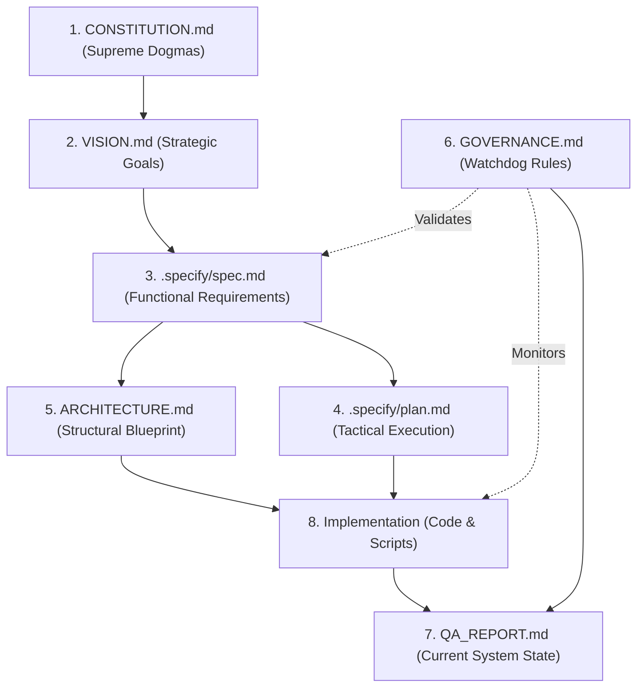
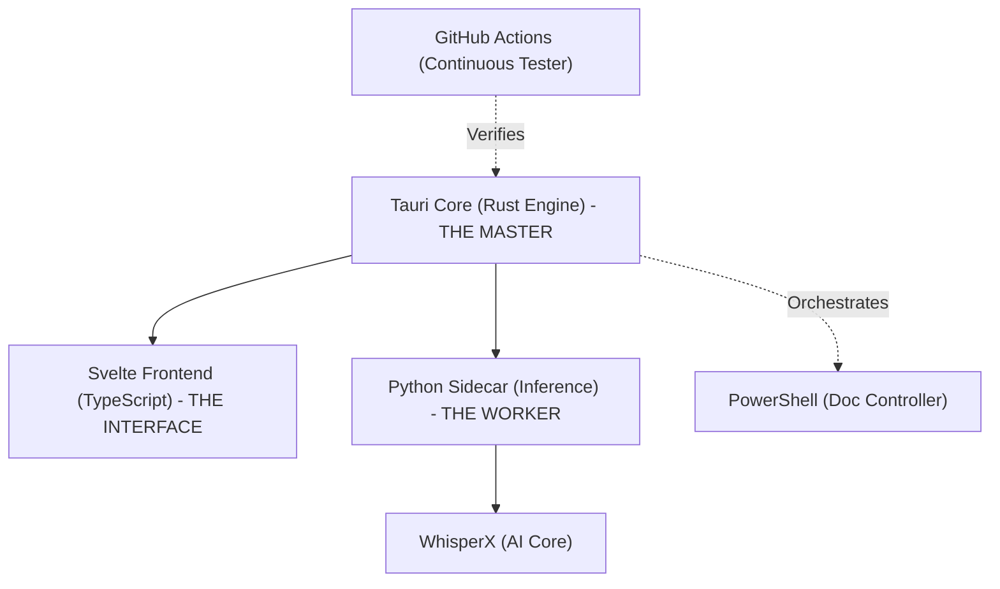

# Project Organization & Subordination

**Cesta:** ORGANIZATION.md
**Verze:** 1.1
**Vytvoreno:** 2026-02-16 12:23 (UTC+1)
**Posledni zmena:** 2026-02-17 (UTC+1)

## Historie zmen

| Datum | Verze | Popis zmeny |
|-------|-------|-------------|
| 2026-02-17 | 1.1 | Automaticka aktualizace |
| 2026-02-17 | 1.1 | Automaticka aktualizace |
| 2026-02-16 | 1.0 | Pridana metadata |

## Stav

- [x] Metadata pridana
- [ ] Obsah dokumentu kompletni

---
This document visualizes the "Chain of Command" and absolute subordination for all project documentation and technical components.

## 🌳 Strom Podřízenosti (The Unified Hierarchy Tree)
Toto je "mapa moci" celého projektu. Každý prvek je podřízen úrovni nad ním.

```text
CONSTITUTION.md (Zákon projektu - NEJVYŠŠÍ DOGMATA)
└── VISION.md (Strategické cíle - CO CHCEME DOKÁZAT?)
    ├── .specify/spec.md (Požadavky - PŘESNÉ PARAMETRY SW)
    │   ├── ARCHITECTURE.md (Blueprint - STRUKTURA A MODULY)
    │   │   ├── src-tauri/ (Rust Backend - ŘÍDÍCÍ MOZEK)
    │   │   ├── src-ui/ (Svelte Frontend - ROZHRANÍ PRO LÉKAŘE)
    │   │   └── src-python/ (WhisperX Sidecar - ML PRACOVNÍ SÍLA)
    │   └── .specify/plan.md (Plán - TAKTIKA A TIMELINE)
    │       └── sandbox/ (Pískoviště - EXPERIMENTÁLNÍ VÝZKUM HW)
    ├── GOVERNANCE.md (Dozor - KDO NA TO DÁVÁ POZOR?)
    │   ├── documentation_analysis.md (Hlídač kvality textů)
    │   ├── Dangerfile.js (Hlídač pravidel vývoje)
    │   ├── .github/workflows/ (Hlídači v cloudu - CI/CD)
    │   └── scripts/update_docs.ps1 (ADC - MÍSTNÍ watchdog)
    └── INDEX.md (Rozcestník - MAPA PRO LIDI I STROJE)
        └── QA_REPORT.md (Stav projektu - AKTUÁLNÍ VÝSLEDKY)
```

## 👑 1. Documentation Hierarchy (Hierarchy of Truth)
This tree shows the subordination of documents. Higher-level documents dictate the content of lower-level ones.



## 🏗️ 2. Technology Hierarchy (Chain of Command)
This tree shows which technology controls or serves which component.



## 📊 3. Role Summary

| Layer | Component | Responsibility | Boss |
| :--- | :--- | :--- | :--- |
| **Strategy** | Constitution / Vision | Defines "Why" and "What not to do". | **The User** |
| **Tactics** | Specs / Plan | Defines "What" and "How". | Strategy |
| **Execution** | Rust / Python / UI | The actual software running on HW. | Tactics |
| **Verification**| Danger / CI / ADC | The Watchdogs ensuring compliance. | Tactics |

---

## 🔍 Verification
The **[GOVERNANCE.md](./GOVERNANCE.md)** document explains how the "Watchdogs" (Layer 4) verify that the "Execution" (Layer 3) stays aligned with the "Strategy" (Layer 1).
