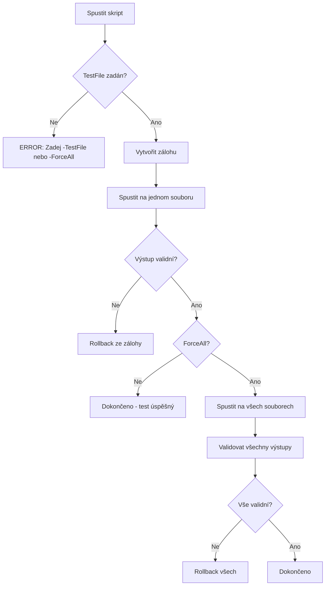

# Kritická analýza: Poškození 25 souborů skriptem update_metadata.ps1

**Cesta:** plans/critical_workflow_failure_analysis.md
**Verze:** 1.0
**Vytvoreno:** 2026-02-17 13:08 (UTC+1)
**Posledni zmena:** 2026-02-17 13:08 (UTC+1)

## Stav

- [x] Metadata pridana
- [ ] Obsah dokumentu kompletni

---

## 1. Shrnutí incidentu

**Datum:** 2026-02-17
**Skript:** `scripts/update_metadata.ps1`
**Dopad:** Poškozeno 25 markdown souborů
**Příčina:** Chyba v PowerShell interpolaci `$1$newVersion`

---

## 2. Analýza selhání

### 2.1 Technická příčina

**Chybný kód:**
```powershell
$content = $content -replace "(\*\*Verze:\*\*\s*)\d+\.\d+", "`$1$newVersion"
```

**Problém:** PowerShell interpretuje `$1$newVersion` jako `$1` + `newVersion`, ale `$1` je nahrazeno prázdným řetězcem, protože není definováno jako proměnná.

**Výsledek:** `**Verze:** 1.0` → `**Verze:** 1.1` místo `**Verze:** 1.1`

### 2.2 Procesní selhání

| Krok | Měl být | Byl proveden | Výsledek |
|------|---------|--------------|----------|
| 1. Test na jednom souboru | Ano | Ne | ❌ |
| 2. DryRun před spuštěním | Ano | Ne | ❌ |
| 3. Záloha před spuštěním | Ano | Ne | ❌ |
| 4. Ověření výsledku | Ano | Ne | ❌ |
| 5. Kontrola poškození | Ano | Ne | ❌ |

### 2.3 Systémová selhání

1. **Žádné automatické zálohy** - Skript nemá mechanismus pro zálohu
2. **Žádná validace výstupu** - Skript neověřuje, zda je výstup platný
3. **Žádná kontrola rozsahu** - Skript běžel na všech souborech najednou
4. **Žádné rollback** - Nelze vrátit změny zpět

---

## 3. Poškozené soubory

```
CRITICAL_ANALYSIS.md
CHANGE_LOG.md
README.md
PROMPT_HISTORY.md
QA_REPORT.md
PROPOSED_FIXES.md
VISION.md
logs/README.md
ARCHITECTURE.md
GOVERNANCE.md
INDEX.md
ORGANIZATION.md
TEST_INSPIRATION.md
LOGS_AND_PROMPTS.md
test-make-new-file.md
automation_audit.md
CONSTITUTION.md
plans/documentation_automation_improvements.md
documentation_analysis.md
plans/documentation_automation_improvements_v2.md
sandbox/portable_bench/FINAL_TEST_REPORT.md
sandbox/portable_bench/README.md
sandbox/portable_bench/TEST_REPORT.md
```

---

## 4. Kořenová příčina

### 4.1 Nedostatečná specifikace

Skript `update_metadata.ps1` byl vytvořen bez:
- Požadavku na zálohy
- Požadavku na validaci výstupu
- Požadavku na testování na jednom souboru
- Požadavku na rollback mechanismus

### 4.2 Nedostatečné testování

Testování proběhlo pouze:
- DryRun mode (pouze zobrazení, ne skutečná validace)
- Nebyl testován skutečný výstup

### 4.3 Nedostatečná kontrola kvality

Žádná kontrola:
- Kvality kódu před spuštěním
- Výstupu po spuštění
- Dopadu na ostatní soubory

---

## 5. Návrh řešení

### 5.1 Okamžité kroky

1. **Obnovit soubory z git:**
   ```bash
   git checkout -- "*.md"
   ```

2. **Opravit skript:**
   ```powershell
   # Správná interpolace
   $content = $content -replace "(\*\*Verze:\*\*\s*)\d+\.\d+", "`${1}$newVersion"
   ```

### 5.2 Bezpečnostní mechanismy

#### A. Automatické zálohy

```powershell
function Backup-File {
    param([string]$FilePath)
    
    $backupDir = "logs/backups"
    if (-not (Test-Path $backupDir)) {
        New-Item -ItemType Directory -Path $backupDir | Out-Null
    }
    
    $timestamp = Get-Date -Format "yyyyMMdd_HHmmss"
    $backupPath = "$backupDir/$(Split-Path $FilePath -Leaf).$timestamp.bak"
    
    Copy-Item $FilePath $backupPath
    return $backupPath
}
```

#### B. Validace výstupu

```powershell
function Test-OutputValid {
    param([string]$Content)
    
    # Kontrola, že verze je ve správném formátu
    if ($Content -match "\*\*Verze:\*\*\s*\$\d+") {
        return $false  # Poškozená interpolace
    }
    
    # Kontrola, že timestamp je ve správném formátu
    if ($Content -match "\*\*Posledni zmena:\*\*\s*\$\d+") {
        return $false  # Poškozená interpolace
    }
    
    return $true
}
```

#### C. Test na jednom souboru

```powershell
param(
    [string]$TestFile,  # Pokud zadán, testuje pouze tento soubor
    [switch]$ForceAll   # Pouze s explicitním souhlasem
)

if (-not $TestFile -and -not $ForceAll) {
    Write-Host "ERROR: Musíte zadat -TestFile nebo -ForceAll" -ForegroundColor Red
    exit 1
}
```

#### D. Rollback mechanismus

```powershell
function Restore-FromBackup {
    param([string]$FilePath)
    
    $backupDir = "logs/backups"
    $fileName = Split-Path $FilePath -Leaf
    $latestBackup = Get-ChildItem "$backupDir/$fileName.*.bak" | 
                    Sort-Object LastWriteTime -Descending | 
                    Select-Object -First 1
    
    if ($latestBackup) {
        Copy-Item $latestBackup.FullName $FilePath
        return $true
    }
    return $false
}
```

### 5.3 Workflow pro bezpečné spouštění



---

## 6. Preventivní opatření

### 6.1 Pravidla pro skripty

1. **Vždy implementovat DryRun mode**
2. **Vždy vytvářet zálohy**
3. **Vždy validovat výstup**
4. **Vždy testovat na jednom souboru**
5. **Vždy implementovat rollback**

### 6.2 Pravidla pro spouštění

1. **Nikdy nespouštět na všech souborech bez testu**
2. **Vždy ověřit výstup po spuštění**
3. **Vždy mít možnost rollback**

### 6.3 Dokumentace

1. **Každý skript musí mít dokumentaci**
2. **Každý skript musí mít příklady použití**
3. **Každý skript musí mít varování**

---

## 7. Závěr

Tento incident odhalil kritické nedostatky v:
1. **Procesu vývoje** - Nedostatečné testování
2. **Procesu spouštění** - Nedostatečná kontrola
3. **Systému záloh** - Žádné automatické zálohy
4. **Systému validace** - Žádná kontrola výstupu

**Doporučení:** Implementovat všechny bezpečnostní mechanismy před dalším použitím skriptu.

---

## Historie zmen

| Datum | Verze | Popis zmeny |
|-------|-------|-------------|
| 2026-02-17 | 1.0 | Vytvoření kritické analýzy |

---

*Vytvoreno: 2026-02-17 13:08 (UTC+1)*
