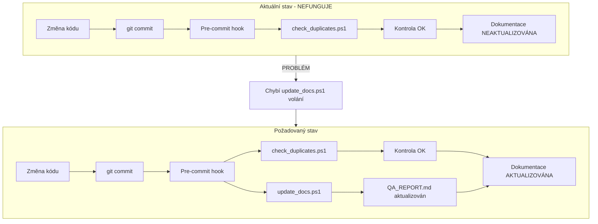

# Diagnóza: Proč dokumentace není automaticky aktualizována

**Cesta:** plans\documentation_automation_diagnosis.md
**Verze:** 1.0
**Vytvoreno:** 2026-02-15 19:28 (UTC+1)
**Posledni zmena:** 2026-02-15 19:28 (UTC+1)

## Historie zmen

| Datum | Verze | Popis zmeny |
|-------|-------|-------------|
| 2026-02-15 | 1.0 | Pridana metadata |

## Stav

- [x] Metadata pridana
- [ ] Obsah dokumentu kompletni

---
**Vytvořeno:** 2026-02-15 04:10 (UTC+1)
**Problém:** Po každé změně kódu není dokumentace automaticky aktualizována

---

## Identifikované příčiny

### 1. KRITICKÝ PROBLÉM: Pre-commit hook NEAKTUALIZUJE dokumentaci

**Soubor:** [`.husky/pre-commit`](.husky/pre-commit)

**Aktuální stav:**
```bash
#!/bin/bash
echo "Running documentation checks..."

# Kontrola duplicit (ignorovat prázdné řádky)
powershell -ExecutionPolicy Bypass -File scripts/check_duplicates.ps1 -IgnoreEmptyLines

if [ $? -ne 0 ]; then
    echo "Duplicate check failed!"
    exit 1
fi

echo "All checks passed!"
```

**Problém:** Hook pouze KONTROLUJE duplicity, ale NESPOUŠTÍ [`scripts/update_docs.ps1`](scripts/update_docs.ps1)!

---

### 2. KRITICKÝ PROBLÉM: CI/CD NEAKTUALIZUJE dokumentaci

**Soubor:** [`.github/workflows/ci.yml`](.github/workflows/ci.yml)

**Aktuální stav:**
- `test-ui` - frontend testy
- `test-rust` - Rust testy
- `lint` - linter

**Problém:** Žádný job nespouští `update_docs.ps1` pro aktualizaci QA_REPORT.md!

---

### 3. CHYBÍ: Dokumentační workflow

**Plánováno v:** [`plans/documentation_automation_improvements_v2.md`](plans/documentation_automation_improvements_v2.md:159-175)

**Mělo by být:** `.github/workflows/docs.yml`

**Stav:** NEEXISTUJE

---

### 4. CHYBÍ: Automatický changelog

**Problém:** CHANGE_LOG.md se musí aktualizovat manuálně

**Plánováno:** Automatický generátor changelogu z commitů

---

## Diagram toku dokumentace



---

## Kořenová příčina

**Hlavní problém:** Skript [`scripts/update_docs.ps1`](scripts/update_docs.ps1) existuje a je funkční, ale **není nikde automaticky volán**!

| Umístění | Mělo by volat | Aktuální stav |
|----------|---------------|----------------|
| Pre-commit hook | `update_docs.ps1` | NEVOLÁ |
| CI/CD | `update_docs.ps1` | NEVOLÁ |
| Manuálně | `update_docs.ps1` | Možné, ale zapomíná se |

---

## Návrh řešení

### Fáze 1: Oprava pre-commit hook (PRIORITA HIGH)

**Upravit [`.husky/pre-commit`](.husky/pre-commit):**

```bash
#!/bin/bash
echo "Running documentation checks..."

# 1. Kontrola duplicit
powershell -ExecutionPolicy Bypass -File scripts/check_duplicates.ps1 -IgnoreEmptyLines

if [ $? -ne 0 ]; then
    echo "Duplicate check failed!"
    exit 1
fi

# 2. Aktualizace dokumentace NOVĚ!
echo "Updating documentation..."
powershell -ExecutionPolicy Bypass -File scripts/update_docs.ps1

echo "All checks passed!"
```

### Fáze 2: Přidání dokumentačního workflow (PRIORITA MEDIUM)

**Vytvořit `.github/workflows/docs.yml`:**

```yaml
name: Documentation Update
on:
  push:
    branches: [main, develop]
  pull_request:
    branches: [main]

jobs:
  update-docs:
    runs-on: windows-latest
    steps:
      - uses: actions/checkout@v4
      
      - name: Update QA Report
        run: powershell -ExecutionPolicy Bypass -File scripts/update_docs.ps1
      
      - name: Check for duplicates
        run: powershell -ExecutionPolicy Bypass -File scripts/check_duplicates.ps1 -IgnoreEmptyLines
      
      - name: Commit updated docs
        run: |
          git config --local user.email "action@github.com"
          git config --local user.name "GitHub Action"
          git add QA_REPORT.md CHANGE_LOG.md
          git diff --quiet && git diff --staged --quiet || git commit -m "docs: automatic update"
          git push
```

### Fáze 3: Rozšíření update_docs.ps1 (PRIORITA LOW)

**Přidat do [`scripts/update_docs.ps1`](scripts/update_docs.ps1):**
- Aktualizace CHANGE_LOG.md z posledních commitů
- Kontrola timestampů v NEXT_SESSION.md
- Validace odkazů v dokumentaci

---

## Dodatečný safeguard: Run on Save

- Primární automatizaci nyní zajišťuje `scripts/run_on_save.ps1` (volá ho `emeraldwalk.RunOnSave` z `.vscode/settings.json`), takže metadata se aktualizují při ukládání souborů.  
- Watchdog `scripts/watch_docs.ps1` lze spustit s `pwsh scripts/watch_docs.ps1` pro detekci změn v `test/*.md` a automatické spouštění Run on Save i mimo editor.  
- Kontrolní skript `scripts/check_run_on_save.ps1 -FilePath test/runonsave-test.md` ověří, že plugin je nakonfigurovaný, log `logs/runonsave.log` obsahuje `UPDATED ... vX.Y` a dokument má metadata.  
- Pre-commit hook už jen kontroluje (`update_metadata` běží v `-DryRun`), takže pokud Run on Save neproběhne, Guard všechny chyby zachytí (hook zablokuje commit a log vypíše „Run on Save missing“).  

## Implementační checklist

### Okamžitě (dnes)
- [ ] Upravit `.husky/pre-commit` - přidat volání `update_docs.ps1`
- [ ] Otestovat pre-commit hook

### Tento týden
- [ ] Vytvořit `.github/workflows/docs.yml`
- [ ] Přidat automatický commit změněné dokumentace

### Budoucí
- [ ] Rozšířit `update_docs.ps1` o CHANGE_LOG.md
- [ ] Přidat validaci timestampů

---

## Očekávané výsledky

1. **Po každém commitu** - QA_REPORT.md automaticky aktualizován
2. **Po každém pushi** - CI/CD ověří a případně aktualizuje dokumentaci
3. **Žádné manuální aktualizace** - vše automaticky

---

## Poznámka k implementaci

Pro implementaci je třeba přepnout do **Code módu**, protože:
- Úprava `.husky/pre-commit` - bash script
- Vytvoření `.github/workflows/docs.yml` - YAML soubor

**Architect mód může pouze:** vytvářet/upravovat `.md` soubory

---

*Diagnóza vytvořena: 2026-02-15 04:10 (UTC+1)*
