# Proces aktualizace dokumentace v projektu aSTT-RUST

**Cesta:** plans/documentation_update_process.md  
**Verze:** 1.1  
**Vytvořeno:** 2026-02-17 15:54 (UTC+1)  
**Poslední změna:** 2026-02-18 03:01 (UTC+1)

---

## Přehled

Projekt využívá automatizovaný systém pro aktualizaci a validaci dokumentace založený na Git hookech a PowerShell skriptech. Celý proces je řízen pomocí [`workflow-steps.json`](workflow-steps.json) konfigurace.

## Komponenty systému

| Komponenta | Popis |
|------------|-------|
| [`workflow-steps.json`](workflow-steps.json) | Centrální konfigurace všech workflow kroků |
| [`scripts/workflow_guard.ps1`](scripts/workflow_guard.ps1) | Hlavní řídící skript pro spouštění kroků |
| [`scripts/update_metadata.ps1`](scripts/update_metadata.ps1) | Aktualizace metadat v .md souborech |
| [`scripts/update_docs.ps1`](scripts/update_docs.ps1) | Aktualizace QA_REPORT.md |
| [`.husky/pre-commit`](.husky/pre-commit) | Git hook pro pre-commit fázi |
| [`.husky/pre-push`](.husky/pre-push) | Git hook pro pre-push fázi |

---

## Diagram procesu - Ideální stav vs Současná implementace

### Ideální proces (dokumentace se aktualizuje kontinuálně)

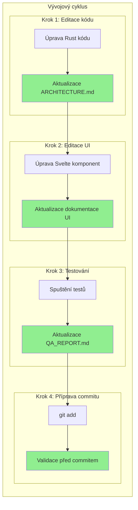

### Současná implementace (aktualizace až při commitu)

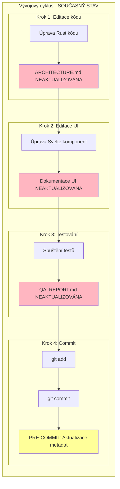

---

## Detailní diagram Git workflow

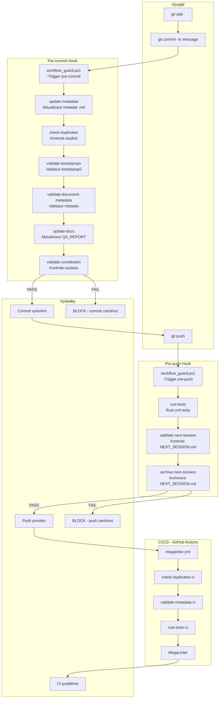

---

## Identifikované problémy současného procesu

| Problém | Dopad | Možné řešení |
|---------|-------|--------------|
| Dokumentace se aktualizuje až při commitu | Zastaralá dokumentace během vývoje | IDE File Watcher |
| Metadata nejsou ve staging area | Commit neobsahuje aktualizovaná metadata | `git add` v pre-commit hooku |
| Žádná kontinuální synchronizace | Dokumentace odrazuje od kódu | Automatizované CI/CD kontroly |

---

## Co je IDE File Watcher?

**IDE File Watcher** je funkce v editoru (např. VS Code, IntelliJ), která automaticky spouští skript při uložení souboru.

### Jak by fungoval pro aktualizaci dokumentace:

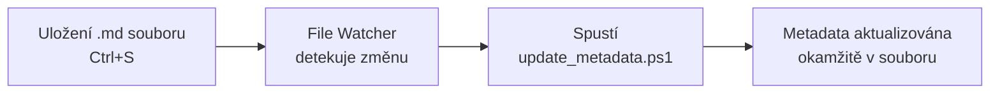

### Konfigurace ve VS Code:

1. Nainstalovat rozšíření **Run on Save** od emeraldwalk
   - Marketplace: https://marketplace.visualstudio.com/items?itemName=emeraldwalk.RunOnSave
   - ID: `emeraldwalk.RunOnSave`
    
2. Přidat do `.vscode/settings.json`:

```json
{
  "emeraldwalk.runonsave": {
    "commands": [
      {
        "match": "\\.md$",
        "cmd": "powershell -ExecutionPolicy Bypass -File ${workspaceFolder}/scripts/update_metadata.ps1 -FilePath ${file}"
      }
    ]
  }
}
```

### Komplexní konfigurace pro všechny typy souborů:

```json
{
  "emeraldwalk.runonsave": {
    "commands": [
      {
        "match": "\\.md$",
        "cmd": "powershell -ExecutionPolicy Bypass -File ${workspaceFolder}/scripts/update_metadata.ps1 -FilePath ${file} >> ${workspaceFolder}/logs/runonsave.log 2>&1",
        "isAsync": true
      },
      {
        "match": "\\.(rs|ts|svelte|py)$",
        "cmd": "python ${workspaceFolder}/scripts/gen_docs.py --source ${file} --output docs/ >> ${workspaceFolder}/logs/runonsave.log 2>&1",
        "isAsync": true
      },
      {
        "match": "\\.specify\\/.*\\.md$",
        "cmd": "python ${workspaceFolder}/scripts/gen_docs.py --spec ${file} >> ${workspaceFolder}/logs/runonsave.log 2>&1",
        "isAsync": true
      }
    ]
  }
}
```

### Rozsah zpracování:

| Typ souboru | Akce | Výstup |
|-------------|------|--------|
| `*.md` | Aktualizace metadat | Stejný soubor |
| `*.rs, *.ts, *.svelte, *.py` | Generování dokumentace | `docs/` složka |
| `.specify/*.md` | Generování ze specifikací | `docs/` složka |

---

## Kompletní architektura automatické správy dokumentace po implementaci

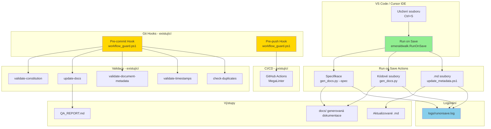

---

## Jak bude systém fungovat - detailní tok

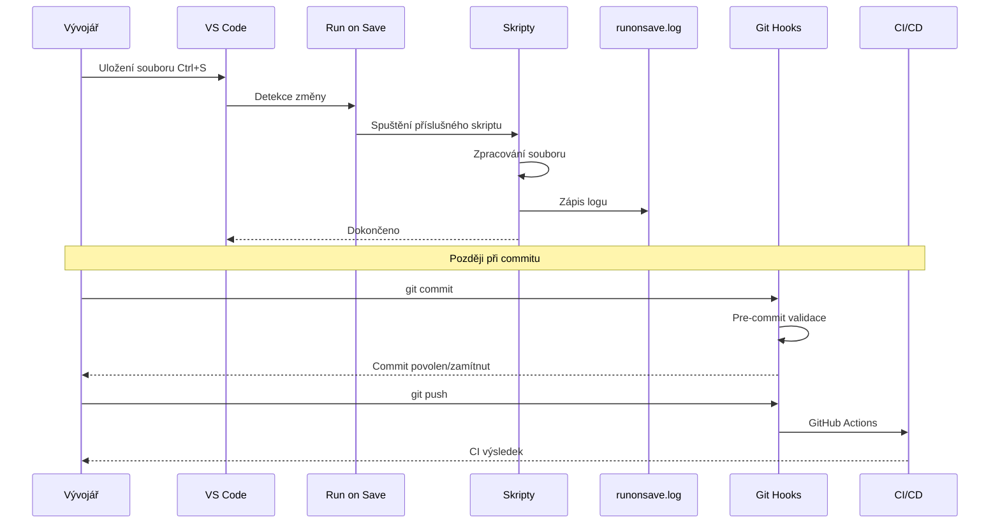

---

## Integrace se současným systémem

| Komponenta | Současný stav | Po implementaci |
|------------|---------------|-----------------|
| **Run on Save** | Není | Nová vrstva - okamžitá aktualizace |
| **Pre-commit hook** | Primární | Fallback + validace |
| **Pre-push hook** | Testy + archivace | Beze změny |
| **CI/CD** | MegaLinter | Beze změny |
| **Logování** | logs/execution-log.json | + logs/runonsave.log |

### Princip fungování:

1. **Run on Save (NOVÉ)** - Okamžitá reakce na uložení
   - Aktualizuje metadata v .md souborech
   - Generuje dokumentaci z kódu
   - Loguje do `logs/runonsave.log`

2. **Pre-commit hook (EXISTUJÍCÍ)** - Validace před commitem
   - Kontrola duplicit
   - Validace timestampů a metadat
   - Aktualizace QA_REPORT.md
   - Kontrola souladu s CONSTITUTION.md

3. **Pre-push hook (EXISTUJÍCÍ)** - Testy před pushem
   - Rust testy
   - Validace NEXT_SESSION.md
   - Archivace session souborů

4. **CI/CD (EXISTUJÍCÍ)** - Finální kontrola v cloudu
   - MegaLinter
   - Rust testy v CI prostředí

### Výhody implementace do workflow:

| Výhoda | Popis |
|--------|-------|
| **Okamžitá aktualizace** | Metadata se aktualizují při každém uložení - dokumentace je vždy aktuální během vývoje |
| **Méně konfliktů** | Změny jsou malé a časté - snižuje riziko konfliktů při merge |
| **Žádné čekání na commit** | Není třeba čekat na pre-commit hook - změny jsou provedeny okamžitě |
| **Lepší DX** | Vývojář vidí aktuální metadata hned po uložení |
| **Méně chybových stavů** | Validace probíhá postupně - snadnější opravy |
| **Oddělené změny** | Každá změna je zaznamenána s timestampem - lepší audit trail |

### Nevýhody implementace do workflow:

| Nevýhoda | Popis | Mitigace |
|----------|-------|----------|
| **Hluk v git historii** | Časté malé změny metadat zanášejí historii | Použít squash merge nebo conventional commits |
| **Závislost na IDE** | Funguje jen pokud je VS Code s pluginem | Zachovat pre-commit hook jako fallback |
| **Možné zpoždění** | Při rychlém ukládání více souborů může dojít k zpoždění | Použít `isAsync: true` v konfiguraci |
| **Konflikty při paralelní práci** | Dva vývojáři na stejném souboru mohou způsobit konflikt | Git standardní řešení konfliktů |
| **Zátěž systému** | Časté spouštění PowerShell skriptů | Skript je jednoduchý a rychlý |
| **Nemožnost vypnout** | Pokud je v .vscode/settings.json, platí pro všechny | Přidat glob ignorování nebo podmínky |

### Doporučení pro implementaci:

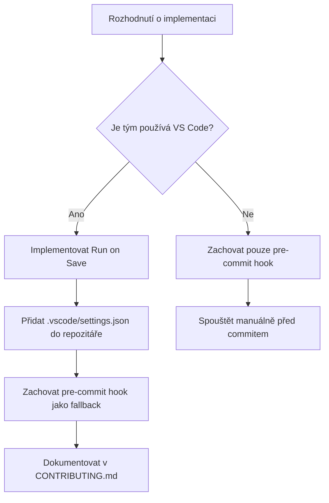

### Kombinované řešení (doporučeno):

Implementovat **obojí** - Run on Save pro okamžitou aktualizaci + pre-commit hook jako fallback:

1. **Run on Save** - aktualizuje metadata při uložení (primární)
2. **Pre-commit hook** - validuje a doplní metadata pokud Run on Save nefunguje (fallback)
3. **CI/CD** - finální kontrola v cloudovém prostředí (garance)

---

## Návrh ideálního procesu

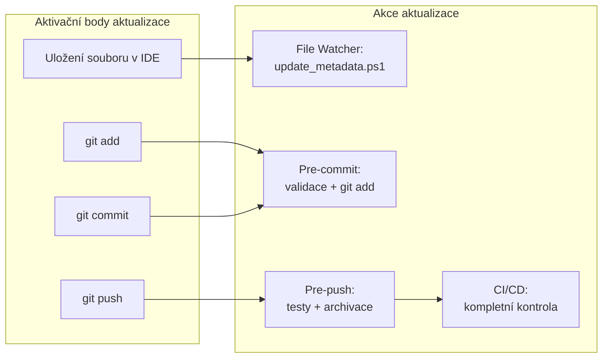

---

## Detailní popis fází

### Fáze 1: Pre-commit

Spouští se před každým commitem. Zahrnuje 6 kroků:

| Krok | Skript | Popis | Při selhání |
|------|--------|-------|-------------|
| update-metadata | [`update_metadata.ps1`](scripts/update_metadata.ps1) | Automaticky aktualizuje verzi a timestamp ve změněných .md souborech | warn (pouze varování) |
| check-duplicates | [`check_duplicates.ps1`](scripts/check_duplicates.ps1) | Detekuje duplicitní řádky v souborech | block (zablokuje commit) |
| validate-timestamps | [`validate_timestamps.ps1`](scripts/validate_timestamps.ps1) | Kontroluje aktuálnost timestampů | block |
| validate-document-metadata | [`validate_document_metadata.ps1`](scripts/validate_document_metadata.ps1) | Validuje verzi, timestamp a historii změn | block |
| update-docs | [`update_docs.ps1`](scripts/update_docs.ps1) | Aktualizuje QA_REPORT.md a CHANGE_LOG.md | block |
| validate-constitution | [`validate_constitution.ps1`](scripts/validate_constitution.ps1) | Ověřuje soulad s CONSTITUTION.md | block |

### Fáze 2: Pre-push

Spouští se před každým pushem do remote repository:

| Krok | Popis | Při selhání |
|------|-------|-------------|
| rust-tests | Spustí Rust unit testy (`cargo test`) | block |
| validate-next-session | Ověří aktuálnost NEXT_SESSION.md | block |
| archive-next-session | Archivuje NEXT_SESSION.md s timestampem | block |

### Fáze 3: CI/CD

Spouští se na GitHub Actions po pushi do main/develop větví:

| Krok | Popis |
|------|-------|
| check-duplicates-ci | Kontrola duplicit v CI prostředí |
| validate-metadata-ci | Validace metadat v CI prostředí |
| rust-tests-ci | Rust testy v CI prostředí |
| MegaLinter | Komplexní linting celého projektu |

---

## Formát metadat dokumentů

Každý .md soubor by měl obsahovat metadata v tomto formátu:

```markdown
**Cesta:** relative/path/to/file.md  
**Verze:** 1.0  
**Vytvořeno:** 2026-02-17 15:54 (UTC+1)  
**Poslední změna:** 2026-02-17 15:54 (UTC+1)

## Historie změn

| Datum | Verze | Popis změny |
|-------|-------|-------------|
| 2026-02-17 | 1.0 | Vytvoření dokumentu |
```

---

## Workflow Execution Guard

Hlavní řídící skript [`workflow_guard.ps1`](scripts/workflow_guard.ps1) zajišťuje:

1. **Načtení konfigurace** z `workflow-steps.json`
2. **Validaci JSON schématu**
3. **Sekvenční spouštění kroků** podle triggeru
4. **Zaznamenávání výsledků** do logu
5. **Retry logiku** pro nestabilní kroky (např. rust-tests)

### Příklad volání:

```powershell
# Pre-commit fáze
powershell -ExecutionPolicy Bypass -File scripts/workflow_guard.ps1 -Trigger pre-commit

# Pre-push fáze
powershell -ExecutionPolicy Bypass -File scripts/workflow_guard.ps1 -Trigger pre-push

# Dry run (pouze simulace)
powershell -ExecutionPolicy Bypass -File scripts/workflow_guard.ps1 -Trigger pre-commit -DryRun
```

---

## Zpracování chyb

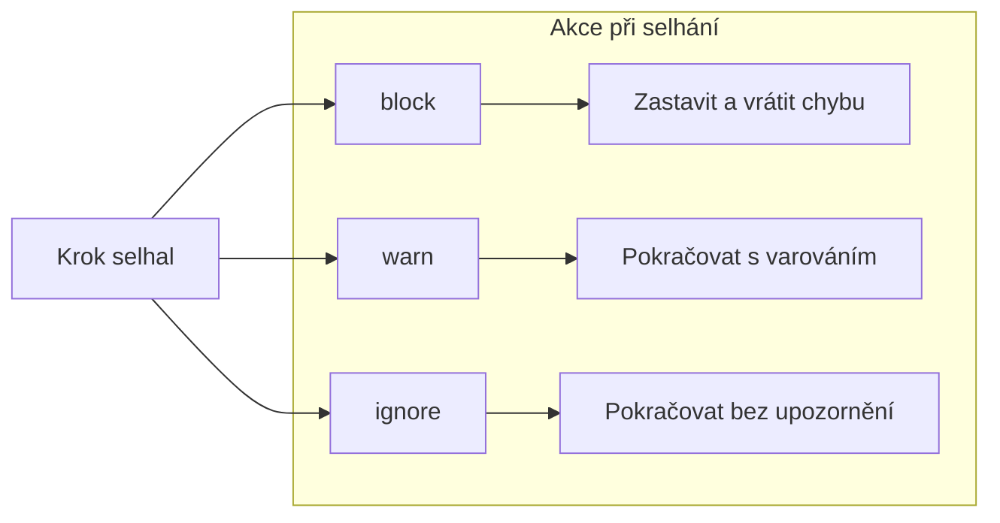

---

## Komplexní analýza procesu aktualizace dokumentace

### Analýza PŘED implementací Run on Save

#### Současný tok dat:

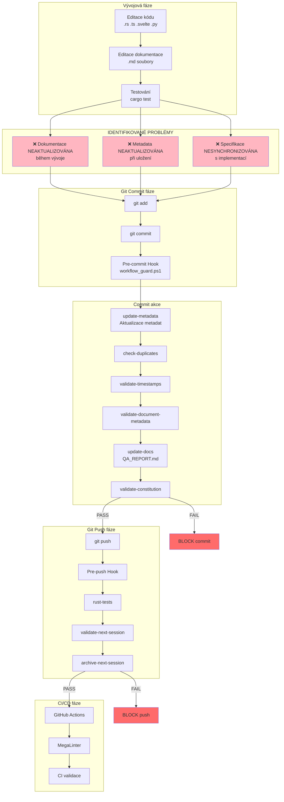

#### Problémy současného stavu:

| Problém | Dopad | Kdy se projeví |
|---------|-------|----------------|
| Dokumentace se aktualizuje až při commitu | Zastaralá dokumentace během vývoje | Během celé vývojové fáze |
| Metadata nejsou ve staging area | Commit neobsahuje aktualizovaná metadata | Při commitu |
| Žádná kontinuální synchronizace | Dokumentace odrazuje od kódu | Při review |
| Specifikace nesynchronizována | Rozdíl mezi spec a implementací | Při merge |
| Žádné logování během vývoje | Nelze diagnostikovat problémy | Celý proces |

---

### Analýza PO implementaci Run on Save

#### Nový tok dat:

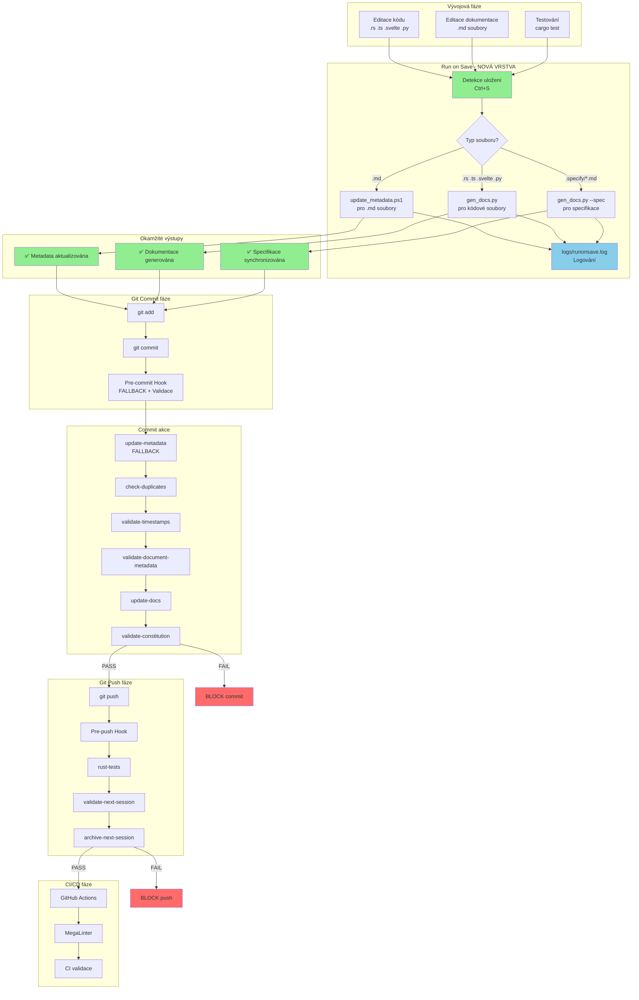

#### Vylepšení po implementaci:

| Vylepšení | Dopad | Kdy se projeví |
|-----------|-------|----------------|
| Okamžitá aktualizace metadat | Dokumentace vždy aktuální | Při každém uložení |
| Generování dokumentace z kódu | Synchronizace kód-dokumentace | Při uložení kódu |
| Synchronizace specifikací | Spec odpovídá implementaci | Při uložení spec |
| Logování do runonsave.log | Diagnostika problémů | Celý proces |
| Pre-commit jako fallback | Garance při selhání Run on Save | Při commitu |

---

### Srovnání PŘED vs PO

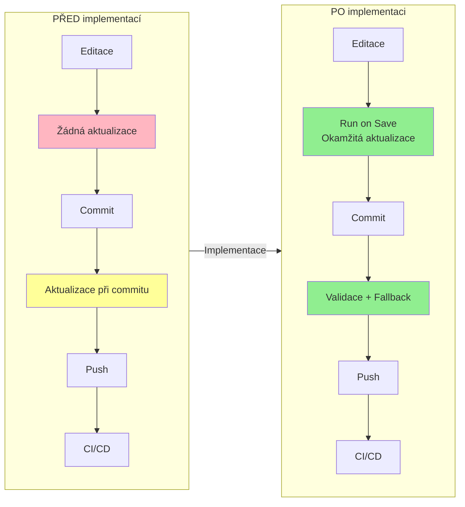

---

### Detailní srovnávací tabulka

| Aspekt | PŘED | PO |
|--------|------|-----|
| **Kdy se aktualizuje dokumentace** | Při commitu | Při uložení (Ctrl+S) |
| **Kdy se aktualizují metadata** | Při commitu | Při uložení |
| **Synchronizace specifikací** | Manuální | Automatická |
| **Logování během vývoje** | Žádné | logs/runonsave.log |
| **Pre-commit hook role** | Primární | Fallback + validace |
| **DX (Developer Experience)** | Čekání na commit | Okamžitá zpětná vazba |
| **Riziko zastaralé dokumentace** | Vysoké | Nízké |
| **Diagnostika problémů** | Obtížná | Snadná (log) |

---

## Shrnutí

Proces aktualizace dokumentace je plně automatizovaný a probíhá ve čtyřech fázích:

1. **Run on Save (NOVÉ)** - Okamžitá aktualizace při uložení
2. **Pre-commit** - Validace a fallback
3. **Pre-push** - Testy a archivace session souborů
4. **CI/CD** - Komplexní kontrola v cloudovém prostředí

Tento systém zajišťuje konzistenci dokumentace, aktuálnost metadat a kvalitu kódu před každým commitem a pushem.

---

*Vytvořeno: 2026-02-17 15:54 (UTC+1)*
