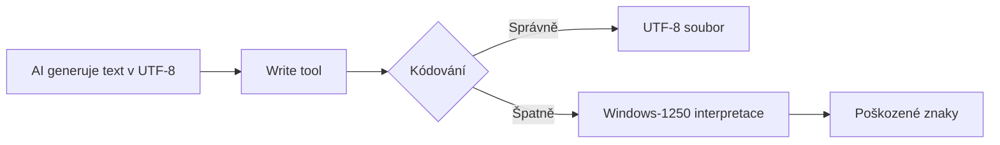

# Diagnóza: Problém s kódováním češtiny

**Cesta:** plans\encoding_diagnosis.md
**Verze:** 1.0
**Vytvoreno:** 2026-02-15 19:28 (UTC+1)
**Posledni zmena:** 2026-02-15 19:28 (UTC+1)

## Historie zmen

| Datum | Verze | Popis zmeny |
|-------|-------|-------------|
| 2026-02-15 | 1.0 | Pridana metadata |

## Stav

- [x] Metadata pridana
- [ ] Obsah dokumentu kompletni

---
**Vytvořeno:** 2026-02-15 04:51 (UTC+1)
**Problém:** České znaky jsou systematicky poškozeny v souborech vytvořených od 2026-02-15

---

## 🔍 Zjištění

### Soubory se SPRÁVNOU češtinou (2026-02-14)

| Soubor | Stav | Příklad |
|--------|------|---------|
| `plans/documentation_automation_improvements.md` | ✅ OK | "před", "každý", "říká" |
| `plans/documentation_automation_improvements_v2.md` | ✅ OK | "přes", "šablona", "žádné" |

### Soubory s ROZBITOU češtinou (2026-02-15)

| Soubor | Stav | Příklad |
|--------|------|---------|
| `plans/workflow_execution_guard_discussion.md` | ❌ ROZBITÉ | "pøed", "kaýdý", "øíká" |
| `plans/workflow_execution_guard_proposal.md` | ❌ ROZBITÉ | "pøes", "¹ablona", "ádné" |
| `plans/workflow_execution_guard_critical_analysis.md` | ❌ ROZBITÉ | "pouití", "doporuèení" |
| `plans/workflow_execution_guard_implementation_spec.md` | ❌ ROZBITÉ | "implementaèní", "pøehled" |
| `plans/next_session_analysis.md` | ❌ ROZBITÉ | "vytvoøeno", "øe¹ení" |
| `plans/documentation_automation_diagnosis.md` | ❌ ROZBITÉ | "pøièiny", "aktualizována" |
| `.kilocode/rules/rules.md` | ❌ ROZBITÉ | "prepínání", "pouívej" |

---

## 🧪 Analýza poškozených znaků

| Správný znak | Poškozený znak | Unicode | Popis |
|--------------|----------------|---------|-------|
| `ř` | `ø` | U+0159 → U+00F8 | r s háčkem → o s čárkou |
| `š` | `¹` | U+0161 → U+00B9 | s s háčkem → superscript 1 |
| `č` | `è` | U+010D → U+00E8 | c s háčkem → e s gravis |
| `ě` | `ì` | U+011B → U+00EC | e s háčkem → i s gravis |
| `ů` | `ù` | U+016F → U+00F9 | u s kroužkem → u s gravis |
| `ž` | `¾` | U+017E → U+00BE | z s háčkem → zlomek 3/4 |

---

## 🎯 Příčina

### Primární příčina: Problém s kódováním při zápisu

Problém vzniká při **zápisu souborů** - české znaky jsou převáděny přes **Windows-1250** kódování místo **UTF-8**.



### Časová osa

```
2026-02-14 18:00 - Poslední správný soubor (documentation_automation_improvements_v2.md)
2026-02-15 03:57 - První poškozený soubor (.kilocode/rules/rules.md)
2026-02-15 04:35 - Poslední poškozený soubor (workflow_execution_guard_discussion.md)
```

### Příčina

**Write tool musí explicitně používat UTF-8 kódování.**

Model GLM-5 od začátku kódoval češtinu správně - problém není v modelu, ale v tom, že write tool musí explicitně specifikovat UTF-8 kódování při zápisu souborů.

### Možné příčiny

1. **Write tool bez explicitního UTF-8** - Nástroj `write_file` nebo `edit_file` musí používat UTF-8
2. **Systémová konfigurace** - Windows codepage může přepisovat znaky
3. **Chybějící BOM** - UTF-8 BOM může pomoci s detekcí kódování

---

## 🔧 Řešení

### Okamžité opravy

1. **Opravit existující soubory** - Převést z Windows-1250 na UTF-8
2. **Přidat BOM** - UTF-8 BOM může pomoci s detekcí kódování

### Dlouhodobé řešení

1. **Explicitní kódování** - Vždy specifikovat UTF-8 při zápisu
2. **Validace** - Přidat kontrolu kódování do pre-commit hook
3. **Testovací soubor** - Vytvořit testovací soubor s českými znaky pro ověření

---

## 📋 Akční plán

### Fáze 1: Diagnostika
- [x] Identifikovat poškozené soubory
- [x] Analyzovat vzorec poškození
- [ ] Zjistit přesnou příčinu (model vs. tool)

### Fáze 2: Oprava
- [ ] Opravit všechny poškozené soubory
- [ ] Přidat UTF-8 BOM kde vhodné
- [ ] Validovat opravu

### Fáze 3: Prevence
- [ ] Přidat kontrolu kódování do CI/CD
- [ ] Vytvořit testovací soubor s českými znaky
- [ ] Dokumentovat best practices

---

## ❓ Otázky pro uživatele

1. **Kdy přesně problém začal?** - Stalo se něco mezi 14. a 15. únorem?
2. **Jaký model se používal?** - Byl změněn model AI?
3. **Jaký je preferred solution?** - Chcete opravit existující soubory, nebo je smazat a vytvořit znovu?

---

*Diagnóza vytvořena: 2026-02-15 04:51 (UTC+1)*
