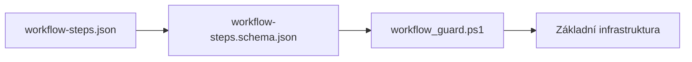
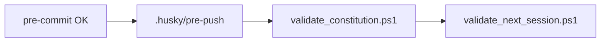
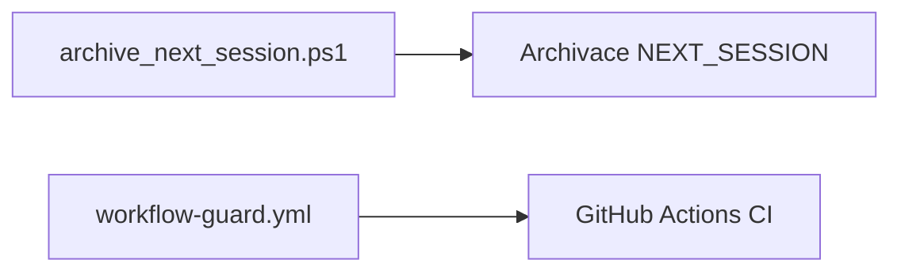
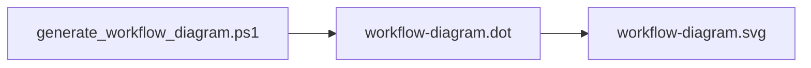
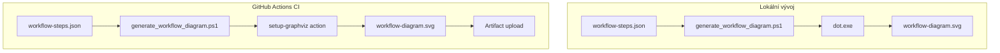
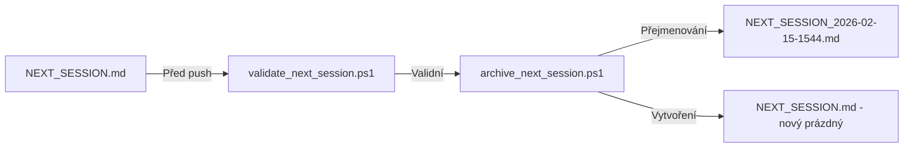

# Priority implementace: Workflow Execution Guard

**Cesta:** plans\implementation_priorities.md
**Verze:** 1.0
**Vytvoreno:** 2026-02-16 12:23 (UTC+1)
**Posledni zmena:** 2026-02-16 12:23 (UTC+1)

## Historie zmen

| Datum | Verze | Popis zmeny |
|-------|-------|-------------|
| 2026-02-16 | 1.0 | Pridana metadata |

## Stav

- [x] Metadata pridana
- [ ] Obsah dokumentu kompletni

---
**Cesta:** plans/implementation_priorities.md
**Vytvořeno:** 2026-02-15 15:44 (UTC+1)
**Verze:** 1.0
**Status:** Návrh k diskuzi

---

## 1. Souhrn

Tento dokument stanovuje priority implementace Workflow Execution Guard na základě analýzy:
- [`workflow_execution_guard_spec_v2.03.md`](plans/workflow_execution_guard_spec_v2.03.md)
- [`NEXT_SESSION.md`](NEXT_SESSION.md)
- [`sdd_complete_workflow_diagram.md`](plans/sdd_complete_workflow_diagram.md)

---

## 2. Matice priorit

### 2.1 Hodnocení kritérií

| Kritérium | Váha | Popis |
|-----------|------|-------|
| Závislost | 30% | Jiné komponenty na tom závisí |
| Hodnota | 25% | Přínos pro uživatele |
| Rizikovost | 25% | Riziko při neimplementaci |
| Úsilí | 20% | Časová náročnost (nižší = lepší) |

### 2.2 Prioritizované položky

| Priorita | Položka | Fáze | Závislost | Hodnota | Riziko | Úsilí | Skóre |
|----------|---------|------|-----------|---------|--------|-------|-------|
| **P0** | `workflow-steps.json` | 1 | Vysoká | Vysoká | Vysoké | Nízké | **95** |
| **P0** | `workflow-steps.schema.json` | 1 | Vysoká | Střední | Vysoké | Nízké | **88** |
| **P0** | `scripts/workflow_guard.ps1` | 1 | Vysoká | Vysoká | Vysoké | Střední | **85** |
| **P1** | `.husky/pre-commit` update | 3 | Vysoká | Vysoká | Střední | Nízké | **80** |
| **P1** | `validate_document_metadata.ps1` | 2 | Střední | Vysoká | Střední | Střední | **75** |
| **P1** | `logs/.gitkeep` + logování | 1 | Střední | Střední | Střední | Nízké | **70** |
| **P2** | `.husky/pre-push` | 3 | Střední | Vysoká | Nízké | Nízké | **68** |
| **P2** | `validate_constitution.ps1` | 2 | Nízká | Střední | Střední | Střední | **60** |
| **P2** | `validate_next_session.ps1` | 2 | Nízká | Střední | Nízké | Střední | **55** |
| **P3** | `archive_next_session.ps1` | 2 | Nízká | Střední | Nízké | Střední | **50** |
| **P3** | `.github/workflows/workflow-guard.yml` | 4 | Nízká | Vysoká | Nízké | Střední | **55** |
| **P4** | `generate_workflow_diagram.ps1` | 5 | Nízká | Nízká | Nízké | Střední | **40** |
| **P4** | `docs/workflow-diagram.svg` | 5 | Nízká | Nízká | Nízké | Nízké | **35** |

---

## 3. Prioritní skupiny

### P0 - Kritické (musí být první)



**Důvod:** Bez těchto souborů nemůže Workflow Guard fungovat. Vše ostatní na nich závisí.

| Soubor | Popis | Akceptační kritéria |
|--------|-------|---------------------|
| `workflow-steps.json` | Definice všech kroků | Validní JSON, projde schema validací |
| `workflow-steps.schema.json` | JSON Schema pro validaci | Validní JSON Schema draft-07 |
| `scripts/workflow_guard.ps1` | Hlavní skript | Spustitelný s `-DryRun` parametrem |

### P1 - Důležité (první viditelný přínos)


**Důvod:** Tyto položky přinášejí první viditelný přínos - pre-commit hook začne fungovat.

| Soubor | Popis | Akceptační kritéria |
|--------|-------|---------------------|
| `.husky/pre-commit` | Aktualizovaný hook | Volá Workflow Guard |
| `validate_document_metadata.ps1` | Validace metadat | Detekuje chybějící metadata |
| `logs/.gitkeep` | Adresar pro logy | Logy se ukládají |

### P2 - Střední (rozšíření funkcionality)



**Důvod:** Rozšiřuje Workflow Guard o pre-push kontrolu a další validace.

### P3 - Nižší (CI/CD a archivace)



**Důvod:** Důležité pro CI/CD, ale neblokuje lokální práci.

### P4 - Nízká (Graphviz vizualizace)



**Důvod:** Nice-to-have, neblokuje nic jiného.

---

## 4. Doporučené pořadí implementace

### Sprint 1: Základní infrastruktura (P0)

```
1. workflow-steps.json           [ ]
2. workflow-steps.schema.json    [ ]
3. scripts/workflow_guard.ps1    [ ]
4. logs/.gitkeep                 [ ]
```

**Výsledek:** Workflow Guard lze spustit lokálně s `-DryRun`

### Sprint 2: Pre-commit integrace (P1)

```
5. .husky/pre-commit (update)    [ ]
6. validate_document_metadata.ps1 [ ]
```

**Výsledek:** Pre-commit hook aktivní, validuje metadata dokumentů

### Sprint 3: Pre-push rozšíření (P2)

```
7. .husky/pre-push               [ ]
8. validate_constitution.ps1     [ ]
9. validate_next_session.ps1     [ ]
```

**Výsledek:** Pre-push hook aktivní, kontroluje constitution a NEXT_SESSION

### Sprint 4: CI/CD a archivace (P3)

```
10. archive_next_session.ps1     [ ]
11. .github/workflows/workflow-guard.yml [ ]
```

**Výsledek:** CI/CD pipeline aktivní, automatická archivace

### Sprint 5: Graphviz vizualizace (P4)

```
12. scripts/generate_workflow_diagram.ps1 [ ]
13. docs/workflow-diagram.svg    [ ]
```

**Výsledek:** Automatická vizualizace workflow

---

## 5. Graphviz integrace - detailní návrh

### 5.1 Požadavky

| Požadavek | Popis |
|-----------|-------|
| Instalace | Graphviz musí být nainstalován lokálně nebo v CI |
| Výstup | SVG diagram pro dokumentaci |
| Automatizace | Generování jako součást CI/CD |

### 5.2 Implementační varianty

| Varianta | Výhody | Nevýhody |
|----------|--------|----------|
| **A: Lokální instalace** | Rychlé, jednoduché | Vyžaduje instalaci na každém stroji |
| **B: Docker kontejner** | Izolované, reprodukovatelné | Složitější nastavení |
| **C: GitHub Action** | Automatické v CI | Funguje jen v CI |

**Doporučení:** Varianta A pro lokální vývoj + Varianta C pro CI/CD

### 5.3 Diagram architektury Graphviz



---

## 6. Rozhodnuté otázky

### 6.1 Schválená rozhodnutí

| Otázka | Rozhodnutí | Detaily |
|--------|------------|---------|
| Graphviz instalace | **Pouze lokálně** | ~25-30 MB, Windows installer |
| Rotace logů | **30 logovacích dní** | Ne kalendářních - rotuje se po 30 záznamech |
| Validace NEXT_SESSION | **Povinná** | S novým pojmenováním `NEXT_SESSION_TimeStamp` |

### 6.2 Nové pojmenování NEXT_SESSION

**Původní návrh:** Archivace do `NEXT_SESSION-YYYY-MM-DD-HHMM.md`

**Nový formát:** `NEXT_SESSION_TimeStamp.md` kde TimeStamp je ve formátu `YYYY-MM-DD-HHMM`



### 6.3 Otevřené otázky k další diskuzi

| Otázka | Kontext |
|--------|---------|
| Paralelní spouštění kroků? | Momentálně sekvenční, ale některé by mohly běžet paralelně |
| Timeout pro jednotlivé kroky? | Některé kroky mohou trvat déle než očekáváno |
| Notifikace při selhání? | Email, Slack, atd. |

---

## 7. Risks and Mitigations

| Riziko | Pravděpodobnost | Dopad | Mitigace |
|--------|-----------------|-------|----------|
| PowerShell kompatibilita | Střední | Vysoký | Testovat na Windows i Linux |
| Graphviz instalace | Nízká | Nízký | Volitelná komponenta |
| Výkon pre-commit | Střední | Střední | Timeout a cache |
| Konflikty s existujícími hooks | Nízká | Vysoký | Rollback plán |

---

## 8. Další kroky

1. **Diskutovat priority s uživatelem** - potvrdit pořadí
2. **Rozhodnout otevřené otázky** - Graphviz, rotace logů, validace
3. **Přepnout do Code módu** - implementace Sprint 1
4. **Testovat postupně** - každý sprint otestovat před pokračováním

---

*Vytvořeno: 2026-02-15 15:44 (UTC+1)*
*Verze: 1.0*
