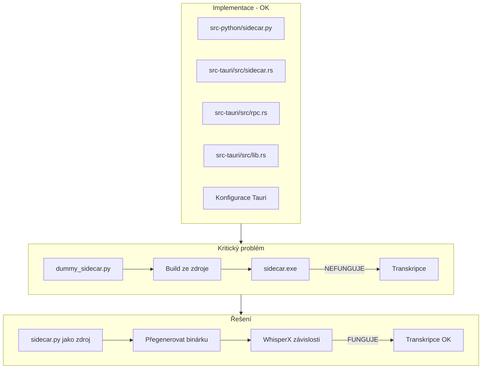

# Analýza NEXT_SESSION.md - Stav implementace

**Cesta:** plans\next_session_analysis.md
**Verze:** 1.0
**Vytvoreno:** 2026-02-15 19:28 (UTC+1)
**Posledni zmena:** 2026-02-15 19:28 (UTC+1)

## Historie zmen

| Datum | Verze | Popis zmeny |
|-------|-------|-------------|
| 2026-02-15 | 1.0 | Pridana metadata |

## Stav

- [x] Metadata pridana
- [ ] Obsah dokumentu kompletni

---
**Vytvořeno:** 2026-02-15 04:00 (UTC+1)
**Zdroj:** NEXT_SESSION.md (z 2026-02-14 20:00)

---

## Shrnutí

Session z 20:00 hlásila "WhisperX integrace DOKONCENA", ale po ověření zjištěno, že **kód je správně, ale binárka NEBYLA přegenerována**.

---

## Co je SPRÁVNĚ UDĚLÁNO

### 1. Python Sidecar ([`src-python/sidecar.py`](src-python/sidecar.py))
- **Stav:** Implementováno
- **Funkce:**
  - JSON-RPC 2.0 server na stdin/stdout
  - WhisperX integrace s modelem, alignem a diarization
  - Robustní logování na stderr s prefixem `[LOG]`
  - Správné error handling s JSON-RPC kódy
- **Verifikace:** Soubor existuje, má 335 řádků, kompletní implementace

### 2. Rust Sidecar Manager ([`src-tauri/src/sidecar.rs`](src-tauri/src/sidecar.rs))
- **Stav:** Implementováno
- **Funkce:**
  - `SidecarManager` pro lifecycle management
  - Async komunikace přes stdin/stdout
  - Timeout 30s pro požadavky
  - Graceful shutdown
- **Verifikace:** Soubor existuje, má 167 řádků

### 3. JSON-RPC datové struktury ([`src-tauri/src/rpc.rs`](src-tauri/src/rpc.rs))
- **Stav:** Implementováno
- **Funkce:**
  - `RpcMethod` enum se všemi metodami
  - `RpcRequest`, `RpcResponse`, `RpcError` struktury
  - Unit testy pro serializaci/deserializaci
- **Verifikace:** Soubor existuje, má 217 řádků, 5 unit testů

### 4. Tauri integrace ([`src-tauri/src/lib.rs`](src-tauri/src/lib.rs))
- **Stav:** Implementováno
- **Funkce:**
  - Export modulu `rpc` a `sidecar`
  - `AppState` s `Arc<Mutex<SidecarManager>>`
  - Tauri příkazy: `init_sidecar`, `start_recording`, `stop_recording`, `transcribe`
- **Verifikace:** Soubor existuje, má 86 řádků

### 5. Cargo závislosti ([`src-tauri/Cargo.toml`](src-tauri/Cargo.toml))
- **Stav:** Správné
- **Závislosti:**
  - `tauri-plugin-shell = "2"` - pro sidecar
  - `tokio` s features `sync`, `macros`, `rt`, `rt-multi-thread`
  - `serde` a `serde_json`

### 6. Tauri konfigurace ([`src-tauri/tauri.conf.json`](src-tauri/tauri.conf.json))
- **Stav:** Správné
- **Konfigurace:**
  - `bundle.externalBin: ["binaries/sidecar"]`
  - `plugins.shell.sidecar: true`
  - `plugins.shell.scope` s sidecar definicí

### 7. Capabilities ([`src-tauri/capabilities/default.json`](src-tauri/capabilities/default.json))
- **Stav:** Správné
- **Oprávnění:**
  - `shell:allow-spawn`, `shell:allow-execute`, `shell:allow-kill`
  - `shell:allow-open` s sidecar podporou

---

## Co je ŠPATNÉ / PROBLÉMY

### KRITICKÝ PROBLÉM: Sidecar binárka

**Problém:** Existující binárka [`sidecar-x86_64-pc-windows-msvc.exe`](src-tauri/binaries/sidecar-x86_64-pc-windows-msvc.exe) byla vytvořena z **dummy_sidecar.py**, NE z plného sidecar.py!

**Důkaz:**
- [`sidecar-x86_64-pc-windows-msvc.spec`](src-tauri/binaries/sidecar-x86_64-pc-windows-msvc.spec:5) ukazuje:
  ```python
  a = Analysis(
      ['dummy_sidecar.py'],  # <-- ŠPATNĚ! Má být sidecar.py
      ...
  )
  ```

- [`dummy_sidecar.py`](src-tauri/binaries/dummy_sidecar.py) je jen placeholder:
  ```python
  if __name__ == "__main__":  
      print('{"jsonrpc":"2.0","result":{"status":"ready"},"id":1}')
  ```

**Důsledek:** Transkripce **NEBUDE FUNGOVAT** s touto binárkou - vrací jen statickou JSON odpověď!

---

## Co CHYBÍ

### 1. Přegenerování sidecar binárky
- **Stav:** NEPROVEDENO
- **Požadováno:** PyInstaller build z `src-python/sidecar.py`
- **Poznámka:** Musí zahrnout WhisperX a všechny závislosti (torch, whisperx, etc.)

### 2. Diarization
- **Stav:** Kód připraven, ale netestováno
- **Požadováno:** HF token v konfiguraci
- **Poznámka:** Viz [`sidecar.py:224-233`](src-python/sidecar.py:224)

### 3. GPU podpora
- **Stav:** Kód připraven, ale netestováno
- **Požadováno:** CUDA device v konfiguraci
- **Poznámka:** Viz [`sidecar.py:133`](src-python/sidecar.py:133)

### 4. Verifikace commitu
- **Stav:** Neověřeno
- **Požadováno:** Ověřit, zda jsou soubory commitnuty a pushnuty
- **Poznámka:** NEXT_SESSION.md uvádí "7 ahead of origin"

---

## Doporučené akce

### Priorita 1: Přegenerovat sidecar binárku

```powershell
# Vytvořit nový spec soubor pro plný sidecar
cd src-tauri/binaries

# Vygenerovat spec soubor
pyi-makespec --onefile --name sidecar-x86_64-pc-windows-msvc ../../src-python/sidecar.py

# Nebo upravit existující spec:
# Změnit ['dummy_sidecar.py'] na ['../../src-python/sidecar.py']

# Build
pyinstaller sidecar-x86_64-pc-windows-msvc.spec
```

### Priorita 2: Ověřit commity

```powershell
git status
git log --oneline -5
```

### Priorita 3: Otestovat transkripci

Po přegenerování binárky otestovat s `jfk.wav`.

---

## Vizualizace problému



---

## Závěr

**Kvalita kódu:** Vysoká - Rust i Python implementace jsou profesionální a kompletní.

**Hlavní problém:** Binárka nebyla přegenerována, takže transkripce nebude fungovat v produkčním prostředí.

**Doporučení:** Okamžitě přegenerovat sidecar binárku z plného `sidecar.py` s WhisperX závislostmi.

---

*Analýza vytvořena: 2026-02-15 04:00 (UTC+1)*
