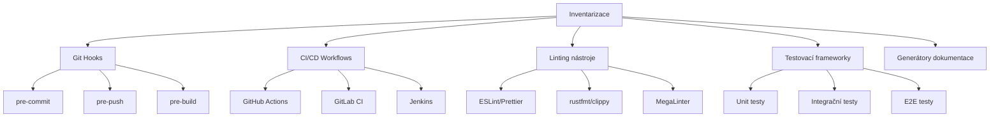
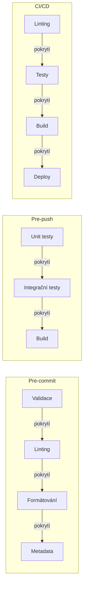
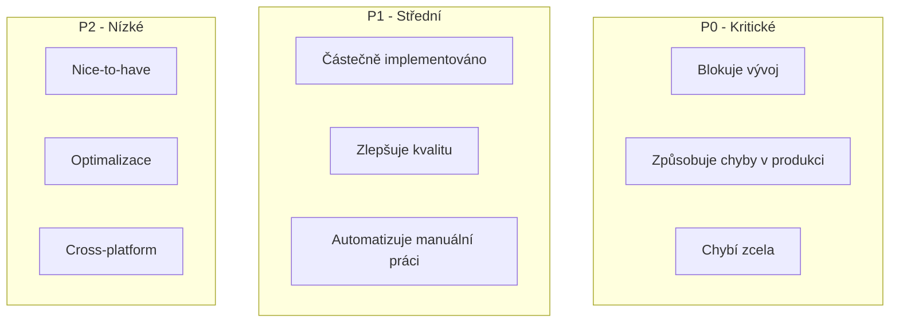
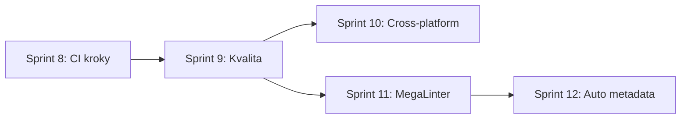
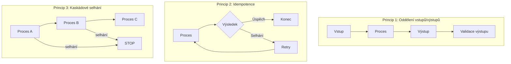
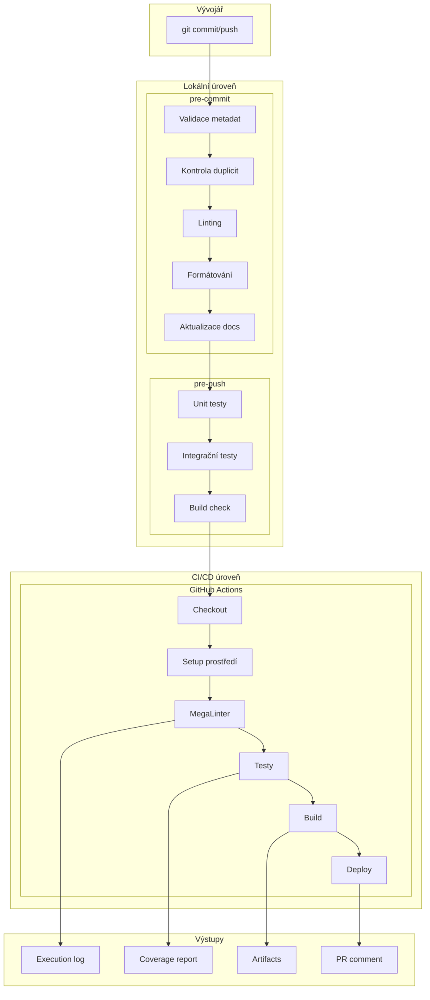
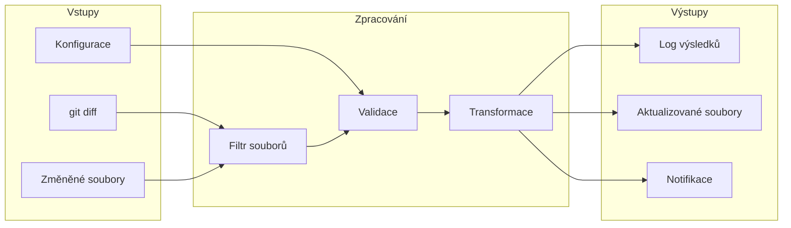
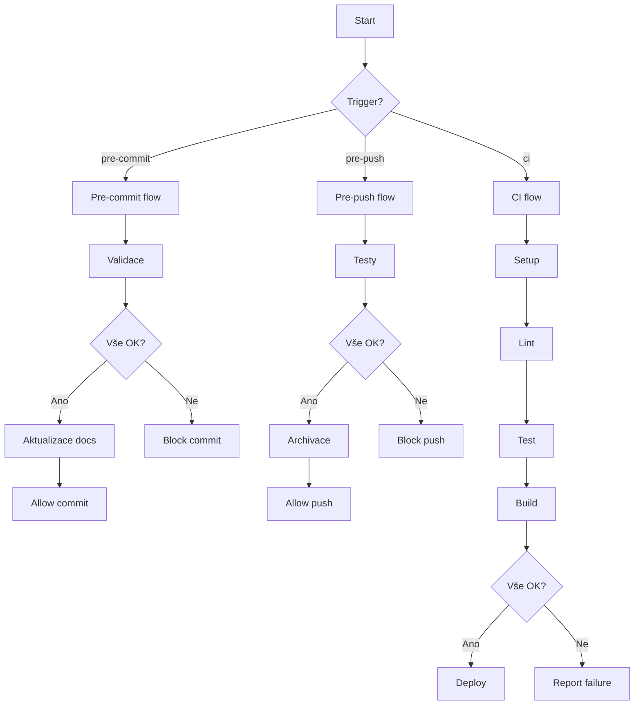

# Metodika analýzy a plánování priorit

**Cesta:** plans/priority_analysis_methodology.md
**Verze:** 1.0
**Vytvoreno:** 2026-02-17 06:29 (UTC+1)
**Posledni zmena:** 2026-02-17 06:29 (UTC+1)

## Historie zmen

| Datum | Verze | Popis zmeny |
|-------|-------|-------------|
| 2026-02-17 | 1.0 | Vytvoření metodiky |

## Stav

- [x] Metodika definována
- [ ] Aplikována na aktuální projekt

---

## 1. Cíl

Poskytnout obecně použitelný postup pro analýzu a vytvoření kompletního plánu priorit automatizace a kvality kódu.

---

## 2. Krok 1: Inventarizace existujících nástrojů

### 2.1 Identifikace automatizačních nástrojů



### 2.2 Kontrolní seznam

| Kategorie | Nástroj | Stav | Poznámka |
|-----------|---------|------|----------|
| Git Hooks | Husky | ✅/❌ | |
| CI/CD | GitHub Actions | ✅/❌ | |
| Linting | ESLint | ✅/❌ | |
| Linting | Prettier | ✅/❌ | |
| Linting | rustfmt | ✅/❌ | |
| Linting | MegaLinter | ✅/❌ | |
| Testování | Jest/Vitest | ✅/❌ | |
| Testování | cargo test | ✅/❌ | |
| Dokumentace | Automatický update | ✅/❌ | |

---

## 3. Krok 2: Analýza mezer (Gap Analysis)

### 3.1 Matice pokrytí



### 3.2 Identifikace chybějících kontrol

| Fáze | Požadovaná kontrola | Existuje? | Priorita |
|------|---------------------|-----------|----------|
| pre-commit | Kontrola duplicit | ✅ | - |
| pre-commit | Linting (ESLint) | ❌ | P0 |
| pre-commit | Formátování (Prettier) | ❌ | P0 |
| pre-commit | Metadata dokumentů | ✅ | - |
| pre-push | Unit testy | ✅ | - |
| pre-push | Integrační testy | ❌ | P1 |
| CI | MegaLinter | ❌ | P0 |
| CI | Test coverage | ❌ | P1 |

---

## 4. Krok 3: Prioritizace

### 4.1 Matice závažnosti



### 4.2 Kritéria pro prioritizaci

| Kritérium | Váha | P0 | P1 | P2 |
|-----------|------|-----|-----|-----|
| Blokuje vývoj | 5 | Ano | Částečně | Ne |
| Způsobuje chyby | 4 | Často | Občas | Zřídka |
| Úsilí implementace | 3 | Nízké | Střední | Vysoké |
| Dopad na kvalitu | 3 | Vysoký | Střední | Nízký |
| Frekvence použití | 2 | Každý commit | Každý push | Občas |

---

## 5. Krok 4: Vytvoření sprintů

### 5.1 Šablona sprintu

```markdown
### Sprint X: [Název] (P0/P1/P2)

**Cíl:** [Jasný cíl sprintu]

**Úkoly:**
- [ ] Úkol 1
- [ ] Úkol 2
- [ ] Úkol 3

**Akceptační kritéria:**
- [ ] Kritérium 1
- [ ] Kritérium 2

**Závislosti:**
- Sprint Y musí být dokončen

**Odhad:** [nízký/střední/vysoký]
```

### 5.2 Pořadí sprintů

1. **P0 sprinty** - kritické problémy
2. **P1 sprinty** - vylepšení kvality
3. **P2 sprinty** - nice-to-have

---

## 6. Krok 5: Validace plánu

### 6.1 Kontrolní seznam

- [ ] Všechny P0 problémy mají sprint
- [ ] Závislosti mezi sprinty jsou definovány
- [ ] Akceptační kritéria jsou měřitelná
- [ ] Plán je aktualizován v NEXT_SESSION.md

### 6.2 Mermaid diagram plánu



---

## 7. Opakovaně použitelný checklist

### 7.1 Inventarizace
- [ ] Seznam všech existujících nástrojů
- [ ] Seznam všech existujících workflow
- [ ] Seznam všech existujících skriptů

### 7.2 Gap Analysis
- [ ] Matice pokrytí pre-commit
- [ ] Matice pokrytí pre-push
- [ ] Matice pokrytí CI/CD
- [ ] Seznam chybějících kontrol

### 7.3 Prioritizace
- [ ] Klasifikace P0/P1/P2
- [ ] Vážení podle kritérií
- [ ] Seřazení podle priority

### 7.4 Plánování
- [ ] Definice sprintů
- [ ] Akceptační kritéria
- [ ] Závislosti
- [ ] Aktualizace NEXT_SESSION.md

---

## 8. Návrh logiky procesů a provázaností

### 8.1 Základní principy



### 8.2 Kompletní architektura automatizace



### 8.3 Datové toky mezi procesy



### 8.4 Matice závislostí procesů

| Proces | Závisí na | Poskytuje pro | Vstup | Výstup |
|--------|-----------|---------------|-------|--------|
| check-duplicates | - | validate-metadata | Seznam souborů | Pass/Fail |
| validate-metadata | check-duplicates | update-docs | .md soubory | Pass/Fail |
| update-docs | validate-metadata | validate-constitution | QA_REPORT.md | Aktualizovaný soubor |
| validate-constitution | update-docs | - | CONSTITUTION.md | Pass/Fail |
| rust-tests | - | - | src-tauri/ | Pass/Fail |
| MegaLinter | - | - | Celý projekt | Lint report |

### 8.5 Pravidla pro návrh procesů

#### 8.5.1 Single Responsibility
```
Každý proces má jednu odpovědnost:
- check-duplicates: pouze kontrola duplicit
- validate-metadata: pouze validace metadat
- update-docs: pouze aktualizace dokumentace
```

#### 8.5.2 Fail Fast
```
Procesy selžou co nejdříve:
1. Validace vstupů
2. Zpracování
3. Validace výstupů
```

#### 8.5.3 Graceful Degradation
```
Při selhání:
- Povinné kroky: block (zastavit)
- Volitelné kroky: warn (pokračovat s varováním)
- Informační kroky: ignore (pokračovat bez varování)
```

### 8.6 Konfigurace závislostí

```json
{
  "steps": [
    {
      "id": "validate-metadata",
      "dependsOn": ["check-duplicates"],
      "onFailure": "block"
    },
    {
      "id": "update-docs",
      "dependsOn": ["validate-metadata"],
      "onFailure": "block"
    },
    {
      "id": "rust-tests",
      "dependsOn": [],
      "onFailure": "block"
    }
  ]
}
```

### 8.7 Diagram rozhodování



### 8.8 Šablona pro dokumentaci procesu

```markdown
## Proces: [Název]

### Základní informace
- **ID:** [identifikátor]
- **Trigger:** [pre-commit/pre-push/ci]
- **Priorita:** [P0/P1/P2]

### Vstupy
- Vstup 1: [popis]
- Vstup 2: [popis]

### Výstupy
- Výstup 1: [popis]
- Výstup 2: [popis]

### Závislosti
- Závisí na: [seznam procesů]
- Poskytuje pro: [seznam procesů]

### Chování při selhání
- onFailure: [block/warn/ignore]

### Příklad konfigurace
\`\`\`json
{
  "id": "...",
  "command": "...",
  "expectedOutput": "..."
}
\`\`\`
```

---

## 9. Příklad aplikace na aktuální projekt

### 8.1 Inventarizace (hotovo)

| Nástroj | Stav |
|---------|------|
| Husky | ✅ |
| pre-commit hooks | ✅ |
| pre-push hooks | ✅ |
| GitHub Actions | ✅ |
| MegaLinter config | ✅ (ale není v CI) |
| ESLint | ❌ |
| Prettier | ❌ |
| rustfmt | ❌ |

### 8.2 Gap Analysis (hotovo)

| Fáze | Chybějící kontrola | Priorita |
|------|-------------------|----------|
| CI | MegaLinter | P0 |
| pre-commit | Automatická metadata | P0 |
| pre-commit | Linting | P0 |
| pre-commit | CHANGE_LOG.md update | P1 |

### 8.3 Výsledné sprinty

- **Sprint 11:** MegaLinter integrace (P0)
- **Sprint 12:** Automatická aktualizace metadat (P0)
- **Sprint 13:** Linting integrace (P0)
- **Sprint 14:** CHANGE_LOG.md automatizace (P1)

---

## Historie změn

| Datum | Verze | Popis změny |
|-------|-------|-------------|
| 2026-02-17 | 1.0 | Vytvoření metodiky |

---

*Vytvořeno: 2026-02-17 06:29 (UTC+1)*
