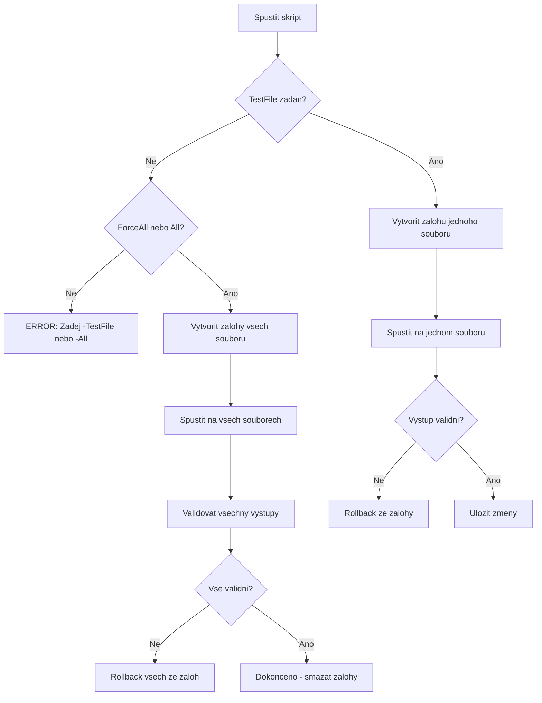

# Plán obnovy a bezpenostních mechanismów

**Cesta:** plans/recovery_and_safety_plan.md
**Verze:** 1.2
**Vytvoreno:** 2026-02-17 13:50 (UTC+1)
**Posledni zmena:** 2026-02-18 20:23 (UTC+1)

## Stav

- [x] Metadata pridana
- [ ] Obsah dokumentu kompletni

---

## 1. Souhrn problému

### 1.1 Co se stalo
- Skript `scripts/update_metadata.ps1` pokodil 25 markdown souborów
- Pwvodní chyba: PowerShell interpolace `$1$newVersion` se vyhodnotila jako prázdný + verze
- Výsledek: `**Verze:** 1.0` se zmenil na `**Verze:** 1.1` místo `**Verze:** 1.1`

### 1.2 Soucasný stav
- **Skript je jiz opraven** (radky 72, 75 pouzivaji `` `${1}$newVersion ``)
- **25 souboru je stale poskozenych** s `**Verze:** 1.1` nebo `**Verze:** 1.2`
- **Zalohy neexistuji** - skript nemel mechanismus pro zalohy

---

## 2. Seznam poskozenych souboru

```
ARCHITECTURE.md
CHANGE_LOG.md
README.md
GOVERNANCE.md
CONSTITUTION.md
VISION.md
INDEX.md
ORGANIZATION.md
QA_REPORT.md
LOGS_AND_PROMPTS.md
TEST_INSPIRATION.md
PROMPT_HISTORY.md
PROPOSED_FIXES.md
automation_audit.md
documentation_analysis.md
test-make-new-file.md
logs/README.md
plans/documentation_automation_improvements.md
plans/documentation_automation_improvements_v2.md
plans/critical_workflow_failure_analysis.md (obsahuje **Verze:** 1.0 ve vysvetleni - OK)
sandbox/portable_bench/FINAL_TEST_REPORT.md
sandbox/portable_bench/README.md
sandbox/portable_bench/TEST_REPORT.md
CRITICAL_ANALYSIS.md
```

**Celkem:** 24 souboru k obnove (critical_workflow_failure_analysis.md je vyjimka - tam je to v prikladu)

---

## 3. Fáze 1: Obnova souboru

### 3.1 Moznosti obnovy

#### A. Git checkout (pokud soubory nebyly commitnuty s chybou)
```powershell
# Zjistit stav git
git status

# Pokud jsou soubory ve staging area nebo working directory:
git checkout -- "*.md"

# Nebo pro konkretne soubory:
git checkout -- ARCHITECTURE.md CHANGE_LOG.md README.md ...
```

#### B. Git revert (pokud byly commitnuty s chybou)
```powershell
# Najit commit s chybou
git log --oneline -10

# Revert commitu
git revert <commit-hash>
```

#### C. Rucon oprava (pokud neni cista zaloha)
```powershell
# Vytvorit opravny skript
# Nahradit: \$1(\d+\.\d+) za **Verze:** $1
```

### 3.2 Doporuceny postup

1. **Zjistit stav git** - `git status` a `git log --oneline -5`
2. **Pokud jsou soubory ve working directory/staged:**
   - `git checkout -- "*.md"` pro obnovu z posledniho commitu
3. **Pokud byly commitnuty s chybou:**
   - `git revert <commit>` pro vraceni zmen
4. **Pokud neni cista zaloha:**
   - Vytvorit opravny skript `scripts/fix_corrupted_metadata.ps1`

---

## 4. Fáze 2: Verifikace opravy skriptu

### 4.1 Kontrola opraveneho skriptu

Skript `scripts/update_metadata.ps1` jiz obsahuje spravnou syntaxi:

```powershell
# Radka 72 - SPRAVNE
$content = $content -replace "(\*\*Verze:\*\*\s*)\d+\.\d+", "`${1}$newVersion"

# Radka 75 - SPRAVNE
$content = $content -replace "(\*\*Posledni zmena:\*\*\s*)\d{4}-\d{2}-\d{2}(?: \d{2}:\d{2})?(?: \(UTC\+\d\))?", "`${1}$timestamp (UTC+1)"
```

### 4.2 Testovani opravy

1. Vytvorit testovaci soubor s metadaty
2. Spustit skript s `-DryRun`
3. Ovefit, ze vystup je spravny
4. Spustit na jednom souboru bez `-DryRun`
5. Ovefit vysledek

---

## 5. Fáze 3: Bezpecnostni mechanismy

### 5.1 Automaticke zalohy

```powershell
function Backup-File {
    param([string]$FilePath)
    
    $backupDir = "logs/backups"
    if (-not (Test-Path $backupDir)) {
        New-Item -ItemType Directory -Path $backupDir | Out-Null
    }
    
    $timestamp = Get-Date -Format "yyyyMMdd_HHmmss"
    $fileName = Split-Path $FilePath -Leaf
    $backupPath = "$backupDir/$fileName.$timestamp.bak"
    
    Copy-Item $FilePath $backupPath
    Write-Log "BACKUP: $backupPath" -Level "INFO"
    return $backupPath
}
```

### 5.2 Validace vystupu

```powershell
function Test-OutputValid {
    param([string]$Content)
    
    # Kontrola, ze verze je ve spravnem formatu
    if ($Content -match "\*\*Verze:\*\*\s*\$\d+") {
        Write-Log "ERROR: Corrupted version format detected" -Level "ERROR"
        return $false
    }
    
    # Kontrola, ze timestamp je ve spravnem formatu
    if ($Content -match "\*\*Posledni zmena:\*\*\s*\$\d+") {
        Write-Log "ERROR: Corrupted timestamp format detected" -Level "ERROR"
        return $false
    }
    
    return $true
}
```

### 5.3 Rollback mechanismus

```powershell
function Restore-FromBackup {
    param([string]$FilePath)
    
    $backupDir = "logs/backups"
    $fileName = Split-Path $FilePath -Leaf
    $latestBackup = Get-ChildItem "$backupDir/$fileName.*.bak" -ErrorAction SilentlyContinue | 
                    Sort-Object LastWriteTime -Descending | 
                    Select-Object -First 1
    
    if ($latestBackup) {
        Copy-Item $latestBackup.FullName $FilePath
        Write-Log "RESTORED: $FilePath from $($latestBackup.Name)" -Level "SUCCESS"
        return $true
    }
    
    Write-Log "NO BACKUP FOUND: $FilePath" -Level "ERROR"
    return $false
}
```

### 5.4 Test na jednom souboru

```powershell
param(
    [string]$TestFile,   # Pokud zadan, testuje pouze tento soubor
    [switch]$ForceAll    # Pouze s explicitnim souhlasem
)

if (-not $TestFile -and -not $All -and -not $ForceAll) {
    Write-Host "ERROR: Musite zadat -TestFile <path>, -All, nebo -ForceAll" -ForegroundColor Red
    Write-Host "  -TestFile  : Testuje pouze jeden soubor (doporucono)" -ForegroundColor Yellow
    Write-Host "  -All       : Aktualizuje vsechny sledovane .md soubory" -ForegroundColor Yellow
    Write-Host "  -ForceAll  : Aktualizuje vsechny soubory bez potvrzeni" -ForegroundColor Red
    exit 1
}
```

---

## 6. Workflow pro bezpecne spusteni



---

## 7. Implementacni kroky

### Sprint 13: Obnova souboru (P0)

| Krok | Akce | Odpovednost |
|------|------|-------------|
| 13.1 | Zjistit stav git | Code mod |
| 13.2 | Obnovit soubory z git | Code mod |
| 13.3 | Verifikovat obnovu | Architect mod |
| 13.4 | Vytvorit opravny skript (pokud treba) | Code mod |

**Akceptacni kriteria:**
- [ ] Vsechny 24 souboru maji spravne metadata
- [ ] Validace metadat proslo bez chyb
- [ ] Git neobsahuje poskozene soubory

### Sprint 14: Bezpecnostni mechanismy (P0)

| Krok | Akce | Odpovednost |
|------|------|-------------|
| 14.1 | Pridat Backup-File funkci | Code mod |
| 14.2 | Pridat Test-OutputValid funkci | Code mod |
| 14.3 | Pridat Restore-FromBackup funkci | Code mod |
| 14.4 | Pridat parametr -TestFile | Code mod |
| 14.5 | Integrovat do hlavni logiky | Code mod |
| 14.6 | Otestovat na jednom souboru | Code mod |
| 14.7 | Otestovat rollback | Code mod |

**Akceptacni kriteria:**
- [ ] Skript vytvari zalohy pred zmenami
- [ ] Skript validuje vystup po zmenach
- [ ] Skript umoznuje rollback
- [ ] Skript vyzaduje -TestFile nebo -ForceAll

---

## 8. Preventivni opatreni

### 8.1 Pravidla pro skripty

1. **Vzdy implementovat DryRun mode**
2. **Vzdy vytvaret zalohy**
3. **Vzdy validovat vystup**
4. **Vzdy testovat na jednom souboru**
5. **Vzdy implementovat rollback**

### 8.2 Pravidla pro spousteni

1. **Nikdy nespoustet na vsech souborech bez testu**
2. **Vzdy overit vystup po spusteni**
3. **Vzdy mit moznost rollback**

### 8.3 Dokumentace

1. **Kazdy skript musi mit dokumentaci**
2. **Kazdy skript musi mit priklady pouziti**
3. **Kazdy skript musi mit varovani**

---

## 9. Dalsi kroky

1. **Prepnout do Code modu** pro implementaci obnovy
2. **Zjistit stav git** a zvolit strategii obnovy
3. **Obnovit soubory**
4. **Implementovat bezpecnostni mechanismy**
5. **Otestovat**

---

## 10. Efektivni postup pro Run on Save (budu se ho drzet)

1. **Zmerit realny stav**: potvrdit, co dnes automaticky bezi (hooky + workflow_guard) a co ne. (HOTOVO)
2. **Navrhnout minimalni Run on Save**: jen rychle a idempotentni kroky (update_metadata + validate_document_metadata). (HOTOVO)
3. **Zavest Run on Save ve VS Code**: upravit `.vscode/settings.json` a pridat prikaz na skript. (HOTOVO)
4. **Gating podle zmen**: spoustet jen pri zmenach `.md` nebo ridicich souboru. (HOTOVO)
5. **Zajistit fallback**: pre-commit zůstane jako pojistka (bez auto-zmen). (HOTOVO)
6. **Audit a log**: jeden log s poslednimi 3 spustenimi + jasny status. (MIMO SCOPE)
7. **Overit funkci**: simulace zmen `.md` a kontrola, ze se zmenil timestamp a log. (TED PROBIEHA)
8. **Zamknout dokumentaci**: popsat stav v dokumentu + aktualizovat diagram. (NADOSET)

### Overeni Run on Save (prakticky test)

- Otevri `.md` s metadaty, uloz, a over, ze se zmenil `**Verze:**` a `**Posledni zmena:**`.
- Zkontroluj `logs/runonsave.log`, ze obsahuje `UPDATED <soubor> vX.Y`.
- Pokud chces automaticke strazeni, spust `pwsh scripts/watch_docs.ps1` — ohlasuje spuštění Run on Save.
- Pro rychlou kontrolu configu a logu pouzij `pwsh scripts/check_run_on_save.ps1`.

---

## Historie zmen

| Datum | Verze | Popis zmeny |
|-------|-------|-------------|
| 2026-02-17 | 1.0 | Vytvoreni planu obnovy a bezpecnostnich mechanismu |

---

*Vytvoreno: 2026-02-17 13:50 (UTC+1)*
