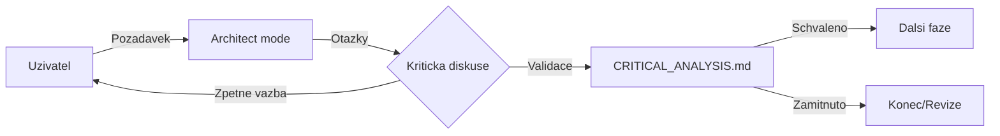
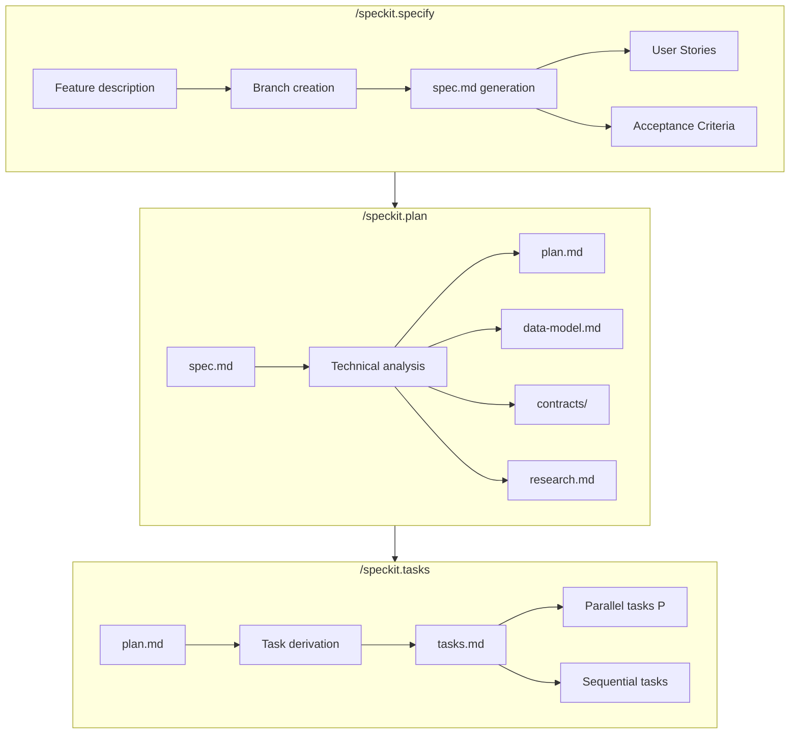
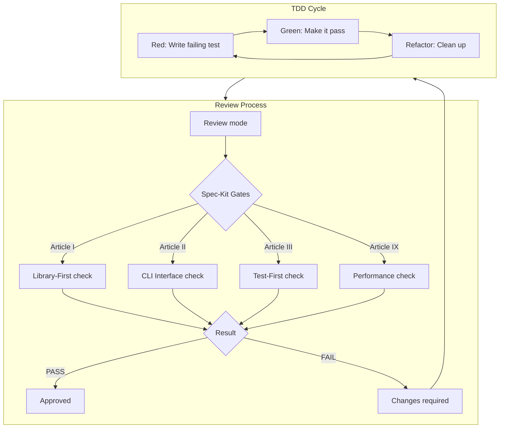
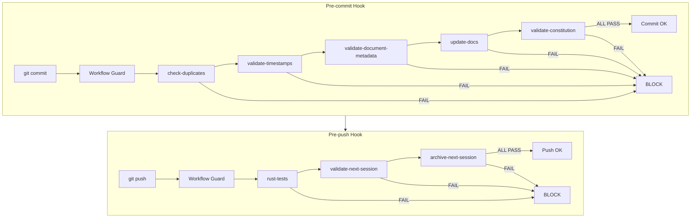
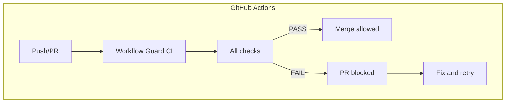

# Kompletni proces kodovani: SDD Workflow

**Cesta:** plans\sdd_complete_workflow_diagram.md
**Verze:** 1.0
**Vytvoreno:** 2026-02-15 19:28 (UTC+1)
**Posledni zmena:** 2026-02-15 19:28 (UTC+1)

## Historie zmen

| Datum | Verze | Popis zmeny |
|-------|-------|-------------|
| 2026-02-15 | 1.0 | Pridana metadata |

## Stav

- [x] Metadata pridana
- [ ] Obsah dokumentu kompletni

---
**Verze:** 1.0
**Vytvoreno:** 2026-02-15 14:15 (UTC+1)
**Status:** Diagram kompletniho procesu

---

## 1. Prehled fazi

| Faze | Nazev | Vstup | Vystup | Odpovedny dokument |
|------|-------|-------|--------|-------------------|
| 0 | Idea | Pozadavek uzivatele | Vague idea | - |
| 1 | Kriticka diskuse | Vague idea | Validovana idea | CRITICAL_ANALYSIS.md |
| 2 | Specifikace | Validovana idea | spec.md | /speckit.specify |
| 3 | Planovani | spec.md | plan.md, data-model.md, contracts/ | /speckit.plan |
| 4 | Taskovani | plan.md | tasks.md | /speckit.tasks |
| 5 | Implementace | tasks.md | Kod + testy | Code mode |
| 6 | Review | Kod | Schvaleni/zmeny | .agent/workflows/review.md |
| 7 | Commit | Schvaleny kod | Git commit | Pre-commit hook |
| 8 | Push | Commit | Remote branch | Pre-push hook |
| 9 | CI/CD | Push | Validace | GitHub Actions |

---

## 2. Diagram kompletniho procesu (Mermaid)

```mermaid
flowchart TB
    subgraph Faze0["Faze 0: Idea"]
        A0[Uzivatelsky pozadavek] --> A1[Vague Idea]
        A1 --> A2{Kriticka diskuse}
    end
    
    subgraph Faze1["Faze 1: Kriticka diskuse"]
        A2 -->|Otazky| B1[Analyza pozadavku]
        B1 --> B2[Smerovani rozhodnuti]
        B2 --> B3[Validovana idea]
        B2 -->|Zamitnuto| A1
    end
    
    subgraph Faze2["Faze 2: Specifikace"]
        B3 --> C1[/speckit.specify]
        C1 --> C2[Vytvoreni vetve]
        C2 --> C3[specs/XXX/spec.md]
        C3 --> C4[User Stories]
        C3 --> C5[Acceptance Criteria]
    end
    
    subgraph Faze3["Faze 3: Planovani"]
        C4 --> D1[/speckit.plan]
        C5 --> D1
        D1 --> D2[plan.md]
        D1 --> D3[data-model.md]
        D1 --> D4[contracts/]
        D1 --> D5[research.md]
    end
    
    subgraph Faze4["Faze 4: Taskovani"]
        D2 --> E1[/speckit.tasks]
        D3 --> E1
        D4 --> E1
        E1 --> E2[tasks.md]
        E2 --> E3[Paralelni tasky P]
        E2 --> E4[Sekvencni tasky]
    end
    
    subgraph Faze5["Faze 5: Implementace"]
        E3 --> F1[Code mode]
        E4 --> F1
        F1 --> F2[TDD: Red faze]
        F2 --> F3[TDD: Green faze]
        F3 --> F4[TDD: Refactor faze]
        F4 --> F5[Kod + testy]
    end
    
    subgraph Faze6["Faze 6: Review"]
        F5 --> G1[Review mode]
        G1 --> G2{Spec-Kit Compliance}
        G2 -->|PASS| G3[Schvaleno]
        G2 -->|FAIL| G4[Zmeny pozadovany]
        G4 --> F1
    end
    
    subgraph Faze7["Faze 7: Commit - Pre-commit Hook"]
        G3 --> H1[git add]
        H1 --> H2[git commit]
        H2 --> H3[Pre-commit Hook]
        H3 --> H4{Workflow Guard}
        H4 --> H5[check-duplicates]
        H5 --> H6[validate-timestamps]
        H6 --> H7[validate-document-metadata]
        H7 --> H8[update-docs]
        H8 --> H9[validate-constitution]
        H9 -->|ALL PASS| H10[Commit Allowed]
        H5 -->|FAIL| Z1[BLOCK]
        H6 -->|FAIL| Z1
        H7 -->|FAIL| Z1
        H8 -->|FAIL| Z1
        H9 -->|FAIL| Z1
    end
    
    subgraph Faze8["Faze 8: Push - Pre-push Hook"]
        H10 --> I1[git push]
        I1 --> I2[Pre-push Hook]
        I2 --> I3{Workflow Guard}
        I3 --> I4[rust-tests]
        I4 --> I5[validate-next-session]
        I5 --> I6[archive-next-session]
        I6 -->|ALL PASS| I7[Push Allowed]
        I4 -->|FAIL| Z2[BLOCK]
        I5 -->|FAIL| Z2
        I6 -->|FAIL| Z2
    end
    
    subgraph Faze9["Faze 9: CI/CD"]
        I7 --> J1[GitHub Actions]
        J1 --> J2[Workflow Guard CI]
        J2 --> J3{All checks pass?}
        J3 -->|YES| J4[Merge allowed]
        J3 -->|NO| J5[PR blocked]
        J5 --> F1
    end
    
    subgraph Dokumentace["Prubezna dokumentace"]
        K1[CONSTITUTION.md] -.->|Pravidla| G2
        K2[VISION.md] -.->|Smer| C1
        K3[GOVERNANCE.md] -.->|Watchdogs| H4
        K4[NEXT_SESSION.md] -.->|Kontext| B1
        K5[QA_REPORT.md] -.->|Stav| J2
    end
```

---

## 3. Detailni popis fazi

### 3.1 Faze 0-1: Idea a Kriticka diskuse



**Klicove aktivity:**
- Analyza pozadavku proti VISION.md
- Kontrola souladu s CONSTITUTION.md
- Identifikace rizik a omezeni
- Rozhodnuti o pokracovani

### 3.2 Faze 2-4: Spec-Kit prikazy



### 3.3 Faze 5-6: Implementace a Review



### 3.4 Faze 7-8: Git Hooks (Workflow Guard)



### 3.5 Faze 9: CI/CD



---

## 4. Nine Articles of Development (Spec-Kit)

| Article | Nazev | Popis |
|---------|-------|-------|
| I | Library-First | Nova logika v samostatne knihovne |
| II | CLI Interface | Python sidecar funkcni jako standalone CLI |
| III | Test-First | Testy doprovazi implementaci |
| IV | Spec Alignment | Zmeny reflektovany v spec.md |
| V | JSON-RPC Contract | Komunikace pres JSON-RPC over stdio |
| VI | Schema Sync | Rust Serde a Python Pydantic synchronizovany |
| VII | CPU/RAM Gate | Beh na 4-5 letych office notebooku |
| VIII | Privacy | Zadne uniky citlivych dat |
| IX | Performance | CPU-only, bez GPU pozadavku |

---

## 5. Watchdog System (GOVERNANCE.md)

| Pillir | Watchdog | Mechanismus | Trigger |
|--------|----------|-------------|---------|
| Data Privacy | Danger JS | Kontrola sitovych volani | Pull Request |
| Code Review | Review Workflow | Spec-Kit audit | Pre-Commit / PR |
| Documentation | Autonomous Doc Controller | Verifikace cest | Lokalni |
| Code Integrity | GitHub CI | cargo test, vitest | Push / PR |
| Release Quality | Release-Please | CHANGELOG, versioning | Merge to Master |
| Doc Standards | MegaLinter | Markdown formatting | Push / PR |
| System Health | QA Report | Agregace test logu | Continuous |

---

## 6. Graphviz DOT format

Pro generovani SVG diagramu pomoci Graphviz:

```dot
digraph SDD_Workflow {
    rankdir=TB;
    node [shape=box, style="rounded,filled", fontname="Arial"];
    edge [fontname="Arial"];
    
    // Faze 0-1
    subgraph cluster_idea {
        label="Faze 0-1: Idea a Kriticka diskuse";
        style=filled;
        color=lightblue;
        
        idea [label="Uzivatelsky pozadavek", shape=oval, fillcolor=lightgreen];
        vague [label="Vague Idea", fillcolor=white];
        critical [label="Kriticka diskuse", shape=diamond, fillcolor=lightyellow];
        validated [label="Validovana idea", fillcolor=lightgreen];
    }
    
    // Faze 2-4
    subgraph cluster_spec {
        label="Faze 2-4: Spec-Kit";
        style=filled;
        color=lightyellow;
        
        specify [label="/speckit.specify", fillcolor=white];
        spec [label="spec.md", fillcolor=lightgreen];
        plan [label="/speckit.plan", fillcolor=white];
        plan_md [label="plan.md", fillcolor=lightgreen];
        tasks [label="/speckit.tasks", fillcolor=white];
        tasks_md [label="tasks.md", fillcolor=lightgreen];
    }
    
    // Faze 5-6
    subgraph cluster_impl {
        label="Faze 5-6: Implementace a Review";
        style=filled;
        color=lightgreen;
        
        code [label="Code mode", fillcolor=white];
        tdd [label="TDD Cycle", fillcolor=lightyellow];
        review [label="Review mode", fillcolor=white];
        approved [label="Schvaleno", shape=oval, fillcolor=lightgreen];
    }
    
    // Faze 7-8
    subgraph cluster_hooks {
        label="Faze 7-8: Git Hooks";
        style=filled;
        color=lightcoral;
        
        commit [label="git commit", fillcolor=white];
        precommit [label="Pre-commit Hook", fillcolor=lightyellow];
        push [label="git push", fillcolor=white];
        prepush [label="Pre-push Hook", fillcolor=lightyellow];
    }
    
    // Faze 9
    subgraph cluster_ci {
        label="Faze 9: CI/CD";
        style=filled;
        color=plum;
        
        actions [label="GitHub Actions", fillcolor=white];
        merge [label="Merge allowed", shape=oval, fillcolor=lightgreen];
    }
    
    // Hrany
    idea -> vague -> critical -> validated;
    validated -> specify -> spec -> plan -> plan_md -> tasks -> tasks_md;
    tasks_md -> code -> tdd -> review -> approved;
    approved -> commit -> precommit -> push -> prepush -> actions -> merge;
    
    // Zpetne vazby
    critical -> idea [label="Zamitnuto", color=red, style=dashed];
    review -> code [label="Zmeny", color=red, style=dashed];
}
```



---

## 7. Souvislosti s dokumentaci

| Dokument | Role v procesu |
|----------|---------------|
| VISION.md | Definuje smer projektu, vstup pro Fazi 1 |
| CONSTITUTION.md | Pravidla pro Review ve Fazi 6 |
| GOVERNANCE.md | Definuje Watchdogs pro Faze 7-9 |
| CRITICAL_ANALYSIS.md | Vystup Kriticke diskuse |
| NEXT_SESSION.md | Kontext pro pokracovani prace |
| QA_REPORT.md | Agregace stavu vsech watchdogu |
| .agent/workflows/review.md | Pravidla pro Review proces |

---

*Vytvoreno: 2026-02-15 14:15 (UTC+1)*
*Verze: 1.0*