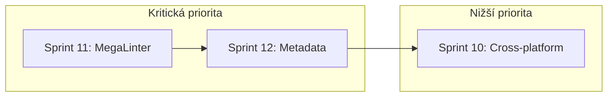

# Implementační plán: Sprint 11-12

**Cesta:** plans/sprint_11_12_implementation_plan.md
**Verze:** 1.0
**Vytvoreno:** 2026-02-17 10:17 (UTC+1)
**Posledni zmena:** 2026-02-17 10:17 (UTC+1)

## Stav

- [x] Metadata pridana
- [ ] Obsah dokumentu kompletni

---

## 1. Cíl

Implementovat dva kritické sprinty (P0) pro automatizaci kvality kódu a metadat:

- **Sprint 11:** MegaLinter integrace do CI/CD
- **Sprint 12:** Automatická aktualizace metadat v pre-commit

---

## 2. Sprint 11: MegaLinter integrace

### 2.1 Analýza současného stavu

**Existující konfigurace (`.mega-linter.yml`):**
- ✅ Markdown linting (markdownlint, markdown-link-check)
- ✅ YAML linting (yamllint, prettier)
- ✅ Spell checking (cspell, lychee)
- ✅ Security scanning (checkov, grype, trufflehog, gitleaks)
- ✅ Copy/paste detection (jscpd)

**Chybějící lintery:**
- ❌ ESLint pro JavaScript/TypeScript
- ❌ Prettier pro formátování
- ❌ rustfmt pro Rust
- ❌ Python linting (pylint, black)

### 2.2 Implementační kroky

#### Krok 1: Rozšíření `.mega-linter.yml`

```yaml
# Přidat do ENABLE sekce:
ENABLE:
  # Existující
  - MARKDOWN_MARKDOWN_LINK_CHECK
  - MARKDOWN_MARKDOWNLINT
  - YAML_YAMLLINT
  - YAML_PRETTIER
  - SPELL_CSPELL
  - SPELL_LYCHEE
  - COPYPASTE_JSCPD
  - REPOSITORY_CHECKOV
  - REPOSITORY_GRYPE
  - REPOSITORY_TRUFFLEHOG
  - REPOSITORY_GITLEAKS
  # NOVÉ
  - JAVASCRIPT_ES
  - TYPESCRIPT_ES
  - JAVASCRIPT_PRETTIER
  - RUST_RUSTFMT
  - PYTHON_PYLINT
  - PYTHON_BLACK
```

#### Krok 2: Vytvoření konfiguračních souborů

| Soubor | Účel |
|--------|------|
| `.eslintrc.json` | Konfigurace ESLint pro JS/TS |
| `.prettierrc` | Konfigurace Prettier |
| `rustfmt.toml` | Konfigurace rustfmt |
| `.pylintrc` | Konfigurace Pylint |
| `pyproject.toml` | Konfigurace Black |

#### Krok 3: Integrace do GitHub Actions

**Nový workflow soubor:** `.github/workflows/megalinter.yml`

```yaml
name: MegaLinter

on:
  push:
    branches: [main, develop]
  pull_request:
    branches: [main]

jobs:
  megalinter:
    name: MegaLinter
    runs-on: ubuntu-latest
    
    steps:
      - name: Checkout Code
        uses: actions/checkout@v4
        with:
          fetch-depth: 0
      
      - name: MegaLinter
        uses: oxsecurity/megalinter@v8
        env:
          APPLY_FIXES: all
          APPLY_FIXES_EVENT: pull_request
          REPORT_OUTPUT_FOLDER: reports
      
      - name: Upload Reports
        uses: actions/upload-artifact@v4
        if: always()
        with:
          name: megalinter-reports
          path: reports
          retention-days: 30
```

#### Krok 4: Aktualizace workflow-steps.json

Přidat nový CI krok:

```json
{
  "id": "megalinter-ci",
  "name": "MegaLinter",
  "trigger": "ci",
  "command": "echo '[MEGALINTER CHECK] Running in GitHub Actions'",
  "expectedOutput": "[MEGALINTER CHECK]",
  "timeout": 300,
  "retry": 0,
  "enabled": true,
  "description": "MegaLinter běží v samostatném workflow"
}
```

### 2.3 Akceptační kritéria

- [ ] MegaLinter běží v GitHub Actions
- [ ] Všechny lintery projdou bez chyb
- [ ] Reporty se nahrávají jako artefakty
- [ ] Workflow-steps.json obsahuje referenci na MegaLinter

---

## 3. Sprint 12: Automatická aktualizace metadat

### 3.1 Analýza současného stavu

**Existující skript (`scripts/fix_document_metadata.ps1`):**
- ✅ Přidává metadata do dokumentů
- ✅ Používá LastWriteTime pro timestamp
- ✅ Podporuje DryRun mode
- ❌ Neběží automaticky v pre-commit
- ❌ Má hardcoded seznam souborů

### 3.2 Implementační kroky

#### Krok 1: Vytvoření nového skriptu `scripts/update_metadata.ps1`

**Funkce:**
- Automatická detekce změněných .md souborů (git diff)
- Aktualizace pouze změněných souborů
- Inkrementace verze
- Aktualizace timestamp

```powershell
# scripts/update_metadata.ps1
# Automaticka aktualizace metadat ve změněných souborech

param(
    [switch]$DryRun,
    [switch]$All
)

# Získat změněné .md soubory
if ($All) {
    $files = git ls-files '*.md'
} else {
    $files = git diff --cached --name-only --diff-filter=ACM '*.md'
}

foreach ($file in $files) {
    # Aktualizovat metadata...
}
```

#### Krok 2: Přidání kroku do workflow-steps.json

```json
{
  "id": "update-metadata",
  "name": "Update Document Metadata",
  "trigger": "pre-commit",
  "command": "powershell -ExecutionPolicy Bypass -File scripts/update_metadata.ps1",
  "expectedOutput": "[METADATA UPDATED]",
  "timeout": 60,
  "retry": 0,
  "enabled": true,
  "description": "Automaticky aktualizuje metadata ve změněných .md souborech"
}
```

#### Krok 3: Aktualizace Husky pre-commit hook

**Současný stav (`.husky/pre-commit`):**
```bash
#!/bin/bash
powershell -ExecutionPolicy Bypass -File scripts/workflow_guard.ps1 -Trigger pre-commit
```

**Nový stav:**
```bash
#!/bin/bash
# 1. Aktualizovat metadata
powershell -ExecutionPolicy Bypass -File scripts/update_metadata.ps1

# 2. Znovu přidat změněné soubory
git add "*.md"

# 3. Spustit validaci
powershell -ExecutionPolicy Bypass -File scripts/workflow_guard.ps1 -Trigger pre-commit
```

### 3.3 Akceptační kritéria

- [ ] Metadata se automaticky aktualizují při commitu
- [ ] Pouze změněné soubory se aktualizují
- [ ] Verze se inkrementuje
- [ ] Timestamp se aktualizuje

---

## 4. Závislosti mezi sprinty



**Poznámka:** Sprint 11 a 12 jsou nezávislé a mohou běžet paralelně.

---

## 5. Rizika a mitigace

| Riziko | Pravděpodobnost | Dopad | Mitigace |
|--------|-----------------|-------|----------|
| MegaLinter najde chyby | Vysoká | Střední | Postupně opravit, použít `APPLY_FIXES` |
| Metadata aktualizace selže | Nízká | Nízký | DryRun mode pro testování |
| Konflikty v pre-commit | Střední | Střední | Pořadí kroků: metadata → validace |

---

## 6. Odhady úsilí

| Úkol | Složitost |
|------|-----------|
| Sprint 11: MegaLinter | Střední |
| Sprint 12: Metadata | Nízká |

---

## 7. Další kroky

1. **Okamžitě:** Přepnout do Code módu
2. **Sprint 11:** Implementovat MegaLinter workflow
3. **Sprint 12:** Implementovat automatickou aktualizaci metadat
4. **Testování:** Otestovat oba sprinty
5. **Dokumentace:** Aktualizovat NEXT_SESSION.md

---

## Historie zmen

| Datum | Verze | Popis zmeny |
|-------|-------|-------------|
| 2026-02-17 | 1.0 | Vytvoření implementačního plánu |

---

*Vytvoreno: 2026-02-17 10:17 (UTC+1)*
