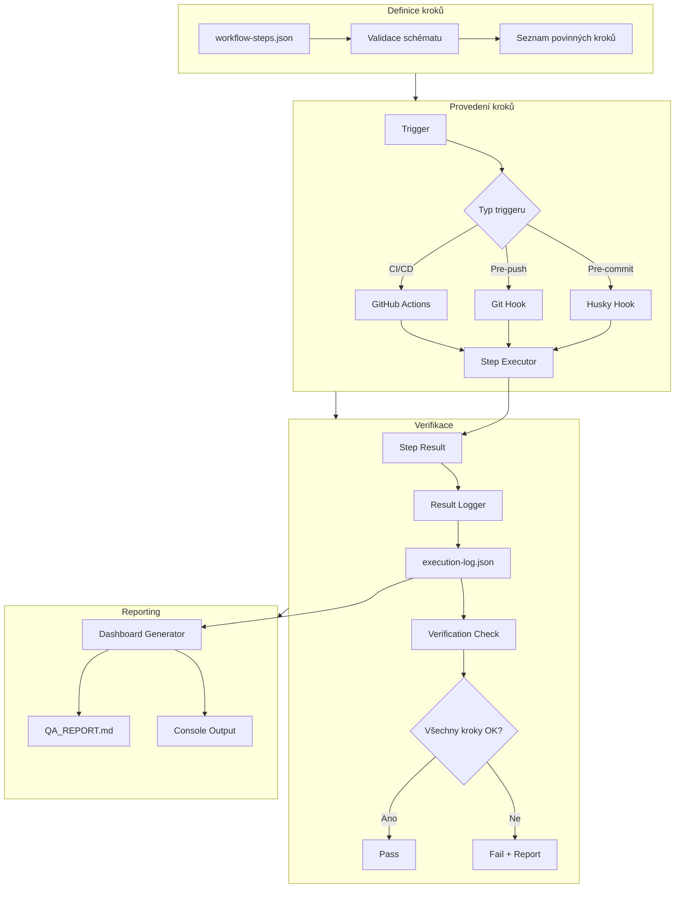

# Workflow Execution Guard - Komplexní návrh

**Cesta:** plans\workflow_execution_guard_proposal.md
**Verze:** 1.0
**Vytvoreno:** 2026-02-15 19:28 (UTC+1)
**Posledni zmena:** 2026-02-15 19:28 (UTC+1)

## Historie zmen

| Datum | Verze | Popis zmeny |
|-------|-------|-------------|
| 2026-02-15 | 1.0 | Pridana metadata |

## Stav

- [x] Metadata pridana
- [ ] Obsah dokumentu kompletni

---
**Vytvořeno:** 2026-02-15 04:20 (UTC+1)
**Verze:** 1.0
**Status:** K revizi

---

## 1. Definice problému

### 1.1 Původní problém
Po každé změně kódu není dokumentace automaticky aktualizována.

### 1.2 Obecnější problém
**Neexistuje systém, který by garantoval, že jsou vykonávány všechny povinné kroky.**

### 1.3 Příklady povinných kroků
| Krok | Kdy | Proč |
|------|-----|------|
| Aktualizace QA_REPORT.md | Před commitem | Stav projektu |
| Aktualizace CHANGE_LOG.md | Před commitem | Historie změn |
| Kontrola duplicit | Před commitem | Kvalita kódu |
| Testy Rust | Před pushem | Funkčnost |
| Testy Frontend | Před pushem | Funkčnost |
| Generování sidecar binárky | Před buildem | Produkční nasazení |

---

## 2. Analýza současného stavu

### 2.1 Existující mechanismy

| Mechanismus | Účel | Stav | Problém |
|-------------|------|------|---------|
| Husky pre-commit | Lokální kontrola | Částečný | Nekompletní - nevolá update_docs.ps1 |
| GitHub Actions CI | Vzdálená kontrola | Částečný | Chybí docs workflow |
| Mega-Linter | Linting | OK | Nekontroluje provedení kroků |
| Danger.js | PR validace | OK | Pouze pro PR |

### 2.2 Chybějící mechanismy

1. **Definice povinných kroků** - neexistuje centrální seznam
2. **Verifikace provedení** - neexistuje kontrola, zda krok byl vykonán
3. **Reporting** - neexistuje přehled o stavu kroků
4. **Fail-fast mechanismus** - neexistuje zastavení při neúspěchu

---

## 3. Návrh řešení: Workflow Execution Guard

### 3.1 Architektura



### 3.2 Komponenty

#### 3.2.1 Definice kroků - `workflow-steps.json`

```json
{
  "$schema": "./workflow-steps.schema.json",
  "version": "1.0",
  "steps": [
    {
      "id": "check-duplicates",
      "name": "Kontrola duplicit",
      "description": "Detekce duplicitních řádků v souborech",
      "trigger": "pre-commit",
      "required": true,
      "command": "powershell -ExecutionPolicy Bypass -File scripts/check_duplicates.ps1 -IgnoreEmptyLines",
      "timeout": 60,
      "expectedOutput": "--- DUPLICATE CHECK PASSED ---",
      "onFailure": "block"
    },
    {
      "id": "update-docs",
      "name": "Aktualizace dokumentace",
      "description": "Aktualizace QA_REPORT.md a CHANGE_LOG.md",
      "trigger": "pre-commit",
      "required": true,
      "command": "powershell -ExecutionPolicy Bypass -File scripts/update_docs.ps1",
      "timeout": 120,
      "expectedOutput": "--- CONTROLLER DONE ---",
      "onFailure": "block"
    },
    {
      "id": "rust-tests",
      "name": "Rust testy",
      "description": "Spuštění Rust unit testů",
      "trigger": "pre-push",
      "required": true,
      "command": "cd src-tauri && cargo test",
      "timeout": 300,
      "expectedOutput": "test result: ok",
      "onFailure": "warn"
    },
    {
      "id": "frontend-tests",
      "name": "Frontend testy",
      "description": "Spuštění frontend testů",
      "trigger": "pre-push",
      "required": false,
      "command": "npm test",
      "timeout": 120,
      "expectedOutput": "passed",
      "onFailure": "warn"
    },
    {
      "id": "build-sidecar",
      "name": "Build sidecar binárky",
      "description": "PyInstaller build sidecar.exe",
      "trigger": "pre-build",
      "required": true,
      "command": "pyinstaller src-tauri/binaries/sidecar-x86_64-pc-windows-msvc.spec",
      "timeout": 600,
      "expectedOutput": "Building EXE",
      "onFailure": "block"
    }
  ]
}
```

#### 3.2.2 Verifikační skript - `scripts/workflow_guard.ps1`

```powershell
# scripts/workflow_guard.ps1
# Workflow Execution Guard - Garantuje provedení povinných kroků

param(
    [Parameter(Mandatory=$true)]
    [ValidateSet("pre-commit", "pre-push", "pre-build", "ci")]
    [string]$Trigger,
    
    [string]$ConfigPath = "$PSScriptRoot/../workflow-steps.json",
    [switch]$DryRun
)

$ErrorActionPreference = "Stop"
$schemaPath = "$PSScriptRoot/../workflow-steps.schema.json"
$logPath = "$PSScriptRoot/../logs/execution-log.json"

# 1. Načtení konfigurace
Write-Host "--- [WORKFLOW GUARD START] ---" -ForegroundColor Cyan
Write-Host "Trigger: $Trigger" -ForegroundColor Yellow

if (-not (Test-Path $ConfigPath)) {
    Write-Error "Configuration file not found: $ConfigPath"
    exit 1
}

$config = Get-Content $ConfigPath | ConvertFrom-Json

# 2. Filtrování kroků pro daný trigger
$steps = $config.steps | Where-Object { $_.trigger -eq $Trigger }

if ($steps.Count -eq 0) {
    Write-Host "No steps defined for trigger: $Trigger" -ForegroundColor Green
    exit 0
}

# 3. Provedení kroků
$results = @()
$failed = @()

foreach ($step in $steps) {
    Write-Host "`nExecuting: $($step.name)" -ForegroundColor Cyan
    
    $result = @{
        id = $step.id
        name = $step.name
        trigger = $Trigger
        timestamp = (Get-Date -Format "yyyy-MM-dd HH:mm:ss")
        status = "pending"
        output = ""
        duration = 0
    }
    
    if ($DryRun) {
        Write-Host "  [DRY RUN] Would execute: $($step.command)" -ForegroundColor Yellow
        $result.status = "skipped"
        $results += $result
        continue
    }
    
    $stopwatch = [System.Diagnostics.Stopwatch]::StartNew()
    
    try {
        $output = Invoke-Expression $step.command 2>&1
        $stopwatch.Stop()
        
        $result.duration = $stopwatch.ElapsedMilliseconds
        $result.output = $output -join "`n"
        
        # Kontrola očekávaného výstupu
        if ($step.expectedOutput -and ($output -notmatch $step.expectedOutput)) {
            $result.status = "failed"
            $failed += $step
            Write-Host "  FAILED: Expected output not found" -ForegroundColor Red
        } else {
            $result.status = "passed"
            Write-Host "  PASSED ($($result.duration)ms)" -ForegroundColor Green
        }
    } catch {
        $stopwatch.Stop()
        $result.duration = $stopwatch.ElapsedMilliseconds
        $result.status = "error"
        $result.output = $_.Exception.Message
        $failed += $step
        Write-Host "  ERROR: $($_.Exception.Message)" -ForegroundColor Red
    }
    
    $results += $result
}

# 4. Uložení logu
$logEntry = @{
    trigger = $Trigger
    timestamp = (Get-Date -Format "yyyy-MM-dd HH:mm:ss")
    results = $results
    summary = @{
        total = $steps.Count
        passed = ($results | Where-Object { $_.status -eq "passed" }).Count
        failed = ($results | Where-Object { $_.status -eq "failed" }).Count
        errors = ($results | Where-Object { $_.status -eq "error" }).Count
    }
}

# Přidat do existujícího logu nebo vytvořit nový
if (Test-Path $logPath) {
    $existingLog = Get-Content $logPath | ConvertFrom-Json
    $existingLog.executions += $logEntry
    $existingLog | ConvertTo-Json -Depth 10 | Out-File $logPath -Encoding utf8
} else {
    @{
        version = "1.0"
        executions = @($logEntry)
    } | ConvertTo-Json -Depth 10 | Out-File $logPath -Encoding utf8
}

# 5. Výsledek
Write-Host "`n--- [WORKFLOW GUARD SUMMARY] ---" -ForegroundColor Cyan
Write-Host "Total: $($logEntry.summary.total)" -ForegroundColor White
Write-Host "Passed: $($logEntry.summary.passed)" -ForegroundColor Green
Write-Host "Failed: $($logEntry.summary.failed)" -ForegroundColor Red
Write-Host "Errors: $($logEntry.summary.errors)" -ForegroundColor Red

if ($failed.Count -gt 0) {
    Write-Host "`nFailed steps:" -ForegroundColor Red
    $failed | ForEach-Object { Write-Host "  - $($_.name)" -ForegroundColor Red }
    
    # Kontrola onFailure akce
    $blockers = $failed | Where-Object { $_.onFailure -eq "block" }
    if ($blockers.Count -gt 0) {
        Write-Host "`nBLOCKING: Cannot proceed due to failed required steps" -ForegroundColor Red
        exit 1
    }
}

Write-Host "`n--- [WORKFLOW GUARD DONE] ---" -ForegroundColor Cyan
exit 0
```

#### 3.2.3 JSON Schema - `workflow-steps.schema.json`

```json
{
  "$schema": "http://json-schema.org/draft-07/schema#",
  "title": "Workflow Steps Configuration",
  "type": "object",
  "required": ["version", "steps"],
  "properties": {
    "version": {
      "type": "string",
      "pattern": "^\\d+\\.\\d+$"
    },
    "steps": {
      "type": "array",
      "items": {
        "type": "object",
        "required": ["id", "name", "trigger", "required", "command"],
        "properties": {
          "id": {
            "type": "string",
            "pattern": "^[a-z0-9-]+$"
          },
          "name": {
            "type": "string",
            "minLength": 1
          },
          "description": {
            "type": "string"
          },
          "trigger": {
            "type": "string",
            "enum": ["pre-commit", "pre-push", "pre-build", "ci"]
          },
          "required": {
            "type": "boolean"
          },
          "command": {
            "type": "string",
            "minLength": 1
          },
          "timeout": {
            "type": "integer",
            "minimum": 1,
            "default": 60
          },
          "expectedOutput": {
            "type": "string"
          },
          "onFailure": {
            "type": "string",
            "enum": ["block", "warn", "ignore"],
            "default": "block"
          }
        }
      }
    }
  }
}
```

---

## 4. Kritická analýza

### 4.1 Výhody

| Výhoda | Popis |
|--------|-------|
| **Centralizovaná definice** | Všechny kroky v jednom souboru |
| **Verifikovatelnost** | Každý krok má očekávaný výstup |
| **Auditovatelnost** | Logy o provedení |
| **Flexibilita** | Různé triggery, různé akce |
| **Fail-fast** | Zastavení při kritických chybách |

### 4.2 Nevýhody a rizika

| Riziko | Pravděpodobnost | Dopad | Mitigace |
|--------|-----------------|-------|----------|
| **Komplexita** | Střední | Střední | Dokumentace, školení |
| **Falešné pozitivy** | Nízká | Střední | Konfigurovatelné expectedOutput |
| **Výkon** | Střední | Nízký | Paralelní provádění, caching |
| **Údržba** | Nízká | Střední | Verzování konfigurace |
| **OneDrive konflikty** | Střední | Nízký | .gitignore pro logy |

### 4.3 Alternativy

| Alternativa | Výhody | Nevýhody |
|-------------|--------|----------|
| **Make/Just** | Standardní, jednoduché | Méně flexibilní, horší reporting |
| **GitHub Actions pouze** | Vzdálené, spolehlivé | Zpoždění, ne lokální |
| **IDE integrace** | Pohodlné | Není všude, závislost na IDE |
| **Tento návrh** | Komplexní, auditovatelný | Vyšší komplexita |

### 4.4 Bezpečnostní aspekty

1. **Command injection** - příkazy z JSON souboru
   - Mitigace: JSON schema validace, pouze povolené příkazy
2. **Citlivé údaje** - v logu
   - Mitigace: Filtrace citlivých údajů, .gitignore
3. **Oprávnění** - spouštění skriptů
   - Mitigace: Běh pod omezeným účtem

### 4.5 Kompatibilita

| Prostředí | Kompatibilita | Poznámka |
|-----------|---------------|----------|
| Windows | Plná | PowerShell 5.1+ |
| Linux | Částečná | pwsh, bash wrapper |
| macOS | Částečná | pwsh, bash wrapper |
| CI/CD | Plná | GitHub Actions, GitLab CI |

---

## 5. Implementační plán

### 5.1 Fáze 1: Základní infrastruktura

1. Vytvořit `workflow-steps.json`
2. Vytvořit `workflow-steps.schema.json`
3. Vytvořit `scripts/workflow_guard.ps1`
4. Vytvořit `logs/` adresář

### 5.2 Fáze 2: Integrace s existujícími hooks

1. Upravit `.husky/pre-commit` - volat `workflow_guard.ps1 -Trigger pre-commit`
2. Vytvořit `.husky/pre-push` - volat `workflow_guard.ps1 -Trigger pre-push`
3. Vytvořit `.github/workflows/workflow-guard.yml` - CI/CD integrace

### 5.3 Fáze 3: Reporting a dashboard

1. Rozšířit `scripts/update_docs.ps1` o čtení `execution-log.json`
2. Přidat sekci do `QA_REPORT.md` - "Workflow Execution History"
3. Vytvořit `scripts/workflow_report.ps1` - generování reportů

### 5.4 Fáze 4: Testování a dokumentace

1. Unit testy pro `workflow_guard.ps1`
2. Integrační testy pro celý workflow
3. Dokumentace v `docs/workflow-guard.md`

---

## 6. Příklad použití

### 6.1 Lokální pre-commit

```bash
# .husky/pre-commit
#!/bin/bash
echo "Running Workflow Guard..."

powershell -ExecutionPolicy Bypass -File scripts/workflow_guard.ps1 -Trigger pre-commit

if [ $? -ne 0 ]; then
    echo "Workflow Guard blocked the commit!"
    exit 1
fi

echo "All checks passed!"
```

### 6.2 CI/CD

```yaml
# .github/workflows/workflow-guard.yml
name: Workflow Guard
on: [push, pull_request]

jobs:
  guard:
    runs-on: windows-latest
    steps:
      - uses: actions/checkout@v4
      
      - name: Run Workflow Guard
        shell: pwsh
        run: |
          powershell -ExecutionPolicy Bypass -File scripts/workflow_guard.ps1 -Trigger ci
      
      - name: Upload Execution Log
        uses: actions/upload-artifact@v4
        with:
          name: execution-log
          path: logs/execution-log.json
```

### 6.3 Manuální spuštění

```powershell
# Testovací běh bez provedení
powershell -ExecutionPolicy Bypass -File scripts/workflow_guard.ps1 -Trigger pre-commit -DryRun

# Skutečný běh
powershell -ExecutionPolicy Bypass -File scripts/workflow_guard.ps1 -Trigger pre-commit
```

---

## 7. Metriky úspěchu

| Metrika | Cíl | Měření |
|---------|-----|--------|
| **Pokrytí kroků** | 100% povinných kroků | Počet kroků v konfiguraci |
| **Úspěšnost** | >95% úspěšných provedení | Log summary |
| **Rychlost** | <30s pre-commit | Duration v logu |
| **Adopce** | Všechny commity projdou | Git history vs. log |

---
---

## 8. Run on Save ochrana

- `scripts/run_on_save.ps1` spouštěný z `emeraldwalk.RunOnSave` vyřešil okamžitou aktualizaci metadat.
- `scripts/watch_docs.ps1` lze spustit jako watcher (`pwsh scripts/watch_docs.ps1`) pro automatické monitorování změn `test/*.md`.
- `scripts/check_run_on_save.ps1` ověřuje konfiguraci pluginu, log `logs/runonsave.log` a obsah souboru; vypíše výstrahu, když Run on Save chybí.
- Workflow Guard zůstává fallbackem: kroky `update_metadata`/`update_doc` teď běží pouze v DryRun režimu, jen hlásí chyby.

---

## 9. Závěr

Tento návrh řeší obecný problém garantování provedení povinných kroků pomocí:

1. **Centralizované definice** - `workflow-steps.json`
2. **Verifikačního skriptu** - `workflow_guard.ps1`
3. **Integrace s hooks** - Husky, GitHub Actions
4. **Auditování** - `execution-log.json`
5. **Reporting** - Dashboard v `QA_REPORT.md`

---

*Návrh vytvořen: 2026-02-15 04:20 (UTC+1)*
*Verze: 1.0*
*Status: K revizi*
