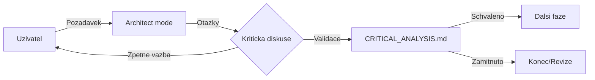
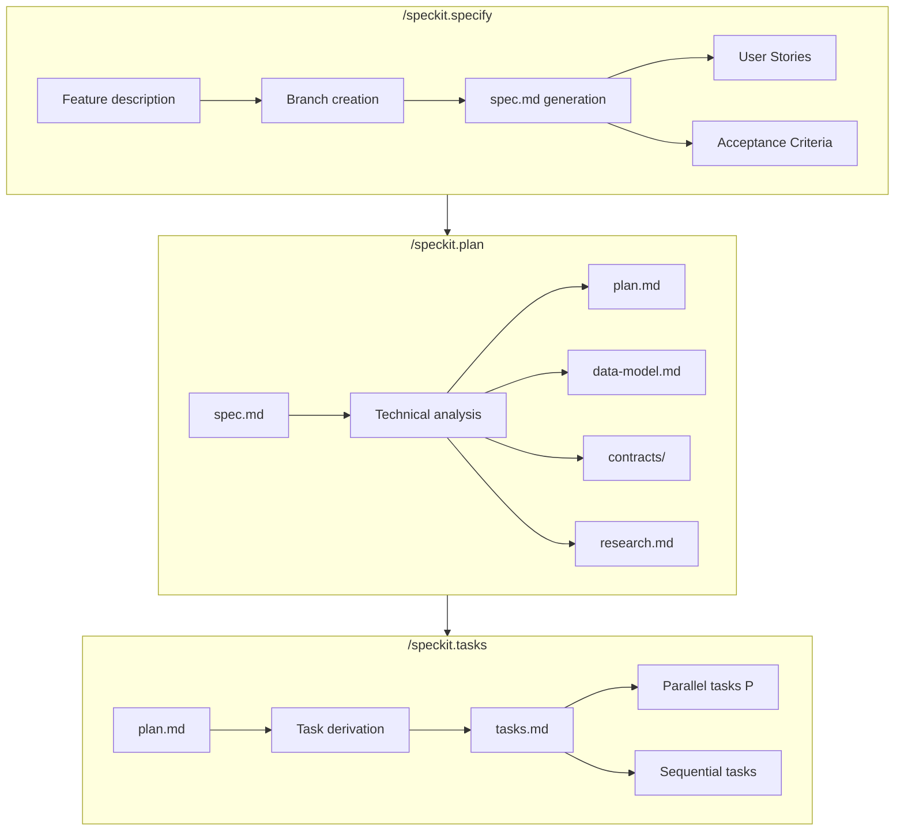
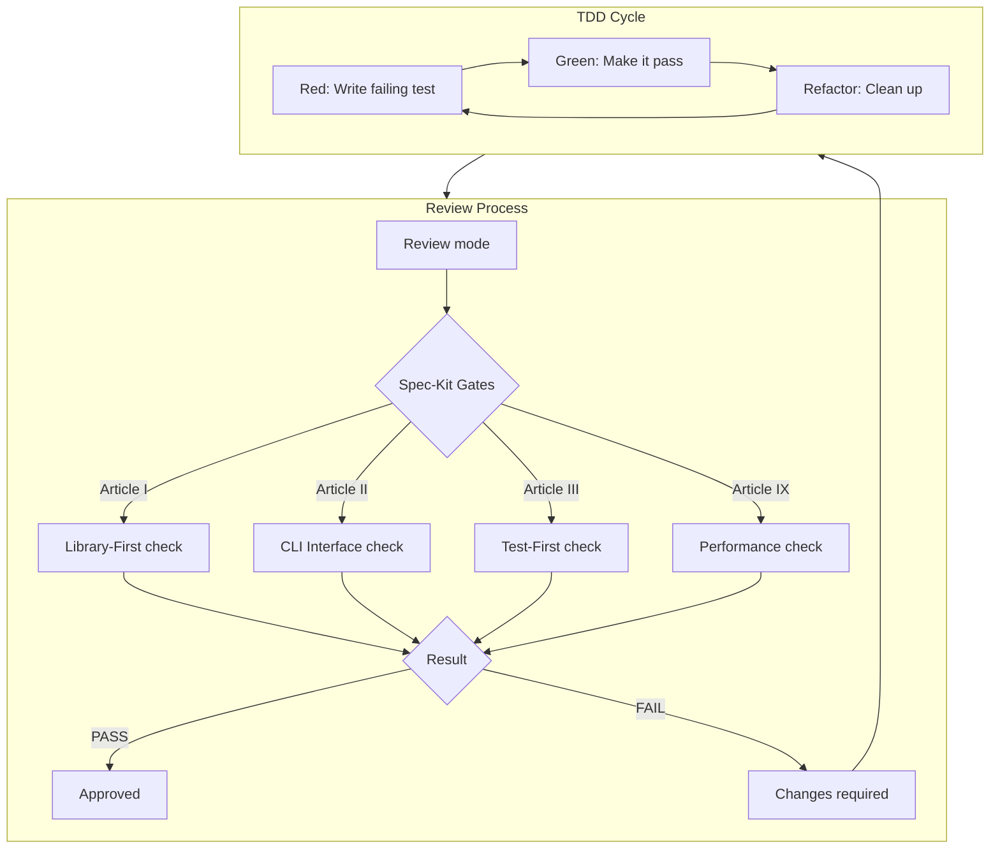
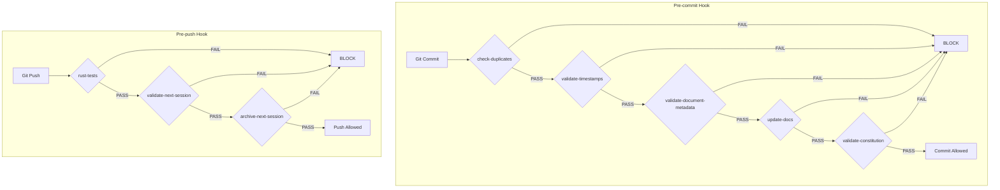

# Implementacni specifikace: Workflow Execution Guard v2.03

**Verze:** 2.03
**Vytvoreno:** 2026-02-15 13:59 (UTC+1)
**Posledni zmena:** 2026-02-15 13:59 (UTC+1)
**Status:** Pripraveno k implementaci

---

## Historie zmen

| Datum | Verze | Popis zmeny |
|-------|-------|-------------|
| 2026-02-15 | 2.04 | Rozhodnuto: Graphviz pouze lokálně, logy 30 logovacích dní, NEXT_SESSION_TimeStamp formát |
| 2026-02-15 | 2.03 | Pridana integrace Graphviz pro vizualizaci workflow |
| 2026-02-15 | 2.02 | Aktualizace metadat, pridana tabulka historie zmen |

## Stav

- [x] Specifikace kompletni
- [x] Diskuze dokoncena
- [x] Graphviz integrace navrzena
- [ ] Implementace v Code modu

---

## 1. Souhrn diskuse

Tato specifikace je vysledkem krok za krokem diskuze o implementaci Workflow Execution Guard. Hlavni cile:

1. **Maximalni spolehlivost** - vsechny kroky s `onFailure: block`
2. **Kontrola dokumentace** - vsechny `.md` soubory musi mit metadata
3. **Verzovani a logovani** - kazdy dokument musi mit verzi, timestamp, historii zmen
4. **Archivace NEXT_SESSION** - automaticka archivace s timestampem
5. **Vizualizace workflow** - Graphviz diagramy pro lepsi prehlednost

---

## 2. Prehled souboru k vytvoreni

| Soubor | Typ | Ucel |
|--------|-----|------|
| `workflow-steps.json` | JSON | Definice povinnych kroku |
| `workflow-steps.schema.json` | JSON Schema | Validace konfigurace |
| `scripts/workflow_guard.ps1` | PowerShell | Hlavni verifikacni skript |
| `scripts/validate_document_metadata.ps1` | PowerShell | Validace metadat dokumentu |
| `scripts/validate_constitution.ps1` | PowerShell | Kontrola souladu s ustavou |
| `scripts/validate_next_session.ps1` | PowerShell | Kontrola NEXT_SESSION.md |
| `scripts/archive_next_session.ps1` | PowerShell | Archivace NEXT_SESSION.md |
| `scripts/generate_workflow_diagram.ps1` | PowerShell | Generovani Graphviz diagramu |
| `logs/.gitkeep` | Git | Adresar pro logy |
| `docs/workflow-diagram.svg` | SVG | Vizualizace workflow |
| `.husky/pre-commit` | Bash | Aktualizovany hook |
| `.husky/pre-push` | Bash | Novy hook |
| `.github/workflows/workflow-guard.yml` | YAML | CI/CD integrace |

---

## 3. Definice kroku workflow

### 3.1 Pre-commit kroky (5 kroku)

| ID | Nazev | Skript | onFailure |
|----|-------|--------|-----------|
| `check-duplicates` | Kontrola duplicit | `scripts/check_duplicates.ps1` | block |
| `validate-timestamps` | Validace timestampu | `scripts/validate_timestamps.ps1` | block |
| `validate-document-metadata` | Validace metadat | `scripts/validate_document_metadata.ps1` | block |
| `update-docs` | Aktualizace dokumentace | `scripts/update_docs.ps1` | block |
| `validate-constitution` | Kontrola ustavy | `scripts/validate_constitution.ps1` | block |

### 3.2 Pre-push kroky (3 kroky)

| ID | Nazev | Skript | onFailure | Retry |
|----|-------|--------|-----------|-------|
| `rust-tests` | Rust testy | `cargo test` | block | 2 pokusy, 8s pauza |
| `validate-next-session` | Kontrola NEXT_SESSION | `scripts/validate_next_session.ps1` | block | - |
| `archive-next-session` | Archivace NEXT_SESSION | `scripts/archive_next_session.ps1` | block | - |

---

## 4. Detailni specifikace souboru

### 4.1 `workflow-steps.json`

```json
{
  "$schema": "./workflow-steps.schema.json",
  "version": "1.0",
  "steps": [
    {
      "id": "check-duplicates",
      "name": "Kontrola duplicit",
      "description": "Detekce duplicitnich radku v souborech",
      "trigger": "pre-commit",
      "required": true,
      "command": "powershell -ExecutionPolicy Bypass -File scripts/check_duplicates.ps1 -IgnoreEmptyLines",
      "timeout": 60,
      "expectedOutput": "--- DUPLICATE CHECK PASSED ---",
      "onFailure": "block"
    },
    {
      "id": "validate-timestamps",
      "name": "Validace timestampu",
      "description": "Kontrola, ze vsechny dokumenty maji aktualni timestamp",
      "trigger": "pre-commit",
      "required": true,
      "command": "powershell -ExecutionPolicy Bypass -File scripts/validate_timestamps.ps1",
      "timeout": 30,
      "expectedOutput": "--- TIMESTAMP VALIDATION PASSED ---",
      "onFailure": "block"
    },
    {
      "id": "validate-document-metadata",
      "name": "Validace metadat dokumentu",
      "description": "Kontrola verze, timestampu a historie zmen vsech .md souboru",
      "trigger": "pre-commit",
      "required": true,
      "command": "powershell -ExecutionPolicy Bypass -File scripts/validate_document_metadata.ps1",
      "timeout": 60,
      "expectedOutput": "--- DOCUMENT METADATA VALIDATION PASSED ---",
      "onFailure": "block"
    },
    {
      "id": "update-docs",
      "name": "Aktualizace dokumentace",
      "description": "Aktualizace QA_REPORT.md a CHANGE_LOG.md",
      "trigger": "pre-commit",
      "required": true,
      "command": "powershell -ExecutionPolicy Bypass -File scripts/update_docs.ps1",
      "timeout": 120,
      "expectedOutput": "--- CONTROLLER DONE ---",
      "onFailure": "block"
    },
    {
      "id": "validate-constitution",
      "name": "Kontrola souladu s ustavou",
      "description": "Overeni, ze zmeny jsou v souladu s CONSTITUTION.md",
      "trigger": "pre-commit",
      "required": true,
      "command": "powershell -ExecutionPolicy Bypass -File scripts/validate_constitution.ps1",
      "timeout": 60,
      "expectedOutput": "--- CONSTITUTION VALIDATION PASSED ---",
      "onFailure": "block"
    },
    {
      "id": "rust-tests",
      "name": "Rust testy",
      "description": "Spusteni Rust unit testu",
      "trigger": "pre-push",
      "required": true,
      "command": "cd src-tauri && cargo test --quiet",
      "timeout": 300,
      "expectedOutput": "test result: ok",
      "retry": {
        "maxAttempts": 2,
        "delaySeconds": 8,
        "retryOn": ["error", "timeout"]
      },
      "onFailure": "block"
    },
    {
      "id": "validate-next-session",
      "name": "Kontrola NEXT_SESSION.md",
      "description": "Overeni, ze NEXT_SESSION.md je aktualni a obsahuje platne informace",
      "trigger": "pre-push",
      "required": true,
      "command": "powershell -ExecutionPolicy Bypass -File scripts/validate_next_session.ps1",
      "timeout": 30,
      "expectedOutput": "--- NEXT SESSION VALIDATION PASSED ---",
      "onFailure": "block"
    },
    {
      "id": "archive-next-session",
      "name": "Archivace NEXT_SESSION.md",
      "description": "Archivace NEXT_SESSION.md s timestampem a vytvoreni noveho",
      "trigger": "pre-push",
      "required": true,
      "command": "powershell -ExecutionPolicy Bypass -File scripts/archive_next_session.ps1",
      "timeout": 30,
      "expectedOutput": "--- NEXT SESSION ARCHIVED ---",
      "onFailure": "block"
    }
  ]
}
```

### 4.2 `workflow-steps.schema.json`

```json
{
  "$schema": "http://json-schema.org/draft-07/schema#",
  "title": "Workflow Steps Configuration",
  "type": "object",
  "required": ["version", "steps"],
  "properties": {
    "version": {
      "type": "string",
      "pattern": "^\\d+\\.\\d+$"
    },
    "steps": {
      "type": "array",
      "minItems": 1,
      "items": {
        "type": "object",
        "required": ["id", "name", "trigger", "required", "command"],
        "properties": {
          "id": {
            "type": "string",
            "pattern": "^[a-z0-9-]+$"
          },
          "name": {
            "type": "string",
            "minLength": 1
          },
          "description": {
            "type": "string"
          },
          "trigger": {
            "type": "string",
            "enum": ["pre-commit", "pre-push", "pre-build", "ci"]
          },
          "required": {
            "type": "boolean"
          },
          "command": {
            "type": "string",
            "minLength": 1
          },
          "timeout": {
            "type": "integer",
            "minimum": 1,
            "default": 60
          },
          "expectedOutput": {
            "type": "string"
          },
          "retry": {
            "type": "object",
            "properties": {
              "maxAttempts": {
                "type": "integer",
                "minimum": 1,
                "default": 1
              },
              "delaySeconds": {
                "type": "integer",
                "minimum": 0,
                "default": 0
              },
              "retryOn": {
                "type": "array",
                "items": {
                  "type": "string",
                  "enum": ["error", "timeout", "failed"]
                }
              }
            }
          },
          "onFailure": {
            "type": "string",
            "enum": ["block", "warn", "ignore"],
            "default": "block"
          }
        }
      }
    }
  }
}
```

---

## 5. Kompletni proces kódování (SDD Workflow)

Tato sekce popisuje cely proces kódování od idey az po dokonceni, vcluding vsech souvislosti s projektovou dokumentaci.

### 5.1 Prehled fazi

| Faze | Nazev | Vstup | Vystup | Odpovedny dokument |
|------|-------|-------|--------|-------------------|
| 0 | Idea | Pozadavek uzivatele | Vague idea | - |
| 1 | Kriticka diskuse | Vague idea | Validovana idea | CRITICAL_ANALYSIS.md |
| 2 | Specifikace | Validovana idea | spec.md | /speckit.specify |
| 3 | Planovani | spec.md | plan.md, data-model.md, contracts/ | /speckit.plan |
| 4 | Taskovani | plan.md | tasks.md | /speckit.tasks |
| 5 | Implementace | tasks.md | Kod + testy | Code mode |
| 6 | Review | Kod | Schvaleni/zmeny | .agent/workflows/review.md |
| 7 | Commit | Schvaleny kod | Git commit | Pre-commit hook |
| 8 | Push | Commit | Remote branch | Pre-push hook |
| 9 | CI/CD | Push | Validace | GitHub Actions |

### 5.2 Diagram kompletniho procesu (Mermaid)

```mermaid
flowchart TB
    subgraph Faze0["Faze 0: Idea"]
        A0[Uzivatelsky pozadavek] --> A1[Vague Idea]
        A1 --> A2{Kriticka diskuse}
    end
    
    subgraph Faze1["Faze 1: Kriticka diskuse"]
        A2 -->|Otazky| B1[Analyza pozadavku]
        B1 --> B2[Smerovani rozhodnuti]
        B2 --> B3[Validovana idea]
        B2 -->|Zamitnuto| A1
    end
    
    subgraph Faze2["Faze 2: Specifikace"]
        B3 --> C1[/speckit.specify]
        C1 --> C2[Vytvoreni vetve]
        C2 --> C3[specs/XXX/spec.md]
        C3 --> C4[User Stories]
        C3 --> C5[Acceptance Criteria]
    end
    
    subgraph Faze3["Faze 3: Planovani"]
        C4 --> D1[/speckit.plan]
        C5 --> D1
        D1 --> D2[plan.md]
        D1 --> D3[data-model.md]
        D1 --> D4[contracts/]
        D1 --> D5[research.md]
    end
    
    subgraph Faze4["Faze 4: Taskovani"]
        D2 --> E1[/speckit.tasks]
        D3 --> E1
        D4 --> E1
        E1 --> E2[tasks.md]
        E2 --> E3[Paralelni tasky P]
        E2 --> E4[Sekvencni tasky]
    end
    
    subgraph Faze5["Faze 5: Implementace"]
        E3 --> F1[Code mode]
        E4 --> F1
        F1 --> F2[TDD: Red faze]
        F2 --> F3[TDD: Green faze]
        F3 --> F4[TDD: Refactor faze]
        F4 --> F5[Kod + testy]
    end
    
    subgraph Faze6["Faze 6: Review"]
        F5 --> G1[Review mode]
        G1 --> G2{Spec-Kit Compliance}
        G2 -->|PASS| G3[Schvaleno]
        G2 -->|FAIL| G4[Zmeny pozadovany]
        G4 --> F1
    end
    
    subgraph Faze7["Faze 7: Commit - Pre-commit Hook"]
        G3 --> H1[git add]
        H1 --> H2[git commit]
        H2 --> H3[Pre-commit Hook]
        H3 --> H4{Workflow Guard}
        H4 --> H5[check-duplicates]
        H5 --> H6[validate-timestamps]
        H6 --> H7[validate-document-metadata]
        H7 --> H8[update-docs]
        H8 --> H9[validate-constitution]
        H9 -->|ALL PASS| H10[Commit Allowed]
        H5 -->|FAIL| Z1[BLOCK]
        H6 -->|FAIL| Z1
        H7 -->|FAIL| Z1
        H8 -->|FAIL| Z1
        H9 -->|FAIL| Z1
    end
    
    subgraph Faze8["Faze 8: Push - Pre-push Hook"]
        H10 --> I1[git push]
        I1 --> I2[Pre-push Hook]
        I2 --> I3{Workflow Guard}
        I3 --> I4[rust-tests]
        I4 --> I5[validate-next-session]
        I5 --> I6[archive-next-session]
        I6 -->|ALL PASS| I7[Push Allowed]
        I4 -->|FAIL| Z2[BLOCK]
        I5 -->|FAIL| Z2
        I6 -->|FAIL| Z2
    end
    
    subgraph Faze9["Faze 9: CI/CD"]
        I7 --> J1[GitHub Actions]
        J1 --> J2[Workflow Guard CI]
        J2 --> J3{All checks pass?}
        J3 -->|YES| J4[Merge allowed]
        J3 -->|NO| J5[PR blocked]
        J5 --> F1
    end
    
    subgraph Dokumentace["Prubezna dokumentace"]
        K1[CONSTITUTION.md] -.->|Pravidla| G2
        K2[VISION.md] -.->|Smer| C1
        K3[GOVERNANCE.md] -.->|Watchdogs| H4
        K4[NEXT_SESSION.md] -.->|Kontext| B1
        K5[QA_REPORT.md] -.->|Stav| J2
    end
```

### 5.3 Detailni popis fazi

#### Faze 0-1: Idea a Kriticka diskuse



**Klicove aktivity:**
- Analyza pozadavku proti VISION.md
- Kontrola souladu s CONSTITUTION.md
- Identifikace rizik a omezeni
- Rozhodnuti o pokracovani

#### Faze 2-4: Spec-Kit prikazy



#### Faze 5-6: Implementace a Review



### 5.4 Graphviz integrace

### 5.1 Pregled

Graphviz bude pouzit pro vizualizaci workflow a generovani diagramu.

**Pozadavky:**
- Graphviz musi byt nainstalovan na systemu
- PowerShell skript bude generovat DOT format
- Vystup bude SVG diagram

### 5.2 `scripts/generate_workflow_diagram.ps1`

```powershell
# generate_workflow_diagram.ps1
# Generuje vizualni diagram workflow z workflow-steps.json

param(
    [string]$ConfigPath = "workflow-steps.json",
    [string]$OutputPath = "docs/workflow-diagram.svg",
    [switch]$Verbose
)

$ErrorActionPreference = "Stop"

# Kontrola Graphviz
if (-not (Get-Command "dot" -ErrorAction SilentlyContinue)) {
    Write-Host "ERROR: Graphviz is not installed!" -ForegroundColor Red
    Write-Host "Download from: https://graphviz.gitlab.io/download/" -ForegroundColor Yellow
    exit 1
}

# Nacteni konfigurace
if (-not (Test-Path $ConfigPath)) {
    Write-Host "ERROR: Configuration file not found: $ConfigPath" -ForegroundColor Red
    exit 1
}

$config = Get-Content $ConfigPath | ConvertFrom-Json

# Generovani DOT formatu
$dotContent = @"
digraph WorkflowGuard {
    rankdir=TB;
    node [shape=box, style="rounded,filled", fontname="Arial"];
    edge [fontname="Arial"];
    
    // Pre-commit sekce
    subgraph cluster_precommit {
        label="Pre-commit Hook";
        style=filled;
        color=lightblue;
        
        start [label="Git Commit", shape=oval, fillcolor=lightgreen];
        check_dup [label="check-duplicates", fillcolor=white];
        val_ts [label="validate-timestamps", fillcolor=white];
        val_meta [label="validate-document-metadata", fillcolor=white];
        upd_docs [label="update-docs", fillcolor=white];
        val_const [label="validate-constitution", fillcolor=white];
        commit_ok [label="Commit Allowed", shape=oval, fillcolor=lightgreen];
        block1 [label="BLOCK", shape=oval, fillcolor=lightcoral];
    }
    
    // Pre-push sekce
    subgraph cluster_prepush {
        label="Pre-push Hook";
        style=filled;
        color=lightyellow;
        
        push_start [label="Git Push", shape=oval, fillcolor=lightgreen];
        rust_test [label="rust-tests", fillcolor=white];
        val_next [label="validate-next-session", fillcolor=white];
        arch_next [label="archive-next-session", fillcolor=white];
        push_ok [label="Push Allowed", shape=oval, fillcolor=lightgreen];
        block2 [label="BLOCK", shape=oval, fillcolor=lightcoral];
    }
    
    // Pre-commit hrany
    start -> check_dup;
    check_dup -> val_ts [label="PASS"];
    check_dup -> block1 [label="FAIL", color=red];
    val_ts -> val_meta [label="PASS"];
    val_ts -> block1 [label="FAIL", color=red];
    val_meta -> upd_docs [label="PASS"];
    val_meta -> block1 [label="FAIL", color=red];
    upd_docs -> val_const [label="PASS"];
    upd_docs -> block1 [label="FAIL", color=red];
    val_const -> commit_ok [label="PASS"];
    val_const -> block1 [label="FAIL", color=red];
    
    // Pre-push hrany
    push_start -> rust_test;
    rust_test -> val_next [label="PASS"];
    rust_test -> block2 [label="FAIL", color=red];
    val_next -> arch_next [label="PASS"];
    val_next -> block2 [label="FAIL", color=red];
    arch_next -> push_ok [label="PASS"];
    arch_next -> block2 [label="FAIL", color=red];
}
"@

# Ulozeni DOT souboru
$dotPath = "docs/workflow-diagram.dot"
$dotContent | Out-File -FilePath $dotPath -Encoding UTF8

if ($Verbose) {
    Write-Host "DOT file created: $dotPath" -ForegroundColor Cyan
}

# Generovani SVG
$dotArgs = @("-Tsvg", $dotPath, "-o", $OutputPath)
& dot $dotArgs

if ($LASTEXITCODE -eq 0) {
    Write-Host "--- WORKFLOW DIAGRAM GENERATED ---" -ForegroundColor Green
    Write-Host "Output: $OutputPath" -ForegroundColor Cyan
    exit 0
} else {
    Write-Host "ERROR: Failed to generate diagram" -ForegroundColor Red
    exit 1
}
```

### 5.3 Vizualizace workflow (Mermaid)



---

## 6. Povinna metadata pro vsechny .md soubory

### 6.1 Format metadat

Kazdy `.md` soubor v projektu musi obsahovat:

```markdown
# Nazev dokumentu (musi odpovidat nazvu souboru)

**Cesta:** relative/path/to/file.md
**Verze:** X.X
**Vytvoreno:** YYYY-MM-DD HH:MM (UTC+X)
**Posledni zmena:** YYYY-MM-DD HH:MM (UTC+X)

## Historie zmen

| Datum | Verze | Popis zmeny |
|-------|-------|-------------|
| YYYY-MM-DD | X.X | Popis... |

## Stav

- [x] Hotovo
- [ ] Rozpracovano
- [ ] Naplanovano

## Pristi kroky

1. Krok 1
2. Krok 2
```

**Poznamka:** Relativni cesta (`**Cesta:**`) musi byt uvedena v hlavicce kazdeho dokumentu.

### 6.2 Validacni pravidla

| Pravidlo | Popis |
|----------|-------|
| Nazev souboru | Musi odpovidat nadpisu dokumentu |
| Verze | Format X.X, musi se zvysovat pri zmene |
| Timestamp | Format YYYY-MM-DD HH:MM (UTC+X) |
| Historie zmen | Kazda zmena musi byt zaznamenana |
| Stav | Jedna z moznosti: Hotovo/Rozpracovano/Naplanovano |

### 6.3 Konvence pojmenování souborů

| Typ souboru | Formát názvu | Příklad |
|-------------|--------------|---------|
| NEXT_SESSION aktuální | `NEXT_SESSION.md` | `NEXT_SESSION.md` |
| NEXT_SESSION archiv | `NEXT_SESSION_YYYY-MM-DD-HHMM.md` | `NEXT_SESSION_2026-02-15-1946.md` |
| NEXT_SESSION archiv složka | `NEXT_SESSION_Archive/` | `NEXT_SESSION_Archive/` |
| Specifikace | `*_spec_vX.XX.md` | `workflow_execution_guard_spec_v2.03.md` |
| Plán | `*.md` v `plans/` | `plans/implementation_priorities.md` |
| Logy | `*.json` v `logs/` | `logs/execution-log.json` |

---

## 7. Husky hooks

### 7.1 `.husky/pre-commit`

```bash
#!/bin/bash

echo "=== Pre-commit Hook ==="
echo "Workflow Execution Guard v2.03"
echo ""

# Kontrola dostupnosti PowerShell
if ! command -v powershell &> /dev/null; then
    echo "ERROR: PowerShell is not available!"
    echo "Please install PowerShell or use --no-verify to skip."
    exit 1
fi

# Kontrola existence skriptu
SCRIPT="scripts/workflow_guard.ps1"
if [ ! -f "$SCRIPT" ]; then
    echo "ERROR: Workflow Guard script not found: $SCRIPT"
    echo "Please run setup first."
    exit 1
fi

# Spusteni Workflow Guard
echo "Running Workflow Guard (pre-commit)..."
powershell -ExecutionPolicy Bypass -File "$SCRIPT" -Trigger pre-commit

if [ $? -ne 0 ]; then
    echo ""
    echo "=========================================="
    echo "ERROR: Workflow Guard blocked the commit!"
    echo "=========================================="
    echo ""
    echo "Failed steps must be fixed before committing."
    echo "Use 'git commit --no-verify' to skip (not recommended)."
    exit 1
fi

echo ""
echo "All pre-commit checks passed! Commit allowed."
```

### 7.2 `.husky/pre-push`

```bash
#!/bin/bash

echo "=== Pre-push Hook ==="
echo "Workflow Execution Guard v2.03"
echo ""

# Kontrola dostupnosti PowerShell
if ! command -v powershell &> /dev/null; then
    echo "ERROR: PowerShell is not available!"
    echo "Please install PowerShell or use --no-verify to skip."
    exit 1
fi

# Kontrola existence skriptu
SCRIPT="scripts/workflow_guard.ps1"
if [ ! -f "$SCRIPT" ]; then
    echo "ERROR: Workflow Guard script not found: $SCRIPT"
    echo "Please run setup first."
    exit 1
fi

# Spusteni Workflow Guard
echo "Running Workflow Guard (pre-push)..."
powershell -ExecutionPolicy Bypass -File "$SCRIPT" -Trigger pre-push

if [ $? -ne 0 ]; then
    echo ""
    echo "=========================================="
    echo "ERROR: Workflow Guard blocked the push!"
    echo "=========================================="
    echo ""
    echo "Failed steps must be fixed before pushing."
    echo "Use 'git push --no-verify' to skip (not recommended)."
    exit 1
fi

echo ""
echo "All pre-push checks passed! Push allowed."
```

---

## 8. GitHub Actions workflow

### `.github/workflows/workflow-guard.yml`

```yaml
name: Workflow Guard

on:
  push:
    branches: [main, develop]
  pull_request:
    branches: [main]

jobs:
  guard:
    runs-on: windows-latest
    permissions:
      contents: read
    
    steps:
      - name: Checkout repository
        uses: actions/checkout@v4
        with:
          fetch-depth: 0
      
      - name: Setup PowerShell
        shell: pwsh
        run: |
          Write-Host "PowerShell version: $($PSVersionTable.PSVersion)"
      
      - name: Setup Graphviz
        uses: ts-graphviz/setup-graphviz@v2
      
      - name: Run Workflow Guard - CI
        shell: pwsh
        run: |
          powershell -ExecutionPolicy Bypass -File scripts/workflow_guard.ps1 -Trigger ci -Verbose
      
      - name: Generate Workflow Diagram
        shell: pwsh
        run: |
          powershell -ExecutionPolicy Bypass -File scripts/generate_workflow_diagram.ps1 -Verbose
      
      - name: Upload Execution Log
        uses: actions/upload-artifact@v4
        if: always()
        with:
          name: execution-log
          path: logs/execution-log.json
          retention-days: 30
      
      - name: Upload Workflow Diagram
        uses: actions/upload-artifact@v4
        if: always()
        with:
          name: workflow-diagram
          path: docs/workflow-diagram.svg
          retention-days: 30
      
      - name: Comment on PR
        if: github.event_name == 'pull_request'
        uses: actions/github-script@v7
        with:
          script: |
            const fs = require('fs');
            const log = JSON.parse(fs.readFileSync('logs/execution-log.json', 'utf8'));
            const latest = log.executions[log.executions.length - 1];
            
            const body = `## Workflow Guard Report
            
            | Metric | Value |
            |--------|-------|
            | Total | ${latest.summary.total} |
            | Passed | ${latest.summary.passed} |
            | Failed | ${latest.summary.failed} |
            | Errors | ${latest.summary.errors} |
            
            ${latest.summary.failed > 0 ? '### Failed Steps\n' + latest.results.filter(r => r.status === 'failed').map(r => '- ${r.name}').join('\n') : ''}
            `;
            
            github.rest.issues.createComment({
              owner: context.repo.owner,
              repo: context.repo.repo,
              issue_number: context.issue.number,
              body: body
            });
```

---

## 9. Aktualizace `.gitignore`

Pridat nasledujici radky:

```
# Workflow Guard logs
logs/execution-log.json

# Graphviz intermediate files
docs/workflow-diagram.dot
```

---

## 10. Implementacni poradi

### Faze 1: Zakladni infrastruktura
1. Vytvorit `workflow-steps.json`
2. Vytvorit `workflow-steps.schema.json`
3. Vytvorit `scripts/workflow_guard.ps1`
4. Vytvorit `logs/.gitkeep`

### Faze 2: Nove validacni skripty
5. Vytvorit `scripts/validate_document_metadata.ps1`
6. Vytvorit `scripts/validate_constitution.ps1`
7. Vytvorit `scripts/validate_next_session.ps1`
8. Vytvorit `scripts/archive_next_session.ps1`

### Faze 3: Integrace s hooks
9. Aktualizovat `.husky/pre-commit`
10. Vytvorit `.husky/pre-push`
11. Aktualizovat `.gitignore`

### Faze 4: CI/CD integrace
12. Vytvorit `.github/workflows/workflow-guard.yml`

### Faze 5: Graphviz integrace
13. Vytvorit `scripts/generate_workflow_diagram.ps1`
14. Vygenerovat `docs/workflow-diagram.svg`

### Faze 6: Testovani
15. Otestovat `workflow_guard.ps1 -Trigger pre-commit -DryRun`
16. Otestovat skutecny commit
17. Otestovat push

---

## 11. Verifikacni kriteria

### 11.1 Funkcni kriteria
- [ ] `workflow_guard.ps1` se spusti bez chyb
- [ ] Pre-commit hook vola Workflow Guard
- [ ] Pre-push hook vola Workflow Guard
- [ ] Logy se ukladaji do `logs/execution-log.json`
- [ ] CI/CD spousti Workflow Guard
- [ ] Vsechny `.md` soubory maji povinna metadata
- [ ] NEXT_SESSION.md se archivuje s timestampem
- [ ] Graphviz diagram se generuje automaticky

### 11.2 Nefunkcni kriteria
- [ ] Pre-commit trva < 60s
- [ ] Pre-push trva < 300s
- [ ] Vystup je citelny a informativni
- [ ] Chybove zpravy jsou uzitecne

### 11.3 Bezpecnostni kriteria
- [ ] Logy neobsahuji citlive udaje
- [ ] Konfigurace je validovana proti schematu
- [ ] Force option je dokumentovana s varovanim

---

## 12. Rollback plan

Pokud implementace selze:

1. **Okamzite:**
   - Odstranit volani Workflow Guard z `.husky/pre-commit`
   - Obnovit puvodni pre-commit hook
   - Commitovat s `--no-verify`

2. **Dlouhodobe:**
   - Analyzovat logy pro identifikaci problemu
   - Opravit problem
   - Znovu nasadit

---

## 13. Rozhodnuti z diskuze

| Tema | Rozhodnuti |
|------|------------|
| Umisteni konfigurace | Koren projektu (jednodussi) |
| Kontrola dokumentu | Vsechny `.md` soubory (nejprisnejsi) |
| onFailure | Vsechny kroky `block` |
| Retry mechanismus | Jen pro `rust-tests` (2 pokusy, 8s pauza) |
| Cache v CI/CD | Bez cache (nejbezpecnejsi) |
| Paralelni spousteni | Ne, sekvenecni (bezpecnejsi) |
| Archivace NEXT_SESSION | Ano, s timestampem |
| Graphviz integrace | Ano, pro vizualizaci workflow |

---

*Vytvoreno: 2026-02-15 13:59 (UTC+1)*
*Verze: 2.03*
*Status: Pripraveno k implementaci*
*Posledni zmena: 2026-02-15 13:59 (UTC+1)*