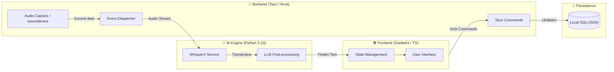

# System Architecture: aSTT Core

**Cesta:** docs/core/ARCHITECTURE.md
**Verze:** 1.5
**Vytvoreno:** 2026-02-15 19:28 (UTC+1)
**Posledni zmena:** 2026-03-04 16:32 (UTC+1)

## Historie zmen

| Datum | Verze | Popis zmeny |
| :--- | :--- | :--- |
| 2026-03-04 | 1.5 | Doplnen povinny runtime startup preflight, severity model a release gate poradi |
| 2026-03-04 | 1.4 | Doplnen baseline: Tauri-first runtime, security profily, outbound API guardrails |
| 2026-02-19 | 1.3 | Přidán diagram technické architektury |
| 2026-02-19 | 1.2 | P1 refactoring a sjednoceni s SSOT (docs/core) |
| 2026-02-17 | 1.1 | Automaticka aktualizace |
| 2026-02-15 | 1.0 | Pridana metadata |

## Stav

- [x] Metadata pridana
- [x] Technický diagram vložen
- [ ] Obsah dokumentu kompletni

---

## 1. Overview

aSTT is a modular desktop application designed for real-time speech transcription
and diarization, primarily for physicians. It leverages a high-performance Rust
backend (Tauri), a Python sidecar for ML inference (WhisperX), and a modern
web frontend.

> [!IMPORTANT]
> **Article I: Library-first**: All core features (ASR, LLM processing, Export)
> MUST be developed as standalone, independent libraries before integration
> into the Tauri host application.

## Stack model (runtime vs quality)

Pro rizeni projektu se striktne oddeluji dve vrstvy:

- Runtime stack (co bezi v produktu): Tauri/Rust, SvelteKit/TS, Python sidecar (WhisperX).
- Quality stack (co hlida kvalitu vyvoje): pre-commit, CI workflow, lint/test nastroje.

Pravidlo:
- Runtime stack se popisuje v `docs/core/ARCHITECTURE.md`.
- Quality workflow (hooks + CI + povinne kontroly) se popisuje v `docs/core/GOVERNANCE.md`.
- Tvrzeni o stavu implementace je platne jen po deterministickem PASS v hooks+CI.

## Security & privacy baseline (default)

- Priorita je fixni: `Privacy -> Security -> Quality`.
- Primarni runtime baseline je `Tauri + Rust`; Electron slouzi jako paritni alternativa.
- Security profily:
  - `Standard` (default, uzivatelsky privetivy),
  - `Hardened` (pridane potvrzovani a omezeni online vstupu),
  - `Strict` (admin-only, fail-closed pravidla a vyssi provozni restrikce).
- Nastaveni je role-based:
  - `User settings` pro UX preference,
  - `Admin settings` pro recording policy, online source policy, screen capture policy a outbound API policy.
- STT worker je navrzen jako offline-only modul i na online PC.
- Outbound integrace do ciziho programu:
  - odesila pouze zpracovany text/metadata (nikdy surove audio),
  - endpointy jsou ridene allowlistem,
  - mimo `localhost` je povinne TLS,
  - kazde odeslani/chyba je auditovano.

## Runtime startup preflight (mandatory)

- Produktovy runtime musi pred aktivaci STT/online capture spustit startup preflight.
- Preflight vraci pouze tri severity tridy:
  - `BLOCKER`: rizikova funkce se nespusti (fail-closed).
  - `WARNING`: funkce je povolena se zretelnou avizaci.
  - `INFO`: bez omezeni, pouze evidence.
- Povinne startup kontroly:
  - HW minimum (CPU, RAM, disk, dostupne audio device),
  - audio permission + dostupnost vstupu/vystupu,
  - firewall/antivir blokace sidecar procesu, IPC a lokalnich portu,
  - kolize znamych procesu/software, ktere mohou destabilizovat recording nebo IPC.
- Role-based vysledky:
  - User view: kratke vysvetleni + doporuceny krok.
  - Admin view: technicky detail (signal, proces, cesta, kod chyby) + navrh opravy.

## Product decision gates (mandatory order)

- Vsechny feature a release rozhodnuti se delaji v pevnem poradi:
  1. `Privacy`
  2. `Security`
  3. `Stability`
  4. `User comfort`
  5. `Windows/macOS portability`
- Pokud feature failne gate 1 nebo 2, implementace se stopuje bez vyjimky.
- Portability pravidlo:
  - Windows cil je portable no-install folder.
  - macOS cil je portable `.app` varianta; pokud prostredi vyzaduje podpis/notarizaci, musi to byt explicitne uvedeno jako deployment constraint.

## Technická Architektura (Stack & Tok Dat)

Tento diagram zobrazuje vnitřní strukturu aplikace a způsob, jakým data (zvuk) putují systémem od mikrofonu až po uživatelské rozhraní.



## Track Segmentation (Machine-Readable)

The project is architected as two parallel tracks defined in `project.json`:

- **Track 1 (Main SW)**: Production-ready code in `src-ui/`, `src-tauri/`. Python sidecar validated in Sandbox before integration.
- **Track 2 (Sandbox/Research)**: Research and prototypes in `sandbox/portable_bench/`. Focused on HW validation and rapid bench testing.

## Modules (Per Constitution)

### 1. ASR module (Python Sidecar)

- **Responsibility**: Audio ingestion, speech-to-text, speaker diarization.
- **Technology**: Python 3.10, WhisperX, PyTorch.
- **Communication**: **JSON-RPC over Stdio**.
- **Key interface**: `transcribe(audio_path) -> JSON`, `stream_audio(chunk) -> JSON`.

### 2. LLM module (Rust/Python Hybrid)

- **Responsibility**: Processing transcripts for summaries, notes, and structured data.
- **Technology**:
  - **Local**: `llama.cpp` (managed by Rust or Python sidecar).
  - **Cloud**: OpenAI-compatible REST API client (Rust).
- **Interface**: `process_text(text, prompt_template) -> text`.

### 3. Context module (Rust)

- **Responsibility**: Managing prompts, medical dictionaries, and user context.
- **Storage**: Local JSON/SQLite database.
- **Interface**: `get_prompt(scenario_id)`, `get_dictionary(specialty)`.

### 4. API & export module (Rust)

- **Responsibility**: Securely sending data to external systems.
- **Features**: Retry logic, authentication management, extensive logging.
- **Interface**: `export_to_ehr(data)`, `sync_to_cloud(data)`.

### 5. Settings & user module (Rust/UI)

- **Responsibility**: Configuration management, user profiles, licensing.
- **Storage**: Encrypted local config file.
- **Interface**: `load_settings()`, `save_settings()`.

## 5. Directory structure

```text
aSTT-RUST/
├── .agent/                  # AI Workflows & Instructions (Superpowers)
├── .venv/                   # Development virtual environment
├── docs/
│   ├── core/                # [SSOT] High-level project documentation
│   ├── plans/               # Implementation plans
│   ├── adr/                 # Architectural Decision Records (Log4brains)
│   └── sandbox/             # Research and prototype docs
├── src-tauri/               # [TRACK 1] Rust backend
├── src-ui/                  # [TRACK 1] Svelte frontend
├── sandbox/
│   └── portable_bench/      # [TRACK 2] HW prototype & Research
├── tools/
│   ├── vale/                # Local Vale binary
│   └── superpowers/         # Agentic skills library
├── scripts/                 # Automation & Inventory scripts
└── project.json             # Global machine metadata
```

## 6. Communication protocol (Sidecar IPC)

To prevent "IPC Fragility", Rust and Python communicate via a strict JSON-RPC schema over `stdin/stdout`.

- **Strictness**: Python uses `Pydantic` for validation; Rust uses `Serde`.
- **Log Isolation**: All non-JSON output from Python (logs, prints) is prefixed with `[LOG]` and ignored by the RPC parser to prevent JSON parsing errors.
- **Lifecycle**: Tauri manages the sidecar process (starts on app launch, kills on exit).

## Roadmap & Milestones

### 🗺️ High-level timeline

| Phase | Milestone | Focus | Status |
| :--- | :--- | :--- | :--- |
| **0** | **Portable Bench** | HW validation, Mic/PC audio support, Portable USB run. | **IN PROGRESS** |
| **1** | **Core Prototype** | Rust-Python bridge, Svelte UI, Start/Stop logic. | **PLANNED** |
| **2** | **Diarization Sync** | Real-time speaker labels in UI. | **PLANNED** |
| **3** | **LLM & Summaries** | Automatic clinical notes generation. | **PLANNED** |
| **4** | **Alpha (Physician)** | Portable USB build for field testing. | **PLANNED** |

### 📍 Current priority (Phase 0: Portable Bench)

**Goal**: Create a truly functional, high-performance benchmark that works as a standalone portable folder.

**Finished**:
- [x] Initial WhisperX research and venv setup.
- [x] Basic inference script.

**Pending (CRITICAL)**:
- [ ] **Mic & PC Audio Integration**: Support real-time capture from system audio.
- [ ] **Portable Verification**: Ensure everything runs from a USB stick without local Python install.
- [ ] **Audio Samples**: Test with 2-3 participant medical dialogue samples.

## Future Architecture: Mobile (Addendum)

### Strategy: Hybrid or Server-Side

Migrating the current Desktop architecture (Python Sidecar) to mobile is **not directly possible** due to OS sandboxing and resource constraints.

#### Option A: Server-Side Processing (Recommended for MVP)
- **Mobile App**: Lightweight UI (Tauri Mobile or React Native).
- **Backend**: The Desktop app's Python sidecar moves to a cloud API (FastAPI/GPU Server).
- **Flow**: App records audio -> Uploads to Server -> Server returns JSON.

#### Option B: On-Device (Advanced)
- **Engine Replacement**: Python/WhisperX must be replaced by **C++** libraries (`whisper.cpp` or `mlx` for iOS).
- **Integration**:
    - **iOS**: Swift bindings to CoreML/Metal.
    - **Android**: JNI bindings to TFLite/NCNN.
- **Tauri Mobile**: Can still be used for UI, but the "backend" logic moves from Python sidecar to Rust plugin wrapping the C++ libraries.
