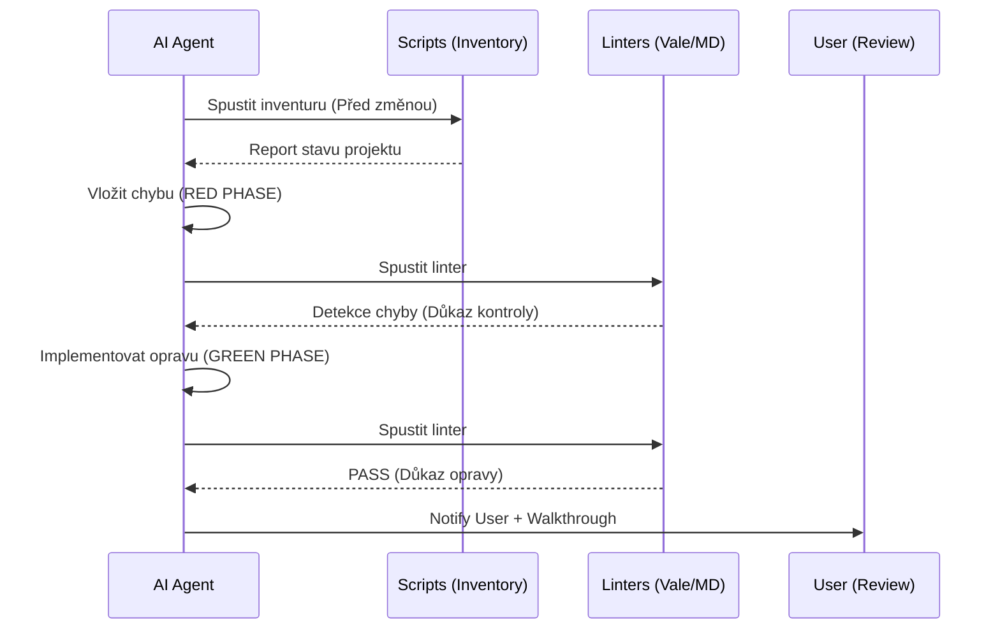
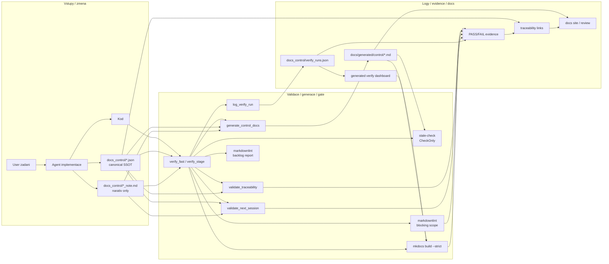

# Project Governance

**Cesta:** docs/core/GOVERNANCE.md
**Verze:** 1.9
**Vytvoreno:** 2026-02-15 19:28 (UTC+1)
**Posledni zmena:** 2026-03-04 16:32 (UTC+1)

## Historie zmen

| Datum | Verze | Popis zmeny |
| :--- | :--- | :--- |
| 2026-03-04 | 1.9 | Doplneny produktove release gates, runtime preflight governance a planovaci sablona feature scope |
| 2026-02-28 | 1.8 | Reset NEXT_SESSION po archivaci pouze s 2x explicitnim potvrzenim |
| 2026-02-28 | 1.7 | Doplnen branch-protection required-check checklist (vcetne determinism + clean clone smoke gate) |
| 2026-02-26 | 1.6 | Zaveden claim=evidence guard (task_status registry + preflight + batch verifier) |
| 2026-02-26 | 1.5 | Zavedena Vale policy: critical + changed-file + backlog no-regression |
| 2026-02-26 | 1.4 | Doplnen JSON-first control-plane procesni diagram a aktualizovan governance scope |
| 2026-02-19 | 1.3 | Přidán diagram životního cyklu dokumentace |
| 2026-02-19 | 1.2 | Refaktoring pro SSOT a integrace Proof-of-Failure |
| 2026-02-17 | 1.1 | Automaticka aktualizace |
| 2026-02-15 | 1.0 | Pridana metadata |

## Stav

- [x] Metadata pridana
- [x] P0 governance sjednocena s aktualnim procesem
- [ ] P1 doplneni detailnich pravidel pro vsechny adresare

---

Tento dokument urcuje pravidla kvality dokumentace, kodu a bezpecnosti.

## Ridici princip

- Dokumentace se meni jen v overenem kontextu (SSOT).
- Kontext je: SW inventura + health check + **Negative Testing (RED Phase)**.

## Governance matrix

- Dokumentace:
  - nastroj: `markdownlint-cli2`
  - trigger: PR / Push / Local Pre-commit (blocking scope)
  - zdroj: curated P0 docs + `docs_control/**/*.md`
  - politika: blocking scope (curated) + oddeleny backlog report (non-blocking)
- Odkazy v dokumentaci:
  - nastroj: `lychee`
  - trigger: PR / Push
  - zdroj: `docs/` + root `.md`
- Styl textu:
  - nastroj: `Vale`
  - trigger: Local pre-commit + PR / Push
  - zdroj: critical scope + changed-file scope + repo backlog report
  - config: `.vale.ini` (blocking errors-only), `.vale.backlog.ini` (report warning+)
- Claim/evidence statusy:
  - nastroj: `scripts/preflight_state_discovery.ps1` + `scripts/verify_batch_status.ps1`
  - trigger: `verify_fast` + PR / Push (governance jobs)
  - zdroj: `docs_control/task_status.json` + `docs_control/verify_runs.json`
  - politika: "claim = evidence" (VERIFIED_* pouze s run_id + required step PASS)
- Kod Node:
  - nastroj: `npm check/test`
  - trigger: PR / Push
  - zdroj: `package.json`
- Kod Rust:
  - nastroj: `fmt/clippy/test`
  - trigger: PR / Push
  - zdroj: `src-tauri/Cargo.toml`
- SW inventura:
  - nastroj: `scripts/inventory_project_sw.ps1`
  - trigger: denne 15:00 + CI
  - zdroj: `docs/software-inventory.md`
- Security posture:
  - nastroj: `OSSF Scorecard`
  - trigger: schedule + push master
  - zdroj: `.github/workflows/scorecard.yml`

## Životní cyklus změny (Workflow)

Každá změna v projektu musí následovat tento cyklus,
aby byla zaručena důvěryhodnost a integrita SSOT.

## Provozni pravidla

1. Pred refactoringem dokumentace spustit inventuru.
2. Pri kritickem FAIL nejdriv opravit infrastrukturu.
3. Zmeny ridicich dokumentu delat po davkach (P0 -> P1).
4. Po kazde davce aktualizovat canonical `docs_control/next_session.json`
   (+ `docs_control/next_session_note.md`) a regenerovat view.

### Vychozi operacni princip (globalni)

Pri navrhu a implementaci pouzivat vychozi rezim:
`deterministicka kvalita + efektivita`.

To znamena:

1. Nejdriv `state discovery` (realita, ne predpoklady).
1. Tvrde poradi pro zmenu je `indexace/preflight -> rozhodnuti -> zmena` (nikdy opacne).
1. Pred kodovanim uzamknout scope + acceptance.
1. Delat nejmensi plne funkcni end-to-end slice.
1. Kazdou zmenu mit validovatelnou (`schema`, `validator`, `alignment`, `stale-check`).
1. `generated` artefakty neupravovat rucne.
1. `claim = evidence` (zadne "hotovo" bez cerstveho dukazu).
1. Po zmene synchronizovat SSOT + generated view.
1. Pri procesni odchylce pouzit `freeze -> navrat k poradi`.

### Produktove gate poradi (release a plan)

1. Pro produktovy scope je povinne rozhodovaci poradi:
   - `Privacy -> Security -> Stability -> User comfort -> Portability`.
2. Pokud zmena neprojde `Privacy` nebo `Security`, release je blokovan.
3. Runtime startup preflight je release-critical:
   - bez validni preflight implementace/dokumentace nelze oznacit release jako ready.
4. Vsechny produktove tasky a ADR musi obsahovat minimalni planovaci sablonu:
   - dopad na `Privacy`,
   - security riziko + mitigace,
   - stabilita (failure modes + recovery),
   - UX dopad (normal + strict profil),
   - Windows/macOS portable dopad.

## Pravidlo archivace souboru

1. Aktivni/SSOT soubory zustavaji se stabilnim nazvem.
2. Archivni kopie pouzivaji format `nazev-YYYY-MM-DD--HH-mm.md`.
3. Odkazy i skripty miri na stabilni (nearchivni) nazvy.
4. `NEXT_SESSION` se archivuje do `NEXT_SESSION_Archive/`.
5. Nova session `NEXT_SESSION` se vytvari pouze pres
   `scripts/archive_next_session.ps1 -ResetAfterArchive -ResetConfirmA 'RESET_NEXT_SESSION_NOW' -ResetConfirmB 'RESET_NEXT_SESSION_NOW'`.
6. Reset po archivaci je povolen pouze na vyzadani a s 2x explicitnim potvrzenim.
7. Pred vytvorenim nove session musi byt vyplneny blok:
   `Neprovedeno`, `Rozpracovane`, `Provedeno`, `Poznamka`.

## Session report (analyza + testovani)

1. Reporty se ukladaji do `docs/plans/sessions/`.
1. Nazev je povinny ve formatu `YYYY-MM-DD--HH-mm_to_HH-mm--tema.md`.
1. Kazdy report musi obsahovat `coding_from_utc` a `coding_to_utc`.
1. CI doplnuje strojovy run report jako artefakt z `project-unified.yml`.

## Workflow enforcement (hooks + CI + docs)

1. Local hook (pre-commit) je povinny pro canonical `NEXT_SESSION` data:

   - `scripts/enforce_next_session_flow.ps1`

1. CI musi vynutit stejne pravidlo:

   - `.github/workflows/ci.yml` spousti:
     - `scripts/preflight_state_discovery.ps1`
     - `scripts/verify_batch_status.ps1`
     - `scripts/validate_capability_audit.ps1`
     - `scripts/validate_traceability.ps1`
     - `scripts/validate_next_session.ps1`
     - `scripts/generate_control_docs.ps1 -CheckOnly`
     - `scripts/enforce_next_session_flow.ps1`

1. Zmena pravidel workflow je validni az po synchronni uprave tri vrstev:

   - hook (`.pre-commit-config.yaml`)
   - CI (`.github/workflows/ci.yml`)
   - docs (`docs/core/GOVERNANCE.md`, `docs/generated/control/NEXT_SESSION.md`)
     a canonical JSON (`docs_control/next_session.json`)

1. Drift mezi docs a realnym workflow je blokujici chyba (P0).

## Procesni diagram (JSON-first control plane)

## Workflow control plane diagrams (diagram source of truth)

1. Diagramovy system ma vlastni canonical JSON SSOT:

   - `docs_control/workflow_control_plane.json`
   - `docs_control/workflow_control_plane.schema.json`
   - `docs_control/workflow_control_plane_note.md` (narativ only)

1. Generated diagram views se vytvari pouze skriptem:

   - `scripts/generate_workflow_control_diagrams.ps1`
   - output: `docs/generated/control/WORKFLOW_CONTROL_PLANE.md`
   - output: `docs/generated/control/workflow_control_plane.verify_evidence_path.md`

1. Validace diagramoveho systemu je rozdelena:

   - `scripts/validate_workflow_control_plane.ps1` (schema + integrita + coverage)
   - `scripts/validate_workflow_control_alignment.ps1` (canonical vs observed manifests)
   - observed manifests: `docs_control/observed_workflow/*.json`

1. Stejny princip plati i zde: zmena workflow bez synchronizace diagram SSOT/generatoru/validace je drift a blokujici chyba (P0).

## Markdownlint scope policy (blocking + backlog)

1. `blocking scope` (P0 gate, curated):

   - `docs/index.md`
   - `docs/core/GOVERNANCE.md`
   - `docs/generated/control/NEXT_SESSION.md`
   - `docs/generated/control/TRACEABILITY_SUMMARY.md`
   - `docs_control/**/*.md`
   - musi byt `PASS` lokalne i v CI

1. `backlog scope` (non-blocking):

   - repo-wide `**/*.md` (seznam dluhu)
   - slouzi pro mereni a burn-down, ne pro okamzite blokovani prace

1. Backlog report se ma generovat samostatne
   a nesmi maskovat blokujici chyby v `blocking scope`.

## Vale scope policy (critical + changed-file + backlog)

1. `critical blocking` (P0 gate, errors-only):

   - `docs/index.md`
   - `docs/core/GOVERNANCE.md`
   - `docs/generated/control/NEXT_SESSION.md`
   - `docs/generated/control/TRACEABILITY_SUMMARY.md`
   - `docs_control/next_session_note.md`
   - lokalne pres `pre-commit` hook `vale-critical`
   - v CI jako samostatny `Vale` step

1. `changed-file blocking` (errors-only):

   - kazdy zmeneny `.md` soubor (krome explicitne vyloucenych generated/archive/vendor cest)
   - lokalne pres `pre-commit` hook `vale`
   - cil: novy dluh nevznika v menenych souborech

1. `repo backlog report + no-regression`:

   - repo-wide scan pres `scripts/report_vale_backlog.ps1`
   - summary/log do `logs/verify/*`
   - baseline v `docs_control/vale_backlog_baseline.json`
   - `verify_fast` vynucuje `no-regression` (nesmi narust errors/warnings/suggestions)
   - CI backlog step je non-blocking report vrstva

## Claim=evidence guard (batch status registry + preflight)

1. `docs_control/task_status.json` je canonical registr batch/process claimu.

   - kazdy batch ma `status`, `required_artifacts`, `required_step_names`
   - status `VERIFIED_*` je povolen jen s `last_verified.run_id`
   - evidence se overuje proti `docs_control/verify_runs.json`

1. `preflight` se spousti pred dalsimi tvrzenimi o stavu:

   - `scripts/preflight_state_discovery.ps1`
   - generuje snapshot do `logs/verify/preflight_state.json`
   - je report-only (rychly reality check)

1. `Capability audit gate` je blokujici krok pred `preflight` pro tvrzeni o externim SW:

   - `docs_control/capability_audit.json` (+ schema) = canonical registry capability claimu
   - `scripts/validate_capability_audit.ps1` = validator + evidence generator
   - evidence: `logs/verify/toolchain_capabilities.json` + `logs/verify/capability_audit_summary.json`
   - claim pouzity pro rozhodovani musi byt `verified` + mit oficialni zdroj
   - bez auditu je status capability claimu `unknown`, ne kategoricky zaver

1. Pred mutacnimi generatory/docs update kroky je povinny `preflight write guard`:

   - `scripts/assert_preflight_write_guard.ps1`
   - vyzaduje cerstve `logs/verify/capability_audit_summary.json`
   - vyzaduje cerstve `logs/verify/preflight_state.json` + `logs/verify/batch_status_verify_summary.json`
   - vyzaduje cerstve `docs_control/observed_workflow/*.json` (indexace reality)
   - vynucuje poradi `indexace/alignment -> capability audit -> preflight -> batch verify -> zmena`
   - vyjimka: render verify dashboarde z `scripts/log_verify_run.ps1` muze pouzit
     `-SkipPreflightWriteGuard`, aby se neztratila evidence pri failu pred preflightem

1. `batch verifier` je blokujici krok pro governance claimy:

   - `scripts/verify_batch_status.ps1`
   - FAIL pokud claim `status` > strojove odvozeny `observed_status`
   - FAIL pokud `VERIFIED_*` nema platny `run_id` nebo required step PASS

1. Volitelne zprisneni (pilot / vybrane batchy):

   - `verification.require_clean_worktree_for_verified = true`
   - `VERIFIED_*` claim je potom platny jen pri cistych batch artefaktech
   - `scripts/verify_batch_status.ps1 -ApplyAutoDowngrade` muze automaticky snizit claim na
     `IMPLEMENTED_UNVERIFIED`, pokud jsou artefakty dirty

1. Po zmene batch artefaktu se claim ma explicitne snizit na
   `IMPLEMENTED_UNVERIFIED`, dokud neni znovu dolozen PASS evidenci.

1. Cilem je zabranit "epistemic drift":

   - tvrzeni "je hotovo" bez cerstveho overeni reality
   - zmena kontextu bez noveho preflight auditu

## Deterministicke pravidlo stavu (Spec-Kit + Superpowers)

1. Stav `PLANNED` patri pouze do canonical `docs_control/next_session.json`
   (Markdown je jen generated view / narativ).

1. Stav `IMPLEMENTED` je povolen az po dukazu:

   - local hook PASS (`pre-commit`)
   - CI PASS (`ci.yml` + `quality-gate.yml`)
   - docs sync PASS (`scripts/validate_workflow_alignment.ps1`)

1. Bez dukazu zustava stav `ROZPRACOVANE` nebo `NEPROVEDENO`.

1. Tvrzeni "hotovo" bez PASS dukazu je governance poruseni (P0).

## Branch protection (required checks)

1. Na vetvi `master` nastav `Require status checks to pass before merging`.
1. Pro `develop` aplikuj stejny checklist az po vytvoreni vetve `develop`.

1. Jako jediny required check nastav:

   - `Project Unified / project-required-check`

1. `Project Unified` orchestruje cele repo: CI, quality gate, docs, determinismus, clean-clone smoke
   a sandbox docs test (`sandbox/TestDocu_a001/**/*.md`).

1. Po kazde zmene `name:` workflow nebo `jobs.<id>.name` aktualizuj required checks,
   jinak branch protection muze vynucovat neexistujici check.

## Aktivni soubory procesu

- `docs/inventory-refactor-playbook.md`
- `docs/software-inventory.md`
- `docs/software-audit-method.md`
- `scripts/inventory_project_sw.ps1`
- `scripts/run_on_save_health_check.ps1`
- `.github/workflows/project-unified.yml`
- `.github/workflows/quality-gate.yml`
- `.github/workflows/determinism.yml`
- `.github/workflows/clean-clone-smoke.yml`
- `.github/workflows/scorecard.yml`
- `tools/superpowers/` (AI assistant framework)

## Nastroje v procesu

- `markdownlint-cli2`
- `lychee`
- `Vale`
- `pre-commit` (lokalne lze pouzit `SKIP=vale`)
- `OSSF Scorecard`

## Poznamka

- Toto je P0 verze pro nizkotokenovy, rizeny refactoring.
- Detailni roadmapa je v generated view `docs/generated/control/NEXT_SESSION.md`
  (ridici data jsou v `docs_control/next_session.json`).
