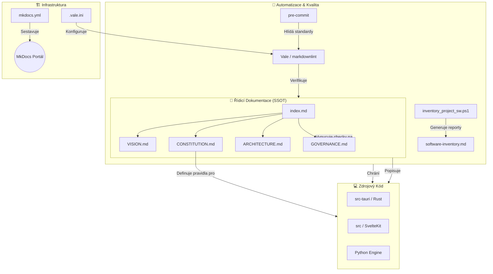

# Project Organization & Subordination

**Cesta:** docs/core/ORGANIZATION.md
**Verze:** 1.3
**Vytvoreno:** 2026-02-15 19:28 (UTC+1)
**Posledni zmena:** 2026-02-19 20:45 (UTC+1)

## Historie zmen

| Datum | Verze | Popis zmeny |
| :--- | :--- | :--- |
| 2026-02-19 | 1.3 | Přidán diagram projektové mapy (provázanost) |
| 2026-02-19 | 1.2 | P1 refactoring hierarchie a sjednoceni s SSOT |
| 2026-02-17 | 1.1 | Automaticka aktualizace |
| 2026-02-16 | 1.0 | Pridana metadata |

## Stav

- [x] Metadata pridana
- [x] Projektová mapa vložena (Mermaid)
- [ ] P1 doplneni detailnich pravidel pro vsechny adresare

---

This document visualizes the "Chain of Command" and absolute subordination for all project documentation and technical components.

## Projektová Mapa (Provázanost)

Tento diagram vizualizuje, jak jsou různé části projektu propojeny – od řídicí dokumentace přes automatizační skripty až po samotný kód.

## Hierarchie a podřízenost dokumentace

Toto je "mapa moci" celého projektu. Každý prvek je podřízen úrovni nad ním.

### L1: Ústavní vrstva (Supreme Law)

- **[CONSTITUTION.md](./CONSTITUTION.md)**: Nejvyšší zákon. Definuje etiku, bezpečnost a základní technické principy.

### L2: Strategická vrstva (Product Intent)

- **[VISION.md](./VISION.md)**: Cíl produktu, pro koho je a jakou má hodnotu.
- **[GOVERNANCE.md](./GOVERNANCE.md)**: Pravidla pro správu kvality, lintery a CI/CD.

### L3: Technická vrstva (Implementation Specs)

- **[ARCHITECTURE.md](./ARCHITECTURE.md)**: Technický stack, moduly, IPC a roadmapa.
- **[ORGANIZATION.md](./ORGANIZATION.md)**: (Tento dokument) Hierarchie a adresářová struktura.

### L4: Dynamická vrstva (Execution)

- **[NEXT_SESSION.md](./NEXT_SESSION.md)**: Co se děje teď a co bude dál.
- **`docs/plans/`**: Konkrétní implementační plány pro jednotlivé funkce.

---

## Tabulka Subordinace

| Úroveň | Dokument | Nadřazený prvek | Vliv na kód |
| :--- | :--- | :--- | :--- |
| **L1** | CONSTITUTION | Uživatelská bezpečnost | Absolutní (Blokující) |
| **L2** | VISION / GOVERNANCE | CONSTITUTION | Strategický / Kvalitativní |
| **L3** | ARCHITECTURE | VISION | Strukturální |
| **L4** | NEXT_SESSION | ARCHITECTURE | Operativní |

## Dokumentační Standard

Každý nový dokument musí být zapsán do **[INDEX.md](../index.md)** a musí následovat linter standardy definované v `.pre-commit-config.yaml`.
