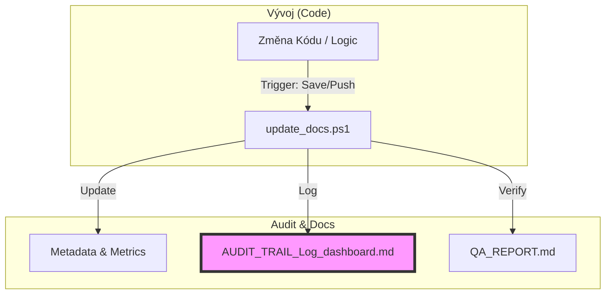

# ISATM: AUDIT TRAIL & Log Dashboard

Tento dashboard slouží k interaktivnímu sledování a auditu synchronizace mezi kódem a dokumentací projektu `aSTT-RUST`.

## 🔄 Code-Doc Sync Flow

## 📋 Unified Traceability Matrix

| Timestamp | Kategorie | Funkce / Modul | Účel / Důvod Změny | Zdroj (Code) | Dokumentace (MD) | Stav | Důkaz |
| :--- | :--- | :--- | :--- | :--- | :--- | :--- | :--- |
| <!-- ROW_START --> | | | | | | | |
| 2026-02-20 14:50 | Prostředí | NEXT_SESSION.md | Historický import | N/A | [C:\Users\adamf\OneDrive\Dokumenty\aSTT-RUST\NEXT_SESSION.md](C:\Users\adamf\OneDrive\Dokumenty\aSTT-RUST\NEXT_SESSION.md) | ✅ | `logs/runonsave.log` | 
| 2026-02-20 14:50 | Prostředí | VISION.md | Historický import | N/A | [C:\Users\adamf\OneDrive\Dokumenty\aSTT-RUST\VISION.md](C:\Users\adamf\OneDrive\Dokumenty\aSTT-RUST\VISION.md) | ✅ | `logs/runonsave.log` | 
| 2026-02-20 14:50 | Prostředí | CONSTITUTION.md | Historický import | N/A | [C:\Users\adamf\OneDrive\Dokumenty\aSTT-RUST\CONSTITUTION.md](C:\Users\adamf\OneDrive\Dokumenty\aSTT-RUST\CONSTITUTION.md) | ✅ | `logs/runonsave.log` | 
| 2026-02-20 14:50 | Prostředí | NEXT_SESSION.md | Historický import | N/A | [C:\Users\adamf\OneDrive\Dokumenty\aSTT-RUST\NEXT_SESSION.md](C:\Users\adamf\OneDrive\Dokumenty\aSTT-RUST\NEXT_SESSION.md) | ✅ | `logs/runonsave.log` | 
| 2026-02-20 14:50 | Prostředí | GOVERNANCE.md | Historický import | N/A | [C:\Users\adamf\OneDrive\Dokumenty\aSTT-RUST\GOVERNANCE.md](C:\Users\adamf\OneDrive\Dokumenty\aSTT-RUST\GOVERNANCE.md) | ✅ | `logs/runonsave.log` | 
| 2026-02-20 14:50 | Prostředí | INDEX.md | Historický import | N/A | [C:\Users\adamf\OneDrive\Dokumenty\aSTT-RUST\INDEX.md](C:\Users\adamf\OneDrive\Dokumenty\aSTT-RUST\INDEX.md) | ✅ | `logs/runonsave.log` | 
| 2026-02-20 14:50 | Prostředí | NEXT_SESSION.md | Historický import | N/A | [C:\Users\adamf\OneDrive\Dokumenty\aSTT-RUST\NEXT_SESSION.md](C:\Users\adamf\OneDrive\Dokumenty\aSTT-RUST\NEXT_SESSION.md) | ✅ | `logs/runonsave.log` | 
| 2026-02-20 14:50 | Prostředí | NEXT_SESSION-2026-02-17--14-44.md | Historický import | N/A | [C:\Users\adamf\OneDrive\Dokumenty\aSTT-RUST\NEXT_SESSION_Archive\NEXT_SESSION-2026-02-17--14-44.md](C:\Users\adamf\OneDrive\Dokumenty\aSTT-RUST\NEXT_SESSION_Archive\NEXT_SESSION-2026-02-17--14-44.md) | ✅ | `logs/runonsave.log` | 
| 2026-02-20 14:50 | Prostředí | NEXT_SESSION.md | Historický import | N/A | [C:\Users\adamf\OneDrive\Dokumenty\aSTT-RUST\NEXT_SESSION_Archive\NEXT_SESSION.md](C:\Users\adamf\OneDrive\Dokumenty\aSTT-RUST\NEXT_SESSION_Archive\NEXT_SESSION.md) | ✅ | `logs/runonsave.log` | 
| 2026-02-20 14:50 | Prostředí | INDEX.md | Historický import | N/A | [C:\Users\adamf\OneDrive\Dokumenty\aSTT-RUST\INDEX.md](C:\Users\adamf\OneDrive\Dokumenty\aSTT-RUST\INDEX.md) | ✅ | `logs/runonsave.log` | 
| 2026-02-20 14:50 | Prostředí | GOVERNANCE.md | Historický import | N/A | [C:\Users\adamf\OneDrive\Dokumenty\aSTT-RUST\GOVERNANCE.md](C:\Users\adamf\OneDrive\Dokumenty\aSTT-RUST\GOVERNANCE.md) | ✅ | `logs/runonsave.log` | 
| 2026-02-20 14:50 | Prostředí | INDEX.md | Historický import | N/A | [C:\Users\adamf\OneDrive\Dokumenty\aSTT-RUST\INDEX.md](C:\Users\adamf\OneDrive\Dokumenty\aSTT-RUST\INDEX.md) | ✅ | `logs/runonsave.log` | 
| 2026-02-20 14:50 | Prostředí | GOVERNANCE.md | Historický import | N/A | [C:\Users\adamf\OneDrive\Dokumenty\aSTT-RUST\GOVERNANCE.md](C:\Users\adamf\OneDrive\Dokumenty\aSTT-RUST\GOVERNANCE.md) | ✅ | `logs/runonsave.log` | 
| 2026-02-20 14:50 | Prostředí | inventory-refactor-playbook.md | Historický import | N/A | [C:\Users\adamf\OneDrive\Dokumenty\aSTT-RUST\docs\inventory-refactor-playbook.md](C:\Users\adamf\OneDrive\Dokumenty\aSTT-RUST\docs\inventory-refactor-playbook.md) | ✅ | `logs/runonsave.log` | 
| 2026-02-20 14:50 | Prostředí | INDEX.md | Historický import | N/A | [C:\Users\adamf\OneDrive\Dokumenty\aSTT-RUST\INDEX.md](C:\Users\adamf\OneDrive\Dokumenty\aSTT-RUST\INDEX.md) | ✅ | `logs/runonsave.log` | 
| 2026-02-20 14:50 | Prostředí | GOVERNANCE.md | Historický import | N/A | [C:\Users\adamf\OneDrive\Dokumenty\aSTT-RUST\GOVERNANCE.md](C:\Users\adamf\OneDrive\Dokumenty\aSTT-RUST\GOVERNANCE.md) | ✅ | `logs/runonsave.log` | 
| 2026-02-20 14:50 | Prostředí | inventory-refactor-playbook.md | Historický import | N/A | [C:\Users\adamf\OneDrive\Dokumenty\aSTT-RUST\docs\inventory-refactor-playbook.md](C:\Users\adamf\OneDrive\Dokumenty\aSTT-RUST\docs\inventory-refactor-playbook.md) | ✅ | `logs/runonsave.log` | 
| 2026-02-20 14:50 | Prostředí | INDEX.md | Historický import | N/A | [C:\Users\adamf\OneDrive\Dokumenty\aSTT-RUST\INDEX.md](C:\Users\adamf\OneDrive\Dokumenty\aSTT-RUST\INDEX.md) | ✅ | `logs/runonsave.log` | 
| 2026-02-20 14:50 | Prostředí | GOVERNANCE.md | Historický import | N/A | [C:\Users\adamf\OneDrive\Dokumenty\aSTT-RUST\GOVERNANCE.md](C:\Users\adamf\OneDrive\Dokumenty\aSTT-RUST\GOVERNANCE.md) | ✅ | `logs/runonsave.log` | 
| 2026-02-20 14:50 | Prostředí | inventory-refactor-playbook.md | Historický import | N/A | [C:\Users\adamf\OneDrive\Dokumenty\aSTT-RUST\docs\inventory-refactor-playbook.md](C:\Users\adamf\OneDrive\Dokumenty\aSTT-RUST\docs\inventory-refactor-playbook.md) | ✅ | `logs/runonsave.log` | 
| 2026-02-20 14:50 | Prostředí | INDEX.md | Historický import | N/A | [C:\Users\adamf\OneDrive\Dokumenty\aSTT-RUST\INDEX.md](C:\Users\adamf\OneDrive\Dokumenty\aSTT-RUST\INDEX.md) | ✅ | `logs/runonsave.log` | 
| 2026-02-20 14:50 | Prostředí | GOVERNANCE.md | Historický import | N/A | [C:\Users\adamf\OneDrive\Dokumenty\aSTT-RUST\GOVERNANCE.md](C:\Users\adamf\OneDrive\Dokumenty\aSTT-RUST\GOVERNANCE.md) | ✅ | `logs/runonsave.log` | 
| 2026-02-20 14:50 | Prostředí | inventory-refactor-playbook.md | Historický import | N/A | [C:\Users\adamf\OneDrive\Dokumenty\aSTT-RUST\docs\inventory-refactor-playbook.md](C:\Users\adamf\OneDrive\Dokumenty\aSTT-RUST\docs\inventory-refactor-playbook.md) | ✅ | `logs/runonsave.log` | 
| 2026-02-20 14:50 | Prostředí | INDEX.md | Historický import | N/A | [C:\Users\adamf\OneDrive\Dokumenty\aSTT-RUST\INDEX.md](C:\Users\adamf\OneDrive\Dokumenty\aSTT-RUST\INDEX.md) | ✅ | `logs/runonsave.log` | 
| 2026-02-20 14:50 | Prostředí | GOVERNANCE.md | Historický import | N/A | [C:\Users\adamf\OneDrive\Dokumenty\aSTT-RUST\GOVERNANCE.md](C:\Users\adamf\OneDrive\Dokumenty\aSTT-RUST\GOVERNANCE.md) | ✅ | `logs/runonsave.log` | 
| 2026-02-20 14:50 | Prostředí | inventory-refactor-playbook.md | Historický import | N/A | [C:\Users\adamf\OneDrive\Dokumenty\aSTT-RUST\docs\inventory-refactor-playbook.md](C:\Users\adamf\OneDrive\Dokumenty\aSTT-RUST\docs\inventory-refactor-playbook.md) | ✅ | `logs/runonsave.log` | 
| 2026-02-20 14:50 | Prostředí | INDEX.md | Historický import | N/A | [C:\Users\adamf\OneDrive\Dokumenty\aSTT-RUST\INDEX.md](C:\Users\adamf\OneDrive\Dokumenty\aSTT-RUST\INDEX.md) | ✅ | `logs/runonsave.log` | 
| 2026-02-20 14:50 | Prostředí | GOVERNANCE.md | Historický import | N/A | [C:\Users\adamf\OneDrive\Dokumenty\aSTT-RUST\GOVERNANCE.md](C:\Users\adamf\OneDrive\Dokumenty\aSTT-RUST\GOVERNANCE.md) | ✅ | `logs/runonsave.log` | 
| 2026-02-20 14:50 | Prostředí | inventory-refactor-playbook.md | Historický import | N/A | [C:\Users\adamf\OneDrive\Dokumenty\aSTT-RUST\docs\inventory-refactor-playbook.md](C:\Users\adamf\OneDrive\Dokumenty\aSTT-RUST\docs\inventory-refactor-playbook.md) | ✅ | `logs/runonsave.log` | 
| 2026-02-20 14:50 | Prostředí | INDEX.md | Historický import | N/A | [C:\Users\adamf\OneDrive\Dokumenty\aSTT-RUST\INDEX.md](C:\Users\adamf\OneDrive\Dokumenty\aSTT-RUST\INDEX.md) | ✅ | `logs/runonsave.log` | 
| 2026-02-20 14:50 | Prostředí | GOVERNANCE.md | Historický import | N/A | [C:\Users\adamf\OneDrive\Dokumenty\aSTT-RUST\GOVERNANCE.md](C:\Users\adamf\OneDrive\Dokumenty\aSTT-RUST\GOVERNANCE.md) | ✅ | `logs/runonsave.log` | 
| 2026-02-20 14:49 | Prostředí | inventory-refactor-playbook.md | Historický import | N/A | [C:\Users\adamf\OneDrive\Dokumenty\aSTT-RUST\docs\inventory-refactor-playbook.md](C:\Users\adamf\OneDrive\Dokumenty\aSTT-RUST\docs\inventory-refactor-playbook.md) | ✅ | `logs/runonsave.log` | 
| 2026-02-20 14:49 | Prostředí | INDEX.md | Historický import | N/A | [C:\Users\adamf\OneDrive\Dokumenty\aSTT-RUST\INDEX.md](C:\Users\adamf\OneDrive\Dokumenty\aSTT-RUST\INDEX.md) | ✅ | `logs/runonsave.log` | 
| 2026-02-20 14:49 | Prostředí | GOVERNANCE.md | Historický import | N/A | [C:\Users\adamf\OneDrive\Dokumenty\aSTT-RUST\GOVERNANCE.md](C:\Users\adamf\OneDrive\Dokumenty\aSTT-RUST\GOVERNANCE.md) | ✅ | `logs/runonsave.log` | 
| 2026-02-20 14:49 | Prostředí | inventory-refactor-playbook.md | Historický import | N/A | [C:\Users\adamf\OneDrive\Dokumenty\aSTT-RUST\docs\inventory-refactor-playbook.md](C:\Users\adamf\OneDrive\Dokumenty\aSTT-RUST\docs\inventory-refactor-playbook.md) | ✅ | `logs/runonsave.log` | 
| 2026-02-20 14:49 | Prostředí | INDEX.md | Historický import | N/A | [C:\Users\adamf\OneDrive\Dokumenty\aSTT-RUST\INDEX.md](C:\Users\adamf\OneDrive\Dokumenty\aSTT-RUST\INDEX.md) | ✅ | `logs/runonsave.log` | 
| 2026-02-20 14:49 | Prostředí | GOVERNANCE.md | Historický import | N/A | [C:\Users\adamf\OneDrive\Dokumenty\aSTT-RUST\GOVERNANCE.md](C:\Users\adamf\OneDrive\Dokumenty\aSTT-RUST\GOVERNANCE.md) | ✅ | `logs/runonsave.log` | 
| 2026-02-20 14:49 | Prostředí | inventory-refactor-playbook.md | Historický import | N/A | [C:\Users\adamf\OneDrive\Dokumenty\aSTT-RUST\docs\inventory-refactor-playbook.md](C:\Users\adamf\OneDrive\Dokumenty\aSTT-RUST\docs\inventory-refactor-playbook.md) | ✅ | `logs/runonsave.log` | 
| 2026-02-20 14:49 | Prostředí | INDEX.md | Historický import | N/A | [C:\Users\adamf\OneDrive\Dokumenty\aSTT-RUST\INDEX.md](C:\Users\adamf\OneDrive\Dokumenty\aSTT-RUST\INDEX.md) | ✅ | `logs/runonsave.log` | 
| 2026-02-20 14:49 | Prostředí | GOVERNANCE.md | Historický import | N/A | [C:\Users\adamf\OneDrive\Dokumenty\aSTT-RUST\GOVERNANCE.md](C:\Users\adamf\OneDrive\Dokumenty\aSTT-RUST\GOVERNANCE.md) | ✅ | `logs/runonsave.log` | 
| 2026-02-20 14:49 | Prostředí | inventory-refactor-playbook.md | Historický import | N/A | [C:\Users\adamf\OneDrive\Dokumenty\aSTT-RUST\docs\inventory-refactor-playbook.md](C:\Users\adamf\OneDrive\Dokumenty\aSTT-RUST\docs\inventory-refactor-playbook.md) | ✅ | `logs/runonsave.log` | 
| 2026-02-20 14:49 | Prostředí | INDEX.md | Historický import | N/A | [C:\Users\adamf\OneDrive\Dokumenty\aSTT-RUST\INDEX.md](C:\Users\adamf\OneDrive\Dokumenty\aSTT-RUST\INDEX.md) | ✅ | `logs/runonsave.log` | 
| 2026-02-20 14:49 | Prostředí | GOVERNANCE.md | Historický import | N/A | [C:\Users\adamf\OneDrive\Dokumenty\aSTT-RUST\GOVERNANCE.md](C:\Users\adamf\OneDrive\Dokumenty\aSTT-RUST\GOVERNANCE.md) | ✅ | `logs/runonsave.log` | 
| 2026-02-20 14:49 | Prostředí | inventory-refactor-playbook.md | Historický import | N/A | [C:\Users\adamf\OneDrive\Dokumenty\aSTT-RUST\docs\inventory-refactor-playbook.md](C:\Users\adamf\OneDrive\Dokumenty\aSTT-RUST\docs\inventory-refactor-playbook.md) | ✅ | `logs/runonsave.log` | 
| 2026-02-20 14:49 | Prostředí | INDEX.md | Historický import | N/A | [C:\Users\adamf\OneDrive\Dokumenty\aSTT-RUST\INDEX.md](C:\Users\adamf\OneDrive\Dokumenty\aSTT-RUST\INDEX.md) | ✅ | `logs/runonsave.log` | 
| 2026-02-20 14:49 | Prostředí | GOVERNANCE.md | Historický import | N/A | [C:\Users\adamf\OneDrive\Dokumenty\aSTT-RUST\GOVERNANCE.md](C:\Users\adamf\OneDrive\Dokumenty\aSTT-RUST\GOVERNANCE.md) | ✅ | `logs/runonsave.log` | 
| 2026-02-20 14:49 | Prostředí | inventory-refactor-playbook.md | Historický import | N/A | [C:\Users\adamf\OneDrive\Dokumenty\aSTT-RUST\docs\inventory-refactor-playbook.md](C:\Users\adamf\OneDrive\Dokumenty\aSTT-RUST\docs\inventory-refactor-playbook.md) | ✅ | `logs/runonsave.log` | 
| 2026-02-20 14:49 | Prostředí | INDEX.md | Historický import | N/A | [C:\Users\adamf\OneDrive\Dokumenty\aSTT-RUST\INDEX.md](C:\Users\adamf\OneDrive\Dokumenty\aSTT-RUST\INDEX.md) | ✅ | `logs/runonsave.log` | 
| 2026-02-20 14:49 | Prostředí | GOVERNANCE.md | Historický import | N/A | [C:\Users\adamf\OneDrive\Dokumenty\aSTT-RUST\GOVERNANCE.md](C:\Users\adamf\OneDrive\Dokumenty\aSTT-RUST\GOVERNANCE.md) | ✅ | `logs/runonsave.log` | 
| 2026-02-20 14:49 | Prostředí | inventory-refactor-playbook.md | Historický import | N/A | [C:\Users\adamf\OneDrive\Dokumenty\aSTT-RUST\docs\inventory-refactor-playbook.md](C:\Users\adamf\OneDrive\Dokumenty\aSTT-RUST\docs\inventory-refactor-playbook.md) | ✅ | `logs/runonsave.log` | 
| 2026-02-20 14:49 | Prostředí | INDEX.md | Historický import | N/A | [C:\Users\adamf\OneDrive\Dokumenty\aSTT-RUST\INDEX.md](C:\Users\adamf\OneDrive\Dokumenty\aSTT-RUST\INDEX.md) | ✅ | `logs/runonsave.log` | 
| 2026-02-20 14:49 | Prostředí | GOVERNANCE.md | Historický import | N/A | [C:\Users\adamf\OneDrive\Dokumenty\aSTT-RUST\GOVERNANCE.md](C:\Users\adamf\OneDrive\Dokumenty\aSTT-RUST\GOVERNANCE.md) | ✅ | `logs/runonsave.log` | 
| 2026-02-20 14:49 | Prostředí | inventory-refactor-playbook.md | Historický import | N/A | [C:\Users\adamf\OneDrive\Dokumenty\aSTT-RUST\docs\inventory-refactor-playbook.md](C:\Users\adamf\OneDrive\Dokumenty\aSTT-RUST\docs\inventory-refactor-playbook.md) | ✅ | `logs/runonsave.log` | 
| 2026-02-20 14:49 | Prostředí | INDEX.md | Historický import | N/A | [C:\Users\adamf\OneDrive\Dokumenty\aSTT-RUST\INDEX.md](C:\Users\adamf\OneDrive\Dokumenty\aSTT-RUST\INDEX.md) | ✅ | `logs/runonsave.log` | 
| 2026-02-20 14:49 | Prostředí | GOVERNANCE.md | Historický import | N/A | [C:\Users\adamf\OneDrive\Dokumenty\aSTT-RUST\GOVERNANCE.md](C:\Users\adamf\OneDrive\Dokumenty\aSTT-RUST\GOVERNANCE.md) | ✅ | `logs/runonsave.log` | 
| 2026-02-20 14:49 | Prostředí | inventory-refactor-playbook.md | Historický import | N/A | [C:\Users\adamf\OneDrive\Dokumenty\aSTT-RUST\docs\inventory-refactor-playbook.md](C:\Users\adamf\OneDrive\Dokumenty\aSTT-RUST\docs\inventory-refactor-playbook.md) | ✅ | `logs/runonsave.log` | 
| 2026-02-20 14:49 | Prostředí | INDEX.md | Historický import | N/A | [C:\Users\adamf\OneDrive\Dokumenty\aSTT-RUST\INDEX.md](C:\Users\adamf\OneDrive\Dokumenty\aSTT-RUST\INDEX.md) | ✅ | `logs/runonsave.log` | 
| 2026-02-20 14:49 | Prostředí | GOVERNANCE.md | Historický import | N/A | [C:\Users\adamf\OneDrive\Dokumenty\aSTT-RUST\GOVERNANCE.md](C:\Users\adamf\OneDrive\Dokumenty\aSTT-RUST\GOVERNANCE.md) | ✅ | `logs/runonsave.log` | 
| 2026-02-20 14:49 | Prostředí | inventory-refactor-playbook.md | Historický import | N/A | [C:\Users\adamf\OneDrive\Dokumenty\aSTT-RUST\docs\inventory-refactor-playbook.md](C:\Users\adamf\OneDrive\Dokumenty\aSTT-RUST\docs\inventory-refactor-playbook.md) | ✅ | `logs/runonsave.log` | 
| 2026-02-20 14:49 | Prostředí | INDEX.md | Historický import | N/A | [C:\Users\adamf\OneDrive\Dokumenty\aSTT-RUST\INDEX.md](C:\Users\adamf\OneDrive\Dokumenty\aSTT-RUST\INDEX.md) | ✅ | `logs/runonsave.log` | 
| 2026-02-20 14:48 | Prostředí | GOVERNANCE.md | Historický import | N/A | [C:\Users\adamf\OneDrive\Dokumenty\aSTT-RUST\GOVERNANCE.md](C:\Users\adamf\OneDrive\Dokumenty\aSTT-RUST\GOVERNANCE.md) | ✅ | `logs/runonsave.log` | 
| 2026-02-20 14:48 | Prostředí | inventory-refactor-playbook.md | Historický import | N/A | [C:\Users\adamf\OneDrive\Dokumenty\aSTT-RUST\docs\inventory-refactor-playbook.md](C:\Users\adamf\OneDrive\Dokumenty\aSTT-RUST\docs\inventory-refactor-playbook.md) | ✅ | `logs/runonsave.log` | 
| 2026-02-20 14:48 | Prostředí | INDEX.md | Historický import | N/A | [C:\Users\adamf\OneDrive\Dokumenty\aSTT-RUST\INDEX.md](C:\Users\adamf\OneDrive\Dokumenty\aSTT-RUST\INDEX.md) | ✅ | `logs/runonsave.log` | 
| 2026-02-20 14:48 | Prostředí | GOVERNANCE.md | Historický import | N/A | [C:\Users\adamf\OneDrive\Dokumenty\aSTT-RUST\GOVERNANCE.md](C:\Users\adamf\OneDrive\Dokumenty\aSTT-RUST\GOVERNANCE.md) | ✅ | `logs/runonsave.log` | 
| 2026-02-20 14:48 | Prostředí | inventory-refactor-playbook.md | Historický import | N/A | [C:\Users\adamf\OneDrive\Dokumenty\aSTT-RUST\docs\inventory-refactor-playbook.md](C:\Users\adamf\OneDrive\Dokumenty\aSTT-RUST\docs\inventory-refactor-playbook.md) | ✅ | `logs/runonsave.log` | 
| 2026-02-20 14:48 | Prostředí | INDEX.md | Historický import | N/A | [C:\Users\adamf\OneDrive\Dokumenty\aSTT-RUST\INDEX.md](C:\Users\adamf\OneDrive\Dokumenty\aSTT-RUST\INDEX.md) | ✅ | `logs/runonsave.log` | 
| 2026-02-20 14:48 | Prostředí | GOVERNANCE.md | Historický import | N/A | [C:\Users\adamf\OneDrive\Dokumenty\aSTT-RUST\GOVERNANCE.md](C:\Users\adamf\OneDrive\Dokumenty\aSTT-RUST\GOVERNANCE.md) | ✅ | `logs/runonsave.log` | 
| 2026-02-20 14:48 | Prostředí | inventory-refactor-playbook.md | Historický import | N/A | [C:\Users\adamf\OneDrive\Dokumenty\aSTT-RUST\docs\inventory-refactor-playbook.md](C:\Users\adamf\OneDrive\Dokumenty\aSTT-RUST\docs\inventory-refactor-playbook.md) | ✅ | `logs/runonsave.log` | 
| 2026-02-20 14:48 | Prostředí | INDEX.md | Historický import | N/A | [C:\Users\adamf\OneDrive\Dokumenty\aSTT-RUST\INDEX.md](C:\Users\adamf\OneDrive\Dokumenty\aSTT-RUST\INDEX.md) | ✅ | `logs/runonsave.log` | 
| 2026-02-20 14:48 | Prostředí | GOVERNANCE.md | Historický import | N/A | [C:\Users\adamf\OneDrive\Dokumenty\aSTT-RUST\GOVERNANCE.md](C:\Users\adamf\OneDrive\Dokumenty\aSTT-RUST\GOVERNANCE.md) | ✅ | `logs/runonsave.log` | 
| 2026-02-20 14:48 | Prostředí | inventory-refactor-playbook.md | Historický import | N/A | [C:\Users\adamf\OneDrive\Dokumenty\aSTT-RUST\docs\inventory-refactor-playbook.md](C:\Users\adamf\OneDrive\Dokumenty\aSTT-RUST\docs\inventory-refactor-playbook.md) | ✅ | `logs/runonsave.log` | 
| 2026-02-20 14:48 | Prostředí | INDEX.md | Historický import | N/A | [C:\Users\adamf\OneDrive\Dokumenty\aSTT-RUST\INDEX.md](C:\Users\adamf\OneDrive\Dokumenty\aSTT-RUST\INDEX.md) | ✅ | `logs/runonsave.log` | 
| 2026-02-20 14:48 | Prostředí | GOVERNANCE.md | Historický import | N/A | [C:\Users\adamf\OneDrive\Dokumenty\aSTT-RUST\GOVERNANCE.md](C:\Users\adamf\OneDrive\Dokumenty\aSTT-RUST\GOVERNANCE.md) | ✅ | `logs/runonsave.log` | 
| 2026-02-20 14:48 | Prostředí | inventory-refactor-playbook.md | Historický import | N/A | [C:\Users\adamf\OneDrive\Dokumenty\aSTT-RUST\docs\inventory-refactor-playbook.md](C:\Users\adamf\OneDrive\Dokumenty\aSTT-RUST\docs\inventory-refactor-playbook.md) | ✅ | `logs/runonsave.log` | 
| 2026-02-20 14:48 | Prostředí | INDEX.md | Historický import | N/A | [C:\Users\adamf\OneDrive\Dokumenty\aSTT-RUST\INDEX.md](C:\Users\adamf\OneDrive\Dokumenty\aSTT-RUST\INDEX.md) | ✅ | `logs/runonsave.log` | 
| 2026-02-20 14:48 | Prostředí | GOVERNANCE.md | Historický import | N/A | [C:\Users\adamf\OneDrive\Dokumenty\aSTT-RUST\GOVERNANCE.md](C:\Users\adamf\OneDrive\Dokumenty\aSTT-RUST\GOVERNANCE.md) | ✅ | `logs/runonsave.log` | 
| 2026-02-20 14:48 | Prostředí | inventory-refactor-playbook.md | Historický import | N/A | [C:\Users\adamf\OneDrive\Dokumenty\aSTT-RUST\docs\inventory-refactor-playbook.md](C:\Users\adamf\OneDrive\Dokumenty\aSTT-RUST\docs\inventory-refactor-playbook.md) | ✅ | `logs/runonsave.log` | 
| 2026-02-20 14:48 | Prostředí | INDEX.md | Historický import | N/A | [C:\Users\adamf\OneDrive\Dokumenty\aSTT-RUST\INDEX.md](C:\Users\adamf\OneDrive\Dokumenty\aSTT-RUST\INDEX.md) | ✅ | `logs/runonsave.log` | 
| 2026-02-20 14:48 | Prostředí | GOVERNANCE.md | Historický import | N/A | [C:\Users\adamf\OneDrive\Dokumenty\aSTT-RUST\GOVERNANCE.md](C:\Users\adamf\OneDrive\Dokumenty\aSTT-RUST\GOVERNANCE.md) | ✅ | `logs/runonsave.log` | 
| 2026-02-20 14:48 | Prostředí | inventory-refactor-playbook.md | Historický import | N/A | [C:\Users\adamf\OneDrive\Dokumenty\aSTT-RUST\docs\inventory-refactor-playbook.md](C:\Users\adamf\OneDrive\Dokumenty\aSTT-RUST\docs\inventory-refactor-playbook.md) | ✅ | `logs/runonsave.log` | 
| 2026-02-20 14:48 | Prostředí | INDEX.md | Historický import | N/A | [C:\Users\adamf\OneDrive\Dokumenty\aSTT-RUST\INDEX.md](C:\Users\adamf\OneDrive\Dokumenty\aSTT-RUST\INDEX.md) | ✅ | `logs/runonsave.log` | 
| 2026-02-20 14:48 | Prostředí | GOVERNANCE.md | Historický import | N/A | [C:\Users\adamf\OneDrive\Dokumenty\aSTT-RUST\GOVERNANCE.md](C:\Users\adamf\OneDrive\Dokumenty\aSTT-RUST\GOVERNANCE.md) | ✅ | `logs/runonsave.log` | 
| 2026-02-20 14:48 | Prostředí | inventory-refactor-playbook.md | Historický import | N/A | [C:\Users\adamf\OneDrive\Dokumenty\aSTT-RUST\docs\inventory-refactor-playbook.md](C:\Users\adamf\OneDrive\Dokumenty\aSTT-RUST\docs\inventory-refactor-playbook.md) | ✅ | `logs/runonsave.log` | 
| 2026-02-20 14:48 | Prostředí | INDEX.md | Historický import | N/A | [C:\Users\adamf\OneDrive\Dokumenty\aSTT-RUST\INDEX.md](C:\Users\adamf\OneDrive\Dokumenty\aSTT-RUST\INDEX.md) | ✅ | `logs/runonsave.log` | 
| 2026-02-20 14:48 | Prostředí | GOVERNANCE.md | Historický import | N/A | [C:\Users\adamf\OneDrive\Dokumenty\aSTT-RUST\GOVERNANCE.md](C:\Users\adamf\OneDrive\Dokumenty\aSTT-RUST\GOVERNANCE.md) | ✅ | `logs/runonsave.log` | 
| 2026-02-20 14:48 | Prostředí | inventory-refactor-playbook.md | Historický import | N/A | [C:\Users\adamf\OneDrive\Dokumenty\aSTT-RUST\docs\inventory-refactor-playbook.md](C:\Users\adamf\OneDrive\Dokumenty\aSTT-RUST\docs\inventory-refactor-playbook.md) | ✅ | `logs/runonsave.log` | 
| 2026-02-20 14:48 | Prostředí | INDEX.md | Historický import | N/A | [C:\Users\adamf\OneDrive\Dokumenty\aSTT-RUST\INDEX.md](C:\Users\adamf\OneDrive\Dokumenty\aSTT-RUST\INDEX.md) | ✅ | `logs/runonsave.log` | 
| 2026-02-20 14:48 | Prostředí | GOVERNANCE.md | Historický import | N/A | [C:\Users\adamf\OneDrive\Dokumenty\aSTT-RUST\GOVERNANCE.md](C:\Users\adamf\OneDrive\Dokumenty\aSTT-RUST\GOVERNANCE.md) | ✅ | `logs/runonsave.log` | 
| 2026-02-20 14:48 | Prostředí | inventory-refactor-playbook.md | Historický import | N/A | [C:\Users\adamf\OneDrive\Dokumenty\aSTT-RUST\docs\inventory-refactor-playbook.md](C:\Users\adamf\OneDrive\Dokumenty\aSTT-RUST\docs\inventory-refactor-playbook.md) | ✅ | `logs/runonsave.log` | 
| 2026-02-20 14:47 | Prostředí | INDEX.md | Historický import | N/A | [C:\Users\adamf\OneDrive\Dokumenty\aSTT-RUST\INDEX.md](C:\Users\adamf\OneDrive\Dokumenty\aSTT-RUST\INDEX.md) | ✅ | `logs/runonsave.log` | 
| 2026-02-20 14:47 | Prostředí | GOVERNANCE.md | Historický import | N/A | [C:\Users\adamf\OneDrive\Dokumenty\aSTT-RUST\GOVERNANCE.md](C:\Users\adamf\OneDrive\Dokumenty\aSTT-RUST\GOVERNANCE.md) | ✅ | `logs/runonsave.log` | 
| 2026-02-20 14:47 | Prostředí | inventory-refactor-playbook.md | Historický import | N/A | [C:\Users\adamf\OneDrive\Dokumenty\aSTT-RUST\docs\inventory-refactor-playbook.md](C:\Users\adamf\OneDrive\Dokumenty\aSTT-RUST\docs\inventory-refactor-playbook.md) | ✅ | `logs/runonsave.log` | 
| 2026-02-20 14:47 | Prostředí | INDEX.md | Historický import | N/A | [C:\Users\adamf\OneDrive\Dokumenty\aSTT-RUST\INDEX.md](C:\Users\adamf\OneDrive\Dokumenty\aSTT-RUST\INDEX.md) | ✅ | `logs/runonsave.log` | 
| 2026-02-20 14:47 | Prostředí | GOVERNANCE.md | Historický import | N/A | [C:\Users\adamf\OneDrive\Dokumenty\aSTT-RUST\GOVERNANCE.md](C:\Users\adamf\OneDrive\Dokumenty\aSTT-RUST\GOVERNANCE.md) | ✅ | `logs/runonsave.log` | 
| 2026-02-20 14:47 | Prostředí | inventory-refactor-playbook.md | Historický import | N/A | [C:\Users\adamf\OneDrive\Dokumenty\aSTT-RUST\docs\inventory-refactor-playbook.md](C:\Users\adamf\OneDrive\Dokumenty\aSTT-RUST\docs\inventory-refactor-playbook.md) | ✅ | `logs/runonsave.log` | 
| 2026-02-20 14:47 | Prostředí | INDEX.md | Historický import | N/A | [C:\Users\adamf\OneDrive\Dokumenty\aSTT-RUST\INDEX.md](C:\Users\adamf\OneDrive\Dokumenty\aSTT-RUST\INDEX.md) | ✅ | `logs/runonsave.log` | 
| 2026-02-20 14:47 | Prostředí | GOVERNANCE.md | Historický import | N/A | [C:\Users\adamf\OneDrive\Dokumenty\aSTT-RUST\GOVERNANCE.md](C:\Users\adamf\OneDrive\Dokumenty\aSTT-RUST\GOVERNANCE.md) | ✅ | `logs/runonsave.log` | 
| 2026-02-20 14:47 | Prostředí | inventory-refactor-playbook.md | Historický import | N/A | [C:\Users\adamf\OneDrive\Dokumenty\aSTT-RUST\docs\inventory-refactor-playbook.md](C:\Users\adamf\OneDrive\Dokumenty\aSTT-RUST\docs\inventory-refactor-playbook.md) | ✅ | `logs/runonsave.log` | 
| 2026-02-20 14:47 | Prostředí | INDEX.md | Historický import | N/A | [C:\Users\adamf\OneDrive\Dokumenty\aSTT-RUST\INDEX.md](C:\Users\adamf\OneDrive\Dokumenty\aSTT-RUST\INDEX.md) | ✅ | `logs/runonsave.log` | 
| 2026-02-20 14:47 | Prostředí | GOVERNANCE.md | Historický import | N/A | [C:\Users\adamf\OneDrive\Dokumenty\aSTT-RUST\GOVERNANCE.md](C:\Users\adamf\OneDrive\Dokumenty\aSTT-RUST\GOVERNANCE.md) | ✅ | `logs/runonsave.log` | 
| 2026-02-20 14:47 | Prostředí | inventory-refactor-playbook.md | Historický import | N/A | [C:\Users\adamf\OneDrive\Dokumenty\aSTT-RUST\docs\inventory-refactor-playbook.md](C:\Users\adamf\OneDrive\Dokumenty\aSTT-RUST\docs\inventory-refactor-playbook.md) | ✅ | `logs/runonsave.log` | 
| 2026-02-20 14:47 | Prostředí | INDEX.md | Historický import | N/A | [C:\Users\adamf\OneDrive\Dokumenty\aSTT-RUST\INDEX.md](C:\Users\adamf\OneDrive\Dokumenty\aSTT-RUST\INDEX.md) | ✅ | `logs/runonsave.log` | 
| 2026-02-20 14:47 | Prostředí | GOVERNANCE.md | Historický import | N/A | [C:\Users\adamf\OneDrive\Dokumenty\aSTT-RUST\GOVERNANCE.md](C:\Users\adamf\OneDrive\Dokumenty\aSTT-RUST\GOVERNANCE.md) | ✅ | `logs/runonsave.log` | 
| 2026-02-20 14:47 | Prostředí | inventory-refactor-playbook.md | Historický import | N/A | [C:\Users\adamf\OneDrive\Dokumenty\aSTT-RUST\docs\inventory-refactor-playbook.md](C:\Users\adamf\OneDrive\Dokumenty\aSTT-RUST\docs\inventory-refactor-playbook.md) | ✅ | `logs/runonsave.log` | 
| 2026-02-20 14:47 | Prostředí | INDEX.md | Historický import | N/A | [C:\Users\adamf\OneDrive\Dokumenty\aSTT-RUST\INDEX.md](C:\Users\adamf\OneDrive\Dokumenty\aSTT-RUST\INDEX.md) | ✅ | `logs/runonsave.log` | 
| 2026-02-20 14:47 | Prostředí | GOVERNANCE.md | Historický import | N/A | [C:\Users\adamf\OneDrive\Dokumenty\aSTT-RUST\GOVERNANCE.md](C:\Users\adamf\OneDrive\Dokumenty\aSTT-RUST\GOVERNANCE.md) | ✅ | `logs/runonsave.log` | 
| 2026-02-20 14:47 | Prostředí | inventory-refactor-playbook.md | Historický import | N/A | [C:\Users\adamf\OneDrive\Dokumenty\aSTT-RUST\docs\inventory-refactor-playbook.md](C:\Users\adamf\OneDrive\Dokumenty\aSTT-RUST\docs\inventory-refactor-playbook.md) | ✅ | `logs/runonsave.log` | 
| 2026-02-20 14:47 | Prostředí | INDEX.md | Historický import | N/A | [C:\Users\adamf\OneDrive\Dokumenty\aSTT-RUST\INDEX.md](C:\Users\adamf\OneDrive\Dokumenty\aSTT-RUST\INDEX.md) | ✅ | `logs/runonsave.log` | 
| 2026-02-20 14:47 | Prostředí | GOVERNANCE.md | Historický import | N/A | [C:\Users\adamf\OneDrive\Dokumenty\aSTT-RUST\GOVERNANCE.md](C:\Users\adamf\OneDrive\Dokumenty\aSTT-RUST\GOVERNANCE.md) | ✅ | `logs/runonsave.log` | 
| 2026-02-20 14:47 | Prostředí | inventory-refactor-playbook.md | Historický import | N/A | [C:\Users\adamf\OneDrive\Dokumenty\aSTT-RUST\docs\inventory-refactor-playbook.md](C:\Users\adamf\OneDrive\Dokumenty\aSTT-RUST\docs\inventory-refactor-playbook.md) | ✅ | `logs/runonsave.log` | 
| 2026-02-20 14:47 | Prostředí | INDEX.md | Historický import | N/A | [C:\Users\adamf\OneDrive\Dokumenty\aSTT-RUST\INDEX.md](C:\Users\adamf\OneDrive\Dokumenty\aSTT-RUST\INDEX.md) | ✅ | `logs/runonsave.log` | 
| 2026-02-20 14:47 | Prostředí | GOVERNANCE.md | Historický import | N/A | [C:\Users\adamf\OneDrive\Dokumenty\aSTT-RUST\GOVERNANCE.md](C:\Users\adamf\OneDrive\Dokumenty\aSTT-RUST\GOVERNANCE.md) | ✅ | `logs/runonsave.log` | 
| 2026-02-20 14:47 | Prostředí | inventory-refactor-playbook.md | Historický import | N/A | [C:\Users\adamf\OneDrive\Dokumenty\aSTT-RUST\docs\inventory-refactor-playbook.md](C:\Users\adamf\OneDrive\Dokumenty\aSTT-RUST\docs\inventory-refactor-playbook.md) | ✅ | `logs/runonsave.log` | 
| 2026-02-20 14:47 | Prostředí | INDEX.md | Historický import | N/A | [C:\Users\adamf\OneDrive\Dokumenty\aSTT-RUST\INDEX.md](C:\Users\adamf\OneDrive\Dokumenty\aSTT-RUST\INDEX.md) | ✅ | `logs/runonsave.log` | 
| 2026-02-20 14:47 | Prostředí | GOVERNANCE.md | Historický import | N/A | [C:\Users\adamf\OneDrive\Dokumenty\aSTT-RUST\GOVERNANCE.md](C:\Users\adamf\OneDrive\Dokumenty\aSTT-RUST\GOVERNANCE.md) | ✅ | `logs/runonsave.log` | 
| 2026-02-20 14:47 | Prostředí | inventory-refactor-playbook.md | Historický import | N/A | [C:\Users\adamf\OneDrive\Dokumenty\aSTT-RUST\docs\inventory-refactor-playbook.md](C:\Users\adamf\OneDrive\Dokumenty\aSTT-RUST\docs\inventory-refactor-playbook.md) | ✅ | `logs/runonsave.log` | 
| 2026-02-20 14:47 | Prostředí | INDEX.md | Historický import | N/A | [C:\Users\adamf\OneDrive\Dokumenty\aSTT-RUST\INDEX.md](C:\Users\adamf\OneDrive\Dokumenty\aSTT-RUST\INDEX.md) | ✅ | `logs/runonsave.log` | 
| 2026-02-20 14:47 | Prostředí | GOVERNANCE.md | Historický import | N/A | [C:\Users\adamf\OneDrive\Dokumenty\aSTT-RUST\GOVERNANCE.md](C:\Users\adamf\OneDrive\Dokumenty\aSTT-RUST\GOVERNANCE.md) | ✅ | `logs/runonsave.log` | 
| 2026-02-20 14:46 | Prostředí | inventory-refactor-playbook.md | Historický import | N/A | [C:\Users\adamf\OneDrive\Dokumenty\aSTT-RUST\docs\inventory-refactor-playbook.md](C:\Users\adamf\OneDrive\Dokumenty\aSTT-RUST\docs\inventory-refactor-playbook.md) | ✅ | `logs/runonsave.log` | 
| 2026-02-20 14:46 | Prostředí | INDEX.md | Historický import | N/A | [C:\Users\adamf\OneDrive\Dokumenty\aSTT-RUST\INDEX.md](C:\Users\adamf\OneDrive\Dokumenty\aSTT-RUST\INDEX.md) | ✅ | `logs/runonsave.log` | 
| 2026-02-20 14:46 | Prostředí | GOVERNANCE.md | Historický import | N/A | [C:\Users\adamf\OneDrive\Dokumenty\aSTT-RUST\GOVERNANCE.md](C:\Users\adamf\OneDrive\Dokumenty\aSTT-RUST\GOVERNANCE.md) | ✅ | `logs/runonsave.log` | 
| 2026-02-20 14:46 | Prostředí | inventory-refactor-playbook.md | Historický import | N/A | [C:\Users\adamf\OneDrive\Dokumenty\aSTT-RUST\docs\inventory-refactor-playbook.md](C:\Users\adamf\OneDrive\Dokumenty\aSTT-RUST\docs\inventory-refactor-playbook.md) | ✅ | `logs/runonsave.log` | 
| 2026-02-20 14:46 | Prostředí | INDEX.md | Historický import | N/A | [C:\Users\adamf\OneDrive\Dokumenty\aSTT-RUST\INDEX.md](C:\Users\adamf\OneDrive\Dokumenty\aSTT-RUST\INDEX.md) | ✅ | `logs/runonsave.log` | 
| 2026-02-20 14:46 | Prostředí | GOVERNANCE.md | Historický import | N/A | [C:\Users\adamf\OneDrive\Dokumenty\aSTT-RUST\GOVERNANCE.md](C:\Users\adamf\OneDrive\Dokumenty\aSTT-RUST\GOVERNANCE.md) | ✅ | `logs/runonsave.log` | 
| 2026-02-20 14:46 | Prostředí | inventory-refactor-playbook.md | Historický import | N/A | [C:\Users\adamf\OneDrive\Dokumenty\aSTT-RUST\docs\inventory-refactor-playbook.md](C:\Users\adamf\OneDrive\Dokumenty\aSTT-RUST\docs\inventory-refactor-playbook.md) | ✅ | `logs/runonsave.log` | 
| 2026-02-20 14:46 | Prostředí | INDEX.md | Historický import | N/A | [C:\Users\adamf\OneDrive\Dokumenty\aSTT-RUST\INDEX.md](C:\Users\adamf\OneDrive\Dokumenty\aSTT-RUST\INDEX.md) | ✅ | `logs/runonsave.log` | 
| 2026-02-20 14:46 | Prostředí | GOVERNANCE.md | Historický import | N/A | [C:\Users\adamf\OneDrive\Dokumenty\aSTT-RUST\GOVERNANCE.md](C:\Users\adamf\OneDrive\Dokumenty\aSTT-RUST\GOVERNANCE.md) | ✅ | `logs/runonsave.log` | 
| 2026-02-20 14:46 | Prostředí | inventory-refactor-playbook.md | Historický import | N/A | [C:\Users\adamf\OneDrive\Dokumenty\aSTT-RUST\docs\inventory-refactor-playbook.md](C:\Users\adamf\OneDrive\Dokumenty\aSTT-RUST\docs\inventory-refactor-playbook.md) | ✅ | `logs/runonsave.log` | 
| 2026-02-20 14:46 | Prostředí | INDEX.md | Historický import | N/A | [C:\Users\adamf\OneDrive\Dokumenty\aSTT-RUST\INDEX.md](C:\Users\adamf\OneDrive\Dokumenty\aSTT-RUST\INDEX.md) | ✅ | `logs/runonsave.log` | 
| 2026-02-20 14:46 | Prostředí | GOVERNANCE.md | Historický import | N/A | [C:\Users\adamf\OneDrive\Dokumenty\aSTT-RUST\GOVERNANCE.md](C:\Users\adamf\OneDrive\Dokumenty\aSTT-RUST\GOVERNANCE.md) | ✅ | `logs/runonsave.log` | 
| 2026-02-20 14:46 | Prostředí | inventory-refactor-playbook.md | Historický import | N/A | [C:\Users\adamf\OneDrive\Dokumenty\aSTT-RUST\docs\inventory-refactor-playbook.md](C:\Users\adamf\OneDrive\Dokumenty\aSTT-RUST\docs\inventory-refactor-playbook.md) | ✅ | `logs/runonsave.log` | 
| 2026-02-20 14:46 | Prostředí | INDEX.md | Historický import | N/A | [C:\Users\adamf\OneDrive\Dokumenty\aSTT-RUST\INDEX.md](C:\Users\adamf\OneDrive\Dokumenty\aSTT-RUST\INDEX.md) | ✅ | `logs/runonsave.log` | 
| 2026-02-20 14:46 | Prostředí | GOVERNANCE.md | Historický import | N/A | [C:\Users\adamf\OneDrive\Dokumenty\aSTT-RUST\GOVERNANCE.md](C:\Users\adamf\OneDrive\Dokumenty\aSTT-RUST\GOVERNANCE.md) | ✅ | `logs/runonsave.log` | 
| 2026-02-20 14:46 | Prostředí | inventory-refactor-playbook.md | Historický import | N/A | [C:\Users\adamf\OneDrive\Dokumenty\aSTT-RUST\docs\inventory-refactor-playbook.md](C:\Users\adamf\OneDrive\Dokumenty\aSTT-RUST\docs\inventory-refactor-playbook.md) | ✅ | `logs/runonsave.log` | 
| 2026-02-20 14:46 | Prostředí | INDEX.md | Historický import | N/A | [C:\Users\adamf\OneDrive\Dokumenty\aSTT-RUST\INDEX.md](C:\Users\adamf\OneDrive\Dokumenty\aSTT-RUST\INDEX.md) | ✅ | `logs/runonsave.log` | 
| 2026-02-20 14:46 | Prostředí | GOVERNANCE.md | Historický import | N/A | [C:\Users\adamf\OneDrive\Dokumenty\aSTT-RUST\GOVERNANCE.md](C:\Users\adamf\OneDrive\Dokumenty\aSTT-RUST\GOVERNANCE.md) | ✅ | `logs/runonsave.log` | 
| 2026-02-20 14:46 | Prostředí | inventory-refactor-playbook.md | Historický import | N/A | [C:\Users\adamf\OneDrive\Dokumenty\aSTT-RUST\docs\inventory-refactor-playbook.md](C:\Users\adamf\OneDrive\Dokumenty\aSTT-RUST\docs\inventory-refactor-playbook.md) | ✅ | `logs/runonsave.log` | 
| 2026-02-20 14:46 | Prostředí | INDEX.md | Historický import | N/A | [C:\Users\adamf\OneDrive\Dokumenty\aSTT-RUST\INDEX.md](C:\Users\adamf\OneDrive\Dokumenty\aSTT-RUST\INDEX.md) | ✅ | `logs/runonsave.log` | 
| 2026-02-20 14:46 | Prostředí | GOVERNANCE.md | Historický import | N/A | [C:\Users\adamf\OneDrive\Dokumenty\aSTT-RUST\GOVERNANCE.md](C:\Users\adamf\OneDrive\Dokumenty\aSTT-RUST\GOVERNANCE.md) | ✅ | `logs/runonsave.log` | 
| 2026-02-20 14:46 | Prostředí | inventory-refactor-playbook.md | Historický import | N/A | [C:\Users\adamf\OneDrive\Dokumenty\aSTT-RUST\docs\inventory-refactor-playbook.md](C:\Users\adamf\OneDrive\Dokumenty\aSTT-RUST\docs\inventory-refactor-playbook.md) | ✅ | `logs/runonsave.log` | 
| 2026-02-20 14:46 | Prostředí | INDEX.md | Historický import | N/A | [C:\Users\adamf\OneDrive\Dokumenty\aSTT-RUST\INDEX.md](C:\Users\adamf\OneDrive\Dokumenty\aSTT-RUST\INDEX.md) | ✅ | `logs/runonsave.log` | 
| 2026-02-20 14:46 | Prostředí | GOVERNANCE.md | Historický import | N/A | [C:\Users\adamf\OneDrive\Dokumenty\aSTT-RUST\GOVERNANCE.md](C:\Users\adamf\OneDrive\Dokumenty\aSTT-RUST\GOVERNANCE.md) | ✅ | `logs/runonsave.log` | 
| 2026-02-20 14:46 | Prostředí | inventory-refactor-playbook.md | Historický import | N/A | [C:\Users\adamf\OneDrive\Dokumenty\aSTT-RUST\docs\inventory-refactor-playbook.md](C:\Users\adamf\OneDrive\Dokumenty\aSTT-RUST\docs\inventory-refactor-playbook.md) | ✅ | `logs/runonsave.log` | 
| 2026-02-20 14:46 | Prostředí | INDEX.md | Historický import | N/A | [C:\Users\adamf\OneDrive\Dokumenty\aSTT-RUST\INDEX.md](C:\Users\adamf\OneDrive\Dokumenty\aSTT-RUST\INDEX.md) | ✅ | `logs/runonsave.log` | 
| 2026-02-20 14:45 | Prostředí | GOVERNANCE.md | Historický import | N/A | [C:\Users\adamf\OneDrive\Dokumenty\aSTT-RUST\GOVERNANCE.md](C:\Users\adamf\OneDrive\Dokumenty\aSTT-RUST\GOVERNANCE.md) | ✅ | `logs/runonsave.log` | 
| 2026-02-20 14:45 | Prostředí | inventory-refactor-playbook.md | Historický import | N/A | [C:\Users\adamf\OneDrive\Dokumenty\aSTT-RUST\docs\inventory-refactor-playbook.md](C:\Users\adamf\OneDrive\Dokumenty\aSTT-RUST\docs\inventory-refactor-playbook.md) | ✅ | `logs/runonsave.log` | 
| 2026-02-20 14:45 | Prostředí | INDEX.md | Historický import | N/A | [C:\Users\adamf\OneDrive\Dokumenty\aSTT-RUST\INDEX.md](C:\Users\adamf\OneDrive\Dokumenty\aSTT-RUST\INDEX.md) | ✅ | `logs/runonsave.log` | 
| 2026-02-20 14:45 | Prostředí | GOVERNANCE.md | Historický import | N/A | [C:\Users\adamf\OneDrive\Dokumenty\aSTT-RUST\GOVERNANCE.md](C:\Users\adamf\OneDrive\Dokumenty\aSTT-RUST\GOVERNANCE.md) | ✅ | `logs/runonsave.log` | 
| 2026-02-20 14:45 | Prostředí | inventory-refactor-playbook.md | Historický import | N/A | [C:\Users\adamf\OneDrive\Dokumenty\aSTT-RUST\docs\inventory-refactor-playbook.md](C:\Users\adamf\OneDrive\Dokumenty\aSTT-RUST\docs\inventory-refactor-playbook.md) | ✅ | `logs/runonsave.log` | 
| 2026-02-20 14:45 | Prostředí | INDEX.md | Historický import | N/A | [C:\Users\adamf\OneDrive\Dokumenty\aSTT-RUST\INDEX.md](C:\Users\adamf\OneDrive\Dokumenty\aSTT-RUST\INDEX.md) | ✅ | `logs/runonsave.log` | 
| 2026-02-20 14:45 | Prostředí | GOVERNANCE.md | Historický import | N/A | [C:\Users\adamf\OneDrive\Dokumenty\aSTT-RUST\GOVERNANCE.md](C:\Users\adamf\OneDrive\Dokumenty\aSTT-RUST\GOVERNANCE.md) | ✅ | `logs/runonsave.log` | 
| 2026-02-20 14:45 | Prostředí | inventory-refactor-playbook.md | Historický import | N/A | [C:\Users\adamf\OneDrive\Dokumenty\aSTT-RUST\docs\inventory-refactor-playbook.md](C:\Users\adamf\OneDrive\Dokumenty\aSTT-RUST\docs\inventory-refactor-playbook.md) | ✅ | `logs/runonsave.log` | 
| 2026-02-20 14:45 | Prostředí | INDEX.md | Historický import | N/A | [C:\Users\adamf\OneDrive\Dokumenty\aSTT-RUST\INDEX.md](C:\Users\adamf\OneDrive\Dokumenty\aSTT-RUST\INDEX.md) | ✅ | `logs/runonsave.log` | 
| 2026-02-20 14:45 | Prostředí | GOVERNANCE.md | Historický import | N/A | [C:\Users\adamf\OneDrive\Dokumenty\aSTT-RUST\GOVERNANCE.md](C:\Users\adamf\OneDrive\Dokumenty\aSTT-RUST\GOVERNANCE.md) | ✅ | `logs/runonsave.log` | 
| 2026-02-20 14:45 | Prostředí | inventory-refactor-playbook.md | Historický import | N/A | [C:\Users\adamf\OneDrive\Dokumenty\aSTT-RUST\docs\inventory-refactor-playbook.md](C:\Users\adamf\OneDrive\Dokumenty\aSTT-RUST\docs\inventory-refactor-playbook.md) | ✅ | `logs/runonsave.log` | 
| 2026-02-20 14:44 | Prostředí | help.md | Historický import | N/A | [C:\Users\adamf\OneDrive\Dokumenty\aSTT-RUST\help.md](C:\Users\adamf\OneDrive\Dokumenty\aSTT-RUST\help.md) | ✅ | `logs/runonsave.log` | 
| 2026-02-20 13:55 | Prostředí | help.md | Změna souboru | N/A | [help.md](../../help.md) | ✅ | `logs/runonsave.log` |
| 2026-02-20 12:42 | Prostředí | Audit | Inicializace Dashboardu | `scripts/update_docs.ps1` | [Dashboard](AUDIT_TRAIL_Log_dashboard.md) | ✅ | `logs/runonsave.log` |

---

## 👨‍🏫 Jak to funguje (Pro laiky)

Tento systém zajišťuje, že dokumentace nikdy "nezestárne". Kdykoliv programátor nebo AI změní kód, spustí se automatický hlídač (**skript**), který:
1. Zkontroluje, zda jsou všechny důležité soubory na svém místě.
2. Aktualizuje statistiky (počet souborů, stav testů).
3. Zapíše o tom záznam do této tabulky, abyste měli přehled o historii projektu.

**Technické detaily:**
- **Skript:** `scripts/update_docs.ps1`
- **Spuštění:** Automaticky při uložení nebo ručně přes terminál.

## 🚀 Možnosti rozšíření
- [ ] **Notifikace:** Zasílání upozornění na Slack/Discord při kritické chybě v dokumentaci.

- [ ] **Log Rotation:** Automatické odsouvání starých záznamů do archivu (`logs/archive/`).

- [ ] **PDF Export:** Generování měsíčních auditních reportů pro stakeholdery.

- [ ] **Git Hook Integration:** Blokování "push" do repozitáře, pokud dokumentace není synchronizovaná.

---
*Poslední aktualizace: 2026-02-20*

