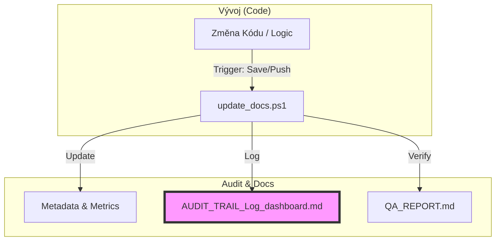

# ISATM: AUDIT TRAIL & Log Dashboard

Tento dashboard slouží k interaktivnímu sledování a auditu synchronizace mezi kódem a dokumentací projektu `aSTT-RUST`.

## 🔄 Code-Doc Sync Flow

## 📋 Unified Traceability Matrix

| Timestamp | Kategorie | Funkce / Modul | Účel / Důvod Změny | Zdroj (Code) | Dokumentace (MD) | Stav | Důkaz |
| :--- | :--- | :--- | :--- | :--- | :--- | :--- | :--- |
| <!-- ROW_START --> | | | | | | | |

---

## 👨‍🏫 Jak to funguje (Pro laiky)

Tento systém zajišťuje, že dokumentace nikdy "nezestárne". Kdykoliv programátor nebo AI změní kód, spustí se automatický hlídač (**skript**), který:
1. Zkontroluje, zda jsou všechny důležité soubory na svém místě.
2. Aktualizuje statistiky (počet souborů, stav testů).
3. Zapíše o tom záznam do této tabulky, abyste měli přehled o historii projektu.

**Technické detaily:**
- **Skript:** `scripts/update_docs.ps1`
- **Spuštění:** Automaticky při uložení nebo ručně přes terminál.

## 🚀 Možnosti rozšíření
- [ ] **Notifikace:** Zasílání upozornění na Slack/Discord při kritické chybě v dokumentaci.

- [ ] **Log Rotation:** Automatické odsouvání starých záznamů do archivu (`logs/archive/`).

- [ ] **PDF Export:** Generování měsíčních auditních reportů pro stakeholdery.

- [ ] **Git Hook Integration:** Blokování "push" do repozitáře, pokud dokumentace není synchronizovaná.

---
*Poslední aktualizace: 2026-02-20*

