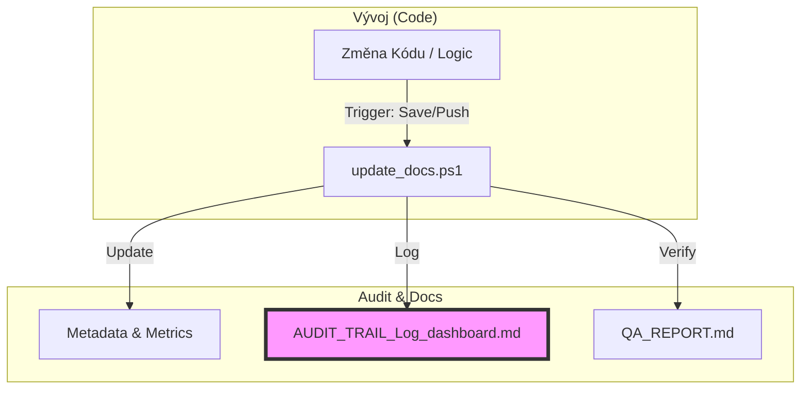

# ISATM: AUDIT TRAIL & Log Dashboard

Tento dashboard slouží k interaktivnímu sledování a auditu synchronizace mezi kódem a dokumentací projektu `aSTT-RUST`.

## 🔄 Code-Doc Sync Flow

## 📋 Unified Traceability Matrix

| Timestamp | Kategorie | Funkce / Modul | Účel / Důvod Změny | Zdroj (Code) | Dokumentace (MD) | Stav | Důkaz |
| :--- | :--- | :--- | :--- | :--- | :--- | :--- | :--- |
| <!-- ROW_START --> | | | | | | | |
| 2026-02-20 13:55 | ProstĹ™edĂ­ | help.md | HistorickĂ˝ import | N/A | [help.md](../../help.md) | ✅ | `logs/runonsave.log` | 
| 2026-02-19 10:31 | ProstĹ™edĂ­ | NEXT_SESSION.md | HistorickĂ˝ import | N/A | [NEXT_SESSION.md](../../NEXT_SESSION.md) | ✅ | `logs/runonsave.log` | 
| 2026-02-19 09:39 | ProstĹ™edĂ­ | NEXT_SESSION.md | HistorickĂ˝ import | N/A | [NEXT_SESSION.md](../../NEXT_SESSION.md) | ✅ | `logs/runonsave.log` | 
| 2026-02-19 09:39 | ProstĹ™edĂ­ | VISION.md | HistorickĂ˝ import | N/A | [VISION.md](C:/Users/adamf/OneDrive/Dokumenty/aSTT-RUST/VISION.md) | ✅ | `logs/runonsave.log` | 
| 2026-02-19 09:39 | ProstĹ™edĂ­ | CONSTITUTION.md | HistorickĂ˝ import | N/A | [CONSTITUTION.md](C:/Users/adamf/OneDrive/Dokumenty/aSTT-RUST/CONSTITUTION.md) | ✅ | `logs/runonsave.log` | 
| 2026-02-19 09:35 | ProstĹ™edĂ­ | NEXT_SESSION.md | HistorickĂ˝ import | N/A | [NEXT_SESSION.md](../../NEXT_SESSION.md) | ✅ | `logs/runonsave.log` | 
| 2026-02-19 09:35 | ProstĹ™edĂ­ | GOVERNANCE.md | HistorickĂ˝ import | N/A | [GOVERNANCE.md](C:/Users/adamf/OneDrive/Dokumenty/aSTT-RUST/GOVERNANCE.md) | ✅ | `logs/runonsave.log` | 
| 2026-02-19 09:33 | ProstĹ™edĂ­ | GOVERNANCE.md | HistorickĂ˝ import | N/A | [GOVERNANCE.md](C:/Users/adamf/OneDrive/Dokumenty/aSTT-RUST/GOVERNANCE.md) | ✅ | `logs/runonsave.log` | 
| 2026-02-19 09:33 | ProstĹ™edĂ­ | INDEX.md | HistorickĂ˝ import | N/A | [INDEX.md](C:/Users/adamf/OneDrive/Dokumenty/aSTT-RUST/INDEX.md) | ✅ | `logs/runonsave.log` | 
| 2026-02-19 09:28 | ProstĹ™edĂ­ | NEXT_SESSION.md | HistorickĂ˝ import | N/A | [NEXT_SESSION.md](../../NEXT_SESSION.md) | ✅ | `logs/runonsave.log` | 
| 2026-02-19 09:27 | ProstĹ™edĂ­ | NEXT_SESSION-2026-02-17--14-44.md | HistorickĂ˝ import | N/A | [NEXT_SESSION-2026-02-17--14-44.md](../../NEXT_SESSION_Archive/NEXT_SESSION-2026-02-17--14-44.md) | ✅ | `logs/runonsave.log` | 
| 2026-02-19 09:27 | ProstĹ™edĂ­ | NEXT_SESSION.md | HistorickĂ˝ import | N/A | [NEXT_SESSION.md](C:/Users/adamf/OneDrive/Dokumenty/aSTT-RUST/NEXT_SESSION_Archive/NEXT_SESSION.md) | ✅ | `logs/runonsave.log` | 
| 2026-02-19 09:16 | ProstĹ™edĂ­ | INDEX.md | HistorickĂ˝ import | N/A | [INDEX.md](C:/Users/adamf/OneDrive/Dokumenty/aSTT-RUST/INDEX.md) | ✅ | `logs/runonsave.log` | 
| 2026-02-19 09:16 | ProstĹ™edĂ­ | GOVERNANCE.md | HistorickĂ˝ import | N/A | [GOVERNANCE.md](C:/Users/adamf/OneDrive/Dokumenty/aSTT-RUST/GOVERNANCE.md) | ✅ | `logs/runonsave.log` | 
| 2026-02-19 09:16 | ProstĹ™edĂ­ | INDEX.md | HistorickĂ˝ import | N/A | [INDEX.md](C:/Users/adamf/OneDrive/Dokumenty/aSTT-RUST/INDEX.md) | ✅ | `logs/runonsave.log` | 
| 2026-02-19 09:16 | ProstĹ™edĂ­ | GOVERNANCE.md | HistorickĂ˝ import | N/A | [GOVERNANCE.md](C:/Users/adamf/OneDrive/Dokumenty/aSTT-RUST/GOVERNANCE.md) | ✅ | `logs/runonsave.log` | 
| 2026-02-19 09:16 | ProstĹ™edĂ­ | inventory-refactor-playbook.md | HistorickĂ˝ import | N/A | [inventory-refactor-playbook.md](../inventory-refactor-playbook.md) | ✅ | `logs/runonsave.log` | 
| 2026-02-19 09:16 | ProstĹ™edĂ­ | INDEX.md | HistorickĂ˝ import | N/A | [INDEX.md](C:/Users/adamf/OneDrive/Dokumenty/aSTT-RUST/INDEX.md) | ✅ | `logs/runonsave.log` | 
| 2026-02-19 09:16 | ProstĹ™edĂ­ | GOVERNANCE.md | HistorickĂ˝ import | N/A | [GOVERNANCE.md](C:/Users/adamf/OneDrive/Dokumenty/aSTT-RUST/GOVERNANCE.md) | ✅ | `logs/runonsave.log` | 
| 2026-02-19 09:16 | ProstĹ™edĂ­ | inventory-refactor-playbook.md | HistorickĂ˝ import | N/A | [inventory-refactor-playbook.md](../inventory-refactor-playbook.md) | ✅ | `logs/runonsave.log` | 
| 2026-02-19 09:16 | ProstĹ™edĂ­ | INDEX.md | HistorickĂ˝ import | N/A | [INDEX.md](C:/Users/adamf/OneDrive/Dokumenty/aSTT-RUST/INDEX.md) | ✅ | `logs/runonsave.log` | 
| 2026-02-19 09:16 | ProstĹ™edĂ­ | GOVERNANCE.md | HistorickĂ˝ import | N/A | [GOVERNANCE.md](C:/Users/adamf/OneDrive/Dokumenty/aSTT-RUST/GOVERNANCE.md) | ✅ | `logs/runonsave.log` | 
| 2026-02-19 09:16 | ProstĹ™edĂ­ | inventory-refactor-playbook.md | HistorickĂ˝ import | N/A | [inventory-refactor-playbook.md](../inventory-refactor-playbook.md) | ✅ | `logs/runonsave.log` | 
| 2026-02-19 09:16 | ProstĹ™edĂ­ | INDEX.md | HistorickĂ˝ import | N/A | [INDEX.md](C:/Users/adamf/OneDrive/Dokumenty/aSTT-RUST/INDEX.md) | ✅ | `logs/runonsave.log` | 
| 2026-02-19 09:16 | ProstĹ™edĂ­ | GOVERNANCE.md | HistorickĂ˝ import | N/A | [GOVERNANCE.md](C:/Users/adamf/OneDrive/Dokumenty/aSTT-RUST/GOVERNANCE.md) | ✅ | `logs/runonsave.log` | 
| 2026-02-19 09:16 | ProstĹ™edĂ­ | inventory-refactor-playbook.md | HistorickĂ˝ import | N/A | [inventory-refactor-playbook.md](../inventory-refactor-playbook.md) | ✅ | `logs/runonsave.log` | 
| 2026-02-19 09:16 | ProstĹ™edĂ­ | INDEX.md | HistorickĂ˝ import | N/A | [INDEX.md](C:/Users/adamf/OneDrive/Dokumenty/aSTT-RUST/INDEX.md) | ✅ | `logs/runonsave.log` | 
| 2026-02-19 09:16 | ProstĹ™edĂ­ | GOVERNANCE.md | HistorickĂ˝ import | N/A | [GOVERNANCE.md](C:/Users/adamf/OneDrive/Dokumenty/aSTT-RUST/GOVERNANCE.md) | ✅ | `logs/runonsave.log` | 
| 2026-02-19 09:15 | ProstĹ™edĂ­ | inventory-refactor-playbook.md | HistorickĂ˝ import | N/A | [inventory-refactor-playbook.md](../inventory-refactor-playbook.md) | ✅ | `logs/runonsave.log` | 
| 2026-02-19 09:15 | ProstĹ™edĂ­ | INDEX.md | HistorickĂ˝ import | N/A | [INDEX.md](C:/Users/adamf/OneDrive/Dokumenty/aSTT-RUST/INDEX.md) | ✅ | `logs/runonsave.log` | 
| 2026-02-19 09:15 | ProstĹ™edĂ­ | GOVERNANCE.md | HistorickĂ˝ import | N/A | [GOVERNANCE.md](C:/Users/adamf/OneDrive/Dokumenty/aSTT-RUST/GOVERNANCE.md) | ✅ | `logs/runonsave.log` | 
| 2026-02-19 09:15 | ProstĹ™edĂ­ | inventory-refactor-playbook.md | HistorickĂ˝ import | N/A | [inventory-refactor-playbook.md](../inventory-refactor-playbook.md) | ✅ | `logs/runonsave.log` | 
| 2026-02-19 09:15 | ProstĹ™edĂ­ | inventory-refactor-playbook.md | HistorickĂ˝ import | N/A | [inventory-refactor-playbook.md](../inventory-refactor-playbook.md) | ✅ | `logs/runonsave.log` | 
| 2026-02-19 09:15 | ProstĹ™edĂ­ | INDEX.md | HistorickĂ˝ import | N/A | [INDEX.md](C:/Users/adamf/OneDrive/Dokumenty/aSTT-RUST/INDEX.md) | ✅ | `logs/runonsave.log` | 
| 2026-02-19 09:15 | ProstĹ™edĂ­ | GOVERNANCE.md | HistorickĂ˝ import | N/A | [GOVERNANCE.md](C:/Users/adamf/OneDrive/Dokumenty/aSTT-RUST/GOVERNANCE.md) | ✅ | `logs/runonsave.log` | 
| 2026-02-19 09:15 | ProstĹ™edĂ­ | inventory-refactor-playbook.md | HistorickĂ˝ import | N/A | [inventory-refactor-playbook.md](../inventory-refactor-playbook.md) | ✅ | `logs/runonsave.log` | 
| 2026-02-19 09:15 | ProstĹ™edĂ­ | inventory-refactor-playbook.md | HistorickĂ˝ import | N/A | [inventory-refactor-playbook.md](../inventory-refactor-playbook.md) | ✅ | `logs/runonsave.log` | 
| 2026-02-19 09:15 | ProstĹ™edĂ­ | INDEX.md | HistorickĂ˝ import | N/A | [INDEX.md](C:/Users/adamf/OneDrive/Dokumenty/aSTT-RUST/INDEX.md) | ✅ | `logs/runonsave.log` | 
| 2026-02-19 09:15 | ProstĹ™edĂ­ | GOVERNANCE.md | HistorickĂ˝ import | N/A | [GOVERNANCE.md](C:/Users/adamf/OneDrive/Dokumenty/aSTT-RUST/GOVERNANCE.md) | ✅ | `logs/runonsave.log` | 
| 2026-02-19 09:15 | ProstĹ™edĂ­ | inventory-refactor-playbook.md | HistorickĂ˝ import | N/A | [inventory-refactor-playbook.md](../inventory-refactor-playbook.md) | ✅ | `logs/runonsave.log` | 
| 2026-02-19 09:15 | ProstĹ™edĂ­ | inventory-refactor-playbook.md | HistorickĂ˝ import | N/A | [inventory-refactor-playbook.md](../inventory-refactor-playbook.md) | ✅ | `logs/runonsave.log` | 
| 2026-02-19 09:15 | ProstĹ™edĂ­ | INDEX.md | HistorickĂ˝ import | N/A | [INDEX.md](C:/Users/adamf/OneDrive/Dokumenty/aSTT-RUST/INDEX.md) | ✅ | `logs/runonsave.log` | 
| 2026-02-19 09:15 | ProstĹ™edĂ­ | GOVERNANCE.md | HistorickĂ˝ import | N/A | [GOVERNANCE.md](C:/Users/adamf/OneDrive/Dokumenty/aSTT-RUST/GOVERNANCE.md) | ✅ | `logs/runonsave.log` | 
| 2026-02-19 09:15 | ProstĹ™edĂ­ | inventory-refactor-playbook.md | HistorickĂ˝ import | N/A | [inventory-refactor-playbook.md](../inventory-refactor-playbook.md) | ✅ | `logs/runonsave.log` | 
| 2026-02-19 09:15 | ProstĹ™edĂ­ | inventory-refactor-playbook.md | HistorickĂ˝ import | N/A | [inventory-refactor-playbook.md](../inventory-refactor-playbook.md) | ✅ | `logs/runonsave.log` | 
| 2026-02-19 09:15 | ProstĹ™edĂ­ | INDEX.md | HistorickĂ˝ import | N/A | [INDEX.md](C:/Users/adamf/OneDrive/Dokumenty/aSTT-RUST/INDEX.md) | ✅ | `logs/runonsave.log` | 
| 2026-02-19 09:15 | ProstĹ™edĂ­ | GOVERNANCE.md | HistorickĂ˝ import | N/A | [GOVERNANCE.md](C:/Users/adamf/OneDrive/Dokumenty/aSTT-RUST/GOVERNANCE.md) | ✅ | `logs/runonsave.log` | 
| 2026-02-19 09:15 | ProstĹ™edĂ­ | inventory-refactor-playbook.md | HistorickĂ˝ import | N/A | [inventory-refactor-playbook.md](../inventory-refactor-playbook.md) | ✅ | `logs/runonsave.log` | 
| 2026-02-19 09:14 | ProstĹ™edĂ­ | inventory-refactor-playbook.md | HistorickĂ˝ import | N/A | [inventory-refactor-playbook.md](../inventory-refactor-playbook.md) | ✅ | `logs/runonsave.log` | 
| 2026-02-19 09:14 | ProstĹ™edĂ­ | INDEX.md | HistorickĂ˝ import | N/A | [INDEX.md](C:/Users/adamf/OneDrive/Dokumenty/aSTT-RUST/INDEX.md) | ✅ | `logs/runonsave.log` | 
| 2026-02-19 09:14 | ProstĹ™edĂ­ | GOVERNANCE.md | HistorickĂ˝ import | N/A | [GOVERNANCE.md](C:/Users/adamf/OneDrive/Dokumenty/aSTT-RUST/GOVERNANCE.md) | ✅ | `logs/runonsave.log` | 
| 2026-02-19 09:14 | ProstĹ™edĂ­ | inventory-refactor-playbook.md | HistorickĂ˝ import | N/A | [inventory-refactor-playbook.md](../inventory-refactor-playbook.md) | ✅ | `logs/runonsave.log` | 
| 2026-02-19 09:14 | ProstĹ™edĂ­ | inventory-refactor-playbook.md | HistorickĂ˝ import | N/A | [inventory-refactor-playbook.md](../inventory-refactor-playbook.md) | ✅ | `logs/runonsave.log` | 
| 2026-02-19 09:14 | ProstĹ™edĂ­ | INDEX.md | HistorickĂ˝ import | N/A | [INDEX.md](C:/Users/adamf/OneDrive/Dokumenty/aSTT-RUST/INDEX.md) | ✅ | `logs/runonsave.log` | 
| 2026-02-19 09:14 | ProstĹ™edĂ­ | GOVERNANCE.md | HistorickĂ˝ import | N/A | [GOVERNANCE.md](C:/Users/adamf/OneDrive/Dokumenty/aSTT-RUST/GOVERNANCE.md) | ✅ | `logs/runonsave.log` | 
| 2026-02-19 09:14 | ProstĹ™edĂ­ | inventory-refactor-playbook.md | HistorickĂ˝ import | N/A | [inventory-refactor-playbook.md](../inventory-refactor-playbook.md) | ✅ | `logs/runonsave.log` | 
| 2026-02-19 09:14 | ProstĹ™edĂ­ | inventory-refactor-playbook.md | HistorickĂ˝ import | N/A | [inventory-refactor-playbook.md](../inventory-refactor-playbook.md) | ✅ | `logs/runonsave.log` | 
| 2026-02-19 09:14 | ProstĹ™edĂ­ | INDEX.md | HistorickĂ˝ import | N/A | [INDEX.md](C:/Users/adamf/OneDrive/Dokumenty/aSTT-RUST/INDEX.md) | ✅ | `logs/runonsave.log` | 
| 2026-02-19 09:14 | ProstĹ™edĂ­ | GOVERNANCE.md | HistorickĂ˝ import | N/A | [GOVERNANCE.md](C:/Users/adamf/OneDrive/Dokumenty/aSTT-RUST/GOVERNANCE.md) | ✅ | `logs/runonsave.log` | 
| 2026-02-19 09:14 | ProstĹ™edĂ­ | inventory-refactor-playbook.md | HistorickĂ˝ import | N/A | [inventory-refactor-playbook.md](../inventory-refactor-playbook.md) | ✅ | `logs/runonsave.log` | 
| 2026-02-19 09:14 | ProstĹ™edĂ­ | inventory-refactor-playbook.md | HistorickĂ˝ import | N/A | [inventory-refactor-playbook.md](../inventory-refactor-playbook.md) | ✅ | `logs/runonsave.log` | 
| 2026-02-19 09:14 | ProstĹ™edĂ­ | INDEX.md | HistorickĂ˝ import | N/A | [INDEX.md](C:/Users/adamf/OneDrive/Dokumenty/aSTT-RUST/INDEX.md) | ✅ | `logs/runonsave.log` | 
| 2026-02-19 09:14 | ProstĹ™edĂ­ | GOVERNANCE.md | HistorickĂ˝ import | N/A | [GOVERNANCE.md](C:/Users/adamf/OneDrive/Dokumenty/aSTT-RUST/GOVERNANCE.md) | ✅ | `logs/runonsave.log` | 
| 2026-02-19 09:14 | ProstĹ™edĂ­ | inventory-refactor-playbook.md | HistorickĂ˝ import | N/A | [inventory-refactor-playbook.md](../inventory-refactor-playbook.md) | ✅ | `logs/runonsave.log` | 
| 2026-02-19 09:14 | ProstĹ™edĂ­ | inventory-refactor-playbook.md | HistorickĂ˝ import | N/A | [inventory-refactor-playbook.md](../inventory-refactor-playbook.md) | ✅ | `logs/runonsave.log` | 
| 2026-02-19 09:14 | ProstĹ™edĂ­ | INDEX.md | HistorickĂ˝ import | N/A | [INDEX.md](C:/Users/adamf/OneDrive/Dokumenty/aSTT-RUST/INDEX.md) | ✅ | `logs/runonsave.log` | 
| 2026-02-19 09:14 | ProstĹ™edĂ­ | GOVERNANCE.md | HistorickĂ˝ import | N/A | [GOVERNANCE.md](C:/Users/adamf/OneDrive/Dokumenty/aSTT-RUST/GOVERNANCE.md) | ✅ | `logs/runonsave.log` | 
| 2026-02-19 09:14 | ProstĹ™edĂ­ | inventory-refactor-playbook.md | HistorickĂ˝ import | N/A | [inventory-refactor-playbook.md](../inventory-refactor-playbook.md) | ✅ | `logs/runonsave.log` | 
| 2026-02-19 09:13 | ProstĹ™edĂ­ | inventory-refactor-playbook.md | HistorickĂ˝ import | N/A | [inventory-refactor-playbook.md](../inventory-refactor-playbook.md) | ✅ | `logs/runonsave.log` | 
| 2026-02-19 09:13 | ProstĹ™edĂ­ | INDEX.md | HistorickĂ˝ import | N/A | [INDEX.md](C:/Users/adamf/OneDrive/Dokumenty/aSTT-RUST/INDEX.md) | ✅ | `logs/runonsave.log` | 
| 2026-02-19 09:13 | ProstĹ™edĂ­ | GOVERNANCE.md | HistorickĂ˝ import | N/A | [GOVERNANCE.md](C:/Users/adamf/OneDrive/Dokumenty/aSTT-RUST/GOVERNANCE.md) | ✅ | `logs/runonsave.log` | 
| 2026-02-19 09:13 | ProstĹ™edĂ­ | inventory-refactor-playbook.md | HistorickĂ˝ import | N/A | [inventory-refactor-playbook.md](../inventory-refactor-playbook.md) | ✅ | `logs/runonsave.log` | 
| 2026-02-19 09:13 | ProstĹ™edĂ­ | inventory-refactor-playbook.md | HistorickĂ˝ import | N/A | [inventory-refactor-playbook.md](../inventory-refactor-playbook.md) | ✅ | `logs/runonsave.log` | 
| 2026-02-19 09:13 | ProstĹ™edĂ­ | INDEX.md | HistorickĂ˝ import | N/A | [INDEX.md](C:/Users/adamf/OneDrive/Dokumenty/aSTT-RUST/INDEX.md) | ✅ | `logs/runonsave.log` | 
| 2026-02-19 09:13 | ProstĹ™edĂ­ | GOVERNANCE.md | HistorickĂ˝ import | N/A | [GOVERNANCE.md](C:/Users/adamf/OneDrive/Dokumenty/aSTT-RUST/GOVERNANCE.md) | ✅ | `logs/runonsave.log` | 
| 2026-02-19 09:13 | ProstĹ™edĂ­ | inventory-refactor-playbook.md | HistorickĂ˝ import | N/A | [inventory-refactor-playbook.md](../inventory-refactor-playbook.md) | ✅ | `logs/runonsave.log` | 
| 2026-02-19 09:13 | ProstĹ™edĂ­ | inventory-refactor-playbook.md | HistorickĂ˝ import | N/A | [inventory-refactor-playbook.md](../inventory-refactor-playbook.md) | ✅ | `logs/runonsave.log` | 
| 2026-02-19 09:13 | ProstĹ™edĂ­ | INDEX.md | HistorickĂ˝ import | N/A | [INDEX.md](C:/Users/adamf/OneDrive/Dokumenty/aSTT-RUST/INDEX.md) | ✅ | `logs/runonsave.log` | 
| 2026-02-19 09:13 | ProstĹ™edĂ­ | GOVERNANCE.md | HistorickĂ˝ import | N/A | [GOVERNANCE.md](C:/Users/adamf/OneDrive/Dokumenty/aSTT-RUST/GOVERNANCE.md) | ✅ | `logs/runonsave.log` | 
| 2026-02-19 09:13 | ProstĹ™edĂ­ | inventory-refactor-playbook.md | HistorickĂ˝ import | N/A | [inventory-refactor-playbook.md](../inventory-refactor-playbook.md) | ✅ | `logs/runonsave.log` | 
| 2026-02-19 09:13 | ProstĹ™edĂ­ | inventory-refactor-playbook.md | HistorickĂ˝ import | N/A | [inventory-refactor-playbook.md](../inventory-refactor-playbook.md) | ✅ | `logs/runonsave.log` | 
| 2026-02-19 09:13 | ProstĹ™edĂ­ | INDEX.md | HistorickĂ˝ import | N/A | [INDEX.md](C:/Users/adamf/OneDrive/Dokumenty/aSTT-RUST/INDEX.md) | ✅ | `logs/runonsave.log` | 
| 2026-02-19 09:13 | ProstĹ™edĂ­ | GOVERNANCE.md | HistorickĂ˝ import | N/A | [GOVERNANCE.md](C:/Users/adamf/OneDrive/Dokumenty/aSTT-RUST/GOVERNANCE.md) | ✅ | `logs/runonsave.log` | 
| 2026-02-19 09:13 | ProstĹ™edĂ­ | inventory-refactor-playbook.md | HistorickĂ˝ import | N/A | [inventory-refactor-playbook.md](../inventory-refactor-playbook.md) | ✅ | `logs/runonsave.log` | 
| 2026-02-19 09:13 | ProstĹ™edĂ­ | inventory-refactor-playbook.md | HistorickĂ˝ import | N/A | [inventory-refactor-playbook.md](../inventory-refactor-playbook.md) | ✅ | `logs/runonsave.log` | 
| 2026-02-19 09:13 | ProstĹ™edĂ­ | INDEX.md | HistorickĂ˝ import | N/A | [INDEX.md](C:/Users/adamf/OneDrive/Dokumenty/aSTT-RUST/INDEX.md) | ✅ | `logs/runonsave.log` | 
| 2026-02-19 09:13 | ProstĹ™edĂ­ | GOVERNANCE.md | HistorickĂ˝ import | N/A | [GOVERNANCE.md](C:/Users/adamf/OneDrive/Dokumenty/aSTT-RUST/GOVERNANCE.md) | ✅ | `logs/runonsave.log` | 
| 2026-02-19 09:13 | ProstĹ™edĂ­ | inventory-refactor-playbook.md | HistorickĂ˝ import | N/A | [inventory-refactor-playbook.md](../inventory-refactor-playbook.md) | ✅ | `logs/runonsave.log` | 
| 2026-02-19 09:12 | ProstĹ™edĂ­ | inventory-refactor-playbook.md | HistorickĂ˝ import | N/A | [inventory-refactor-playbook.md](../inventory-refactor-playbook.md) | ✅ | `logs/runonsave.log` | 
| 2026-02-19 09:12 | ProstĹ™edĂ­ | INDEX.md | HistorickĂ˝ import | N/A | [INDEX.md](C:/Users/adamf/OneDrive/Dokumenty/aSTT-RUST/INDEX.md) | ✅ | `logs/runonsave.log` | 
| 2026-02-19 09:12 | ProstĹ™edĂ­ | GOVERNANCE.md | HistorickĂ˝ import | N/A | [GOVERNANCE.md](C:/Users/adamf/OneDrive/Dokumenty/aSTT-RUST/GOVERNANCE.md) | ✅ | `logs/runonsave.log` | 
| 2026-02-19 09:12 | ProstĹ™edĂ­ | inventory-refactor-playbook.md | HistorickĂ˝ import | N/A | [inventory-refactor-playbook.md](../inventory-refactor-playbook.md) | ✅ | `logs/runonsave.log` | 
| 2026-02-19 09:12 | ProstĹ™edĂ­ | inventory-refactor-playbook.md | HistorickĂ˝ import | N/A | [inventory-refactor-playbook.md](../inventory-refactor-playbook.md) | ✅ | `logs/runonsave.log` | 
| 2026-02-19 09:12 | ProstĹ™edĂ­ | INDEX.md | HistorickĂ˝ import | N/A | [INDEX.md](C:/Users/adamf/OneDrive/Dokumenty/aSTT-RUST/INDEX.md) | ✅ | `logs/runonsave.log` | 
| 2026-02-19 09:12 | ProstĹ™edĂ­ | GOVERNANCE.md | HistorickĂ˝ import | N/A | [GOVERNANCE.md](C:/Users/adamf/OneDrive/Dokumenty/aSTT-RUST/GOVERNANCE.md) | ✅ | `logs/runonsave.log` | 
| 2026-02-19 09:12 | ProstĹ™edĂ­ | inventory-refactor-playbook.md | HistorickĂ˝ import | N/A | [inventory-refactor-playbook.md](../inventory-refactor-playbook.md) | ✅ | `logs/runonsave.log` | 
| 2026-02-19 09:12 | ProstĹ™edĂ­ | inventory-refactor-playbook.md | HistorickĂ˝ import | N/A | [inventory-refactor-playbook.md](../inventory-refactor-playbook.md) | ✅ | `logs/runonsave.log` | 
| 2026-02-19 09:12 | ProstĹ™edĂ­ | INDEX.md | HistorickĂ˝ import | N/A | [INDEX.md](C:/Users/adamf/OneDrive/Dokumenty/aSTT-RUST/INDEX.md) | ✅ | `logs/runonsave.log` | 
| 2026-02-19 09:12 | ProstĹ™edĂ­ | GOVERNANCE.md | HistorickĂ˝ import | N/A | [GOVERNANCE.md](C:/Users/adamf/OneDrive/Dokumenty/aSTT-RUST/GOVERNANCE.md) | ✅ | `logs/runonsave.log` | 
| 2026-02-19 09:12 | ProstĹ™edĂ­ | inventory-refactor-playbook.md | HistorickĂ˝ import | N/A | [inventory-refactor-playbook.md](../inventory-refactor-playbook.md) | ✅ | `logs/runonsave.log` | 
| 2026-02-19 09:12 | ProstĹ™edĂ­ | inventory-refactor-playbook.md | HistorickĂ˝ import | N/A | [inventory-refactor-playbook.md](../inventory-refactor-playbook.md) | ✅ | `logs/runonsave.log` | 
| 2026-02-19 09:12 | ProstĹ™edĂ­ | INDEX.md | HistorickĂ˝ import | N/A | [INDEX.md](C:/Users/adamf/OneDrive/Dokumenty/aSTT-RUST/INDEX.md) | ✅ | `logs/runonsave.log` | 
| 2026-02-19 09:12 | ProstĹ™edĂ­ | GOVERNANCE.md | HistorickĂ˝ import | N/A | [GOVERNANCE.md](C:/Users/adamf/OneDrive/Dokumenty/aSTT-RUST/GOVERNANCE.md) | ✅ | `logs/runonsave.log` | 
| 2026-02-19 09:12 | ProstĹ™edĂ­ | inventory-refactor-playbook.md | HistorickĂ˝ import | N/A | [inventory-refactor-playbook.md](../inventory-refactor-playbook.md) | ✅ | `logs/runonsave.log` | 
| 2026-02-19 09:12 | ProstĹ™edĂ­ | inventory-refactor-playbook.md | HistorickĂ˝ import | N/A | [inventory-refactor-playbook.md](../inventory-refactor-playbook.md) | ✅ | `logs/runonsave.log` | 
| 2026-02-19 09:12 | ProstĹ™edĂ­ | INDEX.md | HistorickĂ˝ import | N/A | [INDEX.md](C:/Users/adamf/OneDrive/Dokumenty/aSTT-RUST/INDEX.md) | ✅ | `logs/runonsave.log` | 
| 2026-02-19 09:12 | ProstĹ™edĂ­ | GOVERNANCE.md | HistorickĂ˝ import | N/A | [GOVERNANCE.md](C:/Users/adamf/OneDrive/Dokumenty/aSTT-RUST/GOVERNANCE.md) | ✅ | `logs/runonsave.log` | 
| 2026-02-19 09:12 | ProstĹ™edĂ­ | inventory-refactor-playbook.md | HistorickĂ˝ import | N/A | [inventory-refactor-playbook.md](../inventory-refactor-playbook.md) | ✅ | `logs/runonsave.log` | 
| 2026-02-19 09:11 | ProstĹ™edĂ­ | inventory-refactor-playbook.md | HistorickĂ˝ import | N/A | [inventory-refactor-playbook.md](../inventory-refactor-playbook.md) | ✅ | `logs/runonsave.log` | 
| 2026-02-19 09:11 | ProstĹ™edĂ­ | INDEX.md | HistorickĂ˝ import | N/A | [INDEX.md](C:/Users/adamf/OneDrive/Dokumenty/aSTT-RUST/INDEX.md) | ✅ | `logs/runonsave.log` | 
| 2026-02-19 09:11 | ProstĹ™edĂ­ | GOVERNANCE.md | HistorickĂ˝ import | N/A | [GOVERNANCE.md](C:/Users/adamf/OneDrive/Dokumenty/aSTT-RUST/GOVERNANCE.md) | ✅ | `logs/runonsave.log` | 
| 2026-02-19 09:11 | ProstĹ™edĂ­ | inventory-refactor-playbook.md | HistorickĂ˝ import | N/A | [inventory-refactor-playbook.md](../inventory-refactor-playbook.md) | ✅ | `logs/runonsave.log` | 
| 2026-02-19 09:11 | ProstĹ™edĂ­ | inventory-refactor-playbook.md | HistorickĂ˝ import | N/A | [inventory-refactor-playbook.md](../inventory-refactor-playbook.md) | ✅ | `logs/runonsave.log` | 
| 2026-02-19 09:11 | ProstĹ™edĂ­ | INDEX.md | HistorickĂ˝ import | N/A | [INDEX.md](C:/Users/adamf/OneDrive/Dokumenty/aSTT-RUST/INDEX.md) | ✅ | `logs/runonsave.log` | 
| 2026-02-19 09:11 | ProstĹ™edĂ­ | GOVERNANCE.md | HistorickĂ˝ import | N/A | [GOVERNANCE.md](C:/Users/adamf/OneDrive/Dokumenty/aSTT-RUST/GOVERNANCE.md) | ✅ | `logs/runonsave.log` | 
| 2026-02-19 09:11 | ProstĹ™edĂ­ | inventory-refactor-playbook.md | HistorickĂ˝ import | N/A | [inventory-refactor-playbook.md](../inventory-refactor-playbook.md) | ✅ | `logs/runonsave.log` | 
| 2026-02-19 09:11 | ProstĹ™edĂ­ | inventory-refactor-playbook.md | HistorickĂ˝ import | N/A | [inventory-refactor-playbook.md](../inventory-refactor-playbook.md) | ✅ | `logs/runonsave.log` | 
| 2026-02-19 09:11 | ProstĹ™edĂ­ | INDEX.md | HistorickĂ˝ import | N/A | [INDEX.md](C:/Users/adamf/OneDrive/Dokumenty/aSTT-RUST/INDEX.md) | ✅ | `logs/runonsave.log` | 
| 2026-02-19 09:11 | ProstĹ™edĂ­ | GOVERNANCE.md | HistorickĂ˝ import | N/A | [GOVERNANCE.md](C:/Users/adamf/OneDrive/Dokumenty/aSTT-RUST/GOVERNANCE.md) | ✅ | `logs/runonsave.log` | 
| 2026-02-19 09:11 | ProstĹ™edĂ­ | inventory-refactor-playbook.md | HistorickĂ˝ import | N/A | [inventory-refactor-playbook.md](../inventory-refactor-playbook.md) | ✅ | `logs/runonsave.log` | 
| 2026-02-19 09:11 | ProstĹ™edĂ­ | inventory-refactor-playbook.md | HistorickĂ˝ import | N/A | [inventory-refactor-playbook.md](../inventory-refactor-playbook.md) | ✅ | `logs/runonsave.log` | 
| 2026-02-19 09:11 | ProstĹ™edĂ­ | INDEX.md | HistorickĂ˝ import | N/A | [INDEX.md](C:/Users/adamf/OneDrive/Dokumenty/aSTT-RUST/INDEX.md) | ✅ | `logs/runonsave.log` | 
| 2026-02-19 09:11 | ProstĹ™edĂ­ | GOVERNANCE.md | HistorickĂ˝ import | N/A | [GOVERNANCE.md](C:/Users/adamf/OneDrive/Dokumenty/aSTT-RUST/GOVERNANCE.md) | ✅ | `logs/runonsave.log` | 
| 2026-02-19 09:11 | ProstĹ™edĂ­ | inventory-refactor-playbook.md | HistorickĂ˝ import | N/A | [inventory-refactor-playbook.md](../inventory-refactor-playbook.md) | ✅ | `logs/runonsave.log` | 
| 2026-02-19 09:11 | ProstĹ™edĂ­ | inventory-refactor-playbook.md | HistorickĂ˝ import | N/A | [inventory-refactor-playbook.md](../inventory-refactor-playbook.md) | ✅ | `logs/runonsave.log` | 
| 2026-02-19 09:11 | ProstĹ™edĂ­ | INDEX.md | HistorickĂ˝ import | N/A | [INDEX.md](C:/Users/adamf/OneDrive/Dokumenty/aSTT-RUST/INDEX.md) | ✅ | `logs/runonsave.log` | 
| 2026-02-19 09:11 | ProstĹ™edĂ­ | GOVERNANCE.md | HistorickĂ˝ import | N/A | [GOVERNANCE.md](C:/Users/adamf/OneDrive/Dokumenty/aSTT-RUST/GOVERNANCE.md) | ✅ | `logs/runonsave.log` | 
| 2026-02-19 09:11 | ProstĹ™edĂ­ | inventory-refactor-playbook.md | HistorickĂ˝ import | N/A | [inventory-refactor-playbook.md](../inventory-refactor-playbook.md) | ✅ | `logs/runonsave.log` | 
| 2026-02-19 09:10 | ProstĹ™edĂ­ | inventory-refactor-playbook.md | HistorickĂ˝ import | N/A | [inventory-refactor-playbook.md](../inventory-refactor-playbook.md) | ✅ | `logs/runonsave.log` | 
| 2026-02-19 09:10 | ProstĹ™edĂ­ | INDEX.md | HistorickĂ˝ import | N/A | [INDEX.md](C:/Users/adamf/OneDrive/Dokumenty/aSTT-RUST/INDEX.md) | ✅ | `logs/runonsave.log` | 
| 2026-02-19 09:10 | ProstĹ™edĂ­ | GOVERNANCE.md | HistorickĂ˝ import | N/A | [GOVERNANCE.md](C:/Users/adamf/OneDrive/Dokumenty/aSTT-RUST/GOVERNANCE.md) | ✅ | `logs/runonsave.log` | 
| 2026-02-19 09:10 | ProstĹ™edĂ­ | inventory-refactor-playbook.md | HistorickĂ˝ import | N/A | [inventory-refactor-playbook.md](../inventory-refactor-playbook.md) | ✅ | `logs/runonsave.log` | 
| 2026-02-19 09:10 | ProstĹ™edĂ­ | inventory-refactor-playbook.md | HistorickĂ˝ import | N/A | [inventory-refactor-playbook.md](../inventory-refactor-playbook.md) | ✅ | `logs/runonsave.log` | 
| 2026-02-19 09:10 | ProstĹ™edĂ­ | INDEX.md | HistorickĂ˝ import | N/A | [INDEX.md](C:/Users/adamf/OneDrive/Dokumenty/aSTT-RUST/INDEX.md) | ✅ | `logs/runonsave.log` | 
| 2026-02-19 09:10 | ProstĹ™edĂ­ | GOVERNANCE.md | HistorickĂ˝ import | N/A | [GOVERNANCE.md](C:/Users/adamf/OneDrive/Dokumenty/aSTT-RUST/GOVERNANCE.md) | ✅ | `logs/runonsave.log` | 
| 2026-02-19 09:10 | ProstĹ™edĂ­ | inventory-refactor-playbook.md | HistorickĂ˝ import | N/A | [inventory-refactor-playbook.md](../inventory-refactor-playbook.md) | ✅ | `logs/runonsave.log` | 
| 2026-02-19 09:10 | ProstĹ™edĂ­ | inventory-refactor-playbook.md | HistorickĂ˝ import | N/A | [inventory-refactor-playbook.md](../inventory-refactor-playbook.md) | ✅ | `logs/runonsave.log` | 
| 2026-02-19 09:10 | ProstĹ™edĂ­ | INDEX.md | HistorickĂ˝ import | N/A | [INDEX.md](C:/Users/adamf/OneDrive/Dokumenty/aSTT-RUST/INDEX.md) | ✅ | `logs/runonsave.log` | 
| 2026-02-19 09:10 | ProstĹ™edĂ­ | GOVERNANCE.md | HistorickĂ˝ import | N/A | [GOVERNANCE.md](C:/Users/adamf/OneDrive/Dokumenty/aSTT-RUST/GOVERNANCE.md) | ✅ | `logs/runonsave.log` | 
| 2026-02-19 09:10 | ProstĹ™edĂ­ | inventory-refactor-playbook.md | HistorickĂ˝ import | N/A | [inventory-refactor-playbook.md](../inventory-refactor-playbook.md) | ✅ | `logs/runonsave.log` | 
| 2026-02-19 09:10 | ProstĹ™edĂ­ | inventory-refactor-playbook.md | HistorickĂ˝ import | N/A | [inventory-refactor-playbook.md](../inventory-refactor-playbook.md) | ✅ | `logs/runonsave.log` | 
| 2026-02-19 09:10 | ProstĹ™edĂ­ | INDEX.md | HistorickĂ˝ import | N/A | [INDEX.md](C:/Users/adamf/OneDrive/Dokumenty/aSTT-RUST/INDEX.md) | ✅ | `logs/runonsave.log` | 
| 2026-02-19 09:10 | ProstĹ™edĂ­ | GOVERNANCE.md | HistorickĂ˝ import | N/A | [GOVERNANCE.md](C:/Users/adamf/OneDrive/Dokumenty/aSTT-RUST/GOVERNANCE.md) | ✅ | `logs/runonsave.log` | 
| 2026-02-19 09:10 | ProstĹ™edĂ­ | inventory-refactor-playbook.md | HistorickĂ˝ import | N/A | [inventory-refactor-playbook.md](../inventory-refactor-playbook.md) | ✅ | `logs/runonsave.log` | 
| 2026-02-19 09:10 | ProstĹ™edĂ­ | inventory-refactor-playbook.md | HistorickĂ˝ import | N/A | [inventory-refactor-playbook.md](../inventory-refactor-playbook.md) | ✅ | `logs/runonsave.log` | 
| 2026-02-19 09:10 | ProstĹ™edĂ­ | INDEX.md | HistorickĂ˝ import | N/A | [INDEX.md](C:/Users/adamf/OneDrive/Dokumenty/aSTT-RUST/INDEX.md) | ✅ | `logs/runonsave.log` | 
| 2026-02-19 09:10 | ProstĹ™edĂ­ | GOVERNANCE.md | HistorickĂ˝ import | N/A | [GOVERNANCE.md](C:/Users/adamf/OneDrive/Dokumenty/aSTT-RUST/GOVERNANCE.md) | ✅ | `logs/runonsave.log` | 
| 2026-02-19 09:10 | ProstĹ™edĂ­ | inventory-refactor-playbook.md | HistorickĂ˝ import | N/A | [inventory-refactor-playbook.md](../inventory-refactor-playbook.md) | ✅ | `logs/runonsave.log` | 
| 2026-02-19 09:09 | ProstĹ™edĂ­ | inventory-refactor-playbook.md | HistorickĂ˝ import | N/A | [inventory-refactor-playbook.md](../inventory-refactor-playbook.md) | ✅ | `logs/runonsave.log` | 
| 2026-02-19 09:09 | ProstĹ™edĂ­ | INDEX.md | HistorickĂ˝ import | N/A | [INDEX.md](C:/Users/adamf/OneDrive/Dokumenty/aSTT-RUST/INDEX.md) | ✅ | `logs/runonsave.log` | 
| 2026-02-19 09:09 | ProstĹ™edĂ­ | GOVERNANCE.md | HistorickĂ˝ import | N/A | [GOVERNANCE.md](C:/Users/adamf/OneDrive/Dokumenty/aSTT-RUST/GOVERNANCE.md) | ✅ | `logs/runonsave.log` | 
| 2026-02-19 09:09 | ProstĹ™edĂ­ | inventory-refactor-playbook.md | HistorickĂ˝ import | N/A | [inventory-refactor-playbook.md](../inventory-refactor-playbook.md) | ✅ | `logs/runonsave.log` | 
| 2026-02-19 09:09 | ProstĹ™edĂ­ | inventory-refactor-playbook.md | HistorickĂ˝ import | N/A | [inventory-refactor-playbook.md](../inventory-refactor-playbook.md) | ✅ | `logs/runonsave.log` | 
| 2026-02-19 09:09 | ProstĹ™edĂ­ | INDEX.md | HistorickĂ˝ import | N/A | [INDEX.md](C:/Users/adamf/OneDrive/Dokumenty/aSTT-RUST/INDEX.md) | ✅ | `logs/runonsave.log` | 
| 2026-02-19 09:09 | ProstĹ™edĂ­ | GOVERNANCE.md | HistorickĂ˝ import | N/A | [GOVERNANCE.md](C:/Users/adamf/OneDrive/Dokumenty/aSTT-RUST/GOVERNANCE.md) | ✅ | `logs/runonsave.log` | 
| 2026-02-19 09:09 | ProstĹ™edĂ­ | inventory-refactor-playbook.md | HistorickĂ˝ import | N/A | [inventory-refactor-playbook.md](../inventory-refactor-playbook.md) | ✅ | `logs/runonsave.log` | 
| 2026-02-19 09:09 | ProstĹ™edĂ­ | inventory-refactor-playbook.md | HistorickĂ˝ import | N/A | [inventory-refactor-playbook.md](../inventory-refactor-playbook.md) | ✅ | `logs/runonsave.log` | 
| 2026-02-19 09:09 | ProstĹ™edĂ­ | INDEX.md | HistorickĂ˝ import | N/A | [INDEX.md](C:/Users/adamf/OneDrive/Dokumenty/aSTT-RUST/INDEX.md) | ✅ | `logs/runonsave.log` | 
| 2026-02-19 09:09 | ProstĹ™edĂ­ | GOVERNANCE.md | HistorickĂ˝ import | N/A | [GOVERNANCE.md](C:/Users/adamf/OneDrive/Dokumenty/aSTT-RUST/GOVERNANCE.md) | ✅ | `logs/runonsave.log` | 
| 2026-02-19 09:09 | ProstĹ™edĂ­ | inventory-refactor-playbook.md | HistorickĂ˝ import | N/A | [inventory-refactor-playbook.md](../inventory-refactor-playbook.md) | ✅ | `logs/runonsave.log` | 
| 2026-02-19 09:09 | ProstĹ™edĂ­ | inventory-refactor-playbook.md | HistorickĂ˝ import | N/A | [inventory-refactor-playbook.md](../inventory-refactor-playbook.md) | ✅ | `logs/runonsave.log` | 
| 2026-02-19 09:09 | ProstĹ™edĂ­ | INDEX.md | HistorickĂ˝ import | N/A | [INDEX.md](C:/Users/adamf/OneDrive/Dokumenty/aSTT-RUST/INDEX.md) | ✅ | `logs/runonsave.log` | 
| 2026-02-19 09:09 | ProstĹ™edĂ­ | GOVERNANCE.md | HistorickĂ˝ import | N/A | [GOVERNANCE.md](C:/Users/adamf/OneDrive/Dokumenty/aSTT-RUST/GOVERNANCE.md) | ✅ | `logs/runonsave.log` | 
| 2026-02-19 09:09 | ProstĹ™edĂ­ | inventory-refactor-playbook.md | HistorickĂ˝ import | N/A | [inventory-refactor-playbook.md](../inventory-refactor-playbook.md) | ✅ | `logs/runonsave.log` | 
| 2026-02-19 09:09 | ProstĹ™edĂ­ | inventory-refactor-playbook.md | HistorickĂ˝ import | N/A | [inventory-refactor-playbook.md](../inventory-refactor-playbook.md) | ✅ | `logs/runonsave.log` | 
| 2026-02-19 09:09 | ProstĹ™edĂ­ | INDEX.md | HistorickĂ˝ import | N/A | [INDEX.md](C:/Users/adamf/OneDrive/Dokumenty/aSTT-RUST/INDEX.md) | ✅ | `logs/runonsave.log` | 
| 2026-02-19 09:09 | ProstĹ™edĂ­ | GOVERNANCE.md | HistorickĂ˝ import | N/A | [GOVERNANCE.md](C:/Users/adamf/OneDrive/Dokumenty/aSTT-RUST/GOVERNANCE.md) | ✅ | `logs/runonsave.log` | 
| 2026-02-19 09:09 | ProstĹ™edĂ­ | inventory-refactor-playbook.md | HistorickĂ˝ import | N/A | [inventory-refactor-playbook.md](../inventory-refactor-playbook.md) | ✅ | `logs/runonsave.log` | 
| 2026-02-19 09:08 | ProstĹ™edĂ­ | inventory-refactor-playbook.md | HistorickĂ˝ import | N/A | [inventory-refactor-playbook.md](../inventory-refactor-playbook.md) | ✅ | `logs/runonsave.log` | 
| 2026-02-19 09:08 | ProstĹ™edĂ­ | INDEX.md | HistorickĂ˝ import | N/A | [INDEX.md](C:/Users/adamf/OneDrive/Dokumenty/aSTT-RUST/INDEX.md) | ✅ | `logs/runonsave.log` | 
| 2026-02-19 09:08 | ProstĹ™edĂ­ | GOVERNANCE.md | HistorickĂ˝ import | N/A | [GOVERNANCE.md](C:/Users/adamf/OneDrive/Dokumenty/aSTT-RUST/GOVERNANCE.md) | ✅ | `logs/runonsave.log` | 
| 2026-02-19 09:08 | ProstĹ™edĂ­ | inventory-refactor-playbook.md | HistorickĂ˝ import | N/A | [inventory-refactor-playbook.md](../inventory-refactor-playbook.md) | ✅ | `logs/runonsave.log` | 
| 2026-02-19 09:08 | ProstĹ™edĂ­ | inventory-refactor-playbook.md | HistorickĂ˝ import | N/A | [inventory-refactor-playbook.md](../inventory-refactor-playbook.md) | ✅ | `logs/runonsave.log` | 
| 2026-02-19 09:08 | ProstĹ™edĂ­ | INDEX.md | HistorickĂ˝ import | N/A | [INDEX.md](C:/Users/adamf/OneDrive/Dokumenty/aSTT-RUST/INDEX.md) | ✅ | `logs/runonsave.log` | 
| 2026-02-19 09:08 | ProstĹ™edĂ­ | GOVERNANCE.md | HistorickĂ˝ import | N/A | [GOVERNANCE.md](C:/Users/adamf/OneDrive/Dokumenty/aSTT-RUST/GOVERNANCE.md) | ✅ | `logs/runonsave.log` | 
| 2026-02-19 09:08 | ProstĹ™edĂ­ | inventory-refactor-playbook.md | HistorickĂ˝ import | N/A | [inventory-refactor-playbook.md](../inventory-refactor-playbook.md) | ✅ | `logs/runonsave.log` | 
| 2026-02-19 09:08 | ProstĹ™edĂ­ | inventory-refactor-playbook.md | HistorickĂ˝ import | N/A | [inventory-refactor-playbook.md](../inventory-refactor-playbook.md) | ✅ | `logs/runonsave.log` | 
| 2026-02-19 09:08 | ProstĹ™edĂ­ | INDEX.md | HistorickĂ˝ import | N/A | [INDEX.md](C:/Users/adamf/OneDrive/Dokumenty/aSTT-RUST/INDEX.md) | ✅ | `logs/runonsave.log` | 
| 2026-02-19 09:08 | ProstĹ™edĂ­ | GOVERNANCE.md | HistorickĂ˝ import | N/A | [GOVERNANCE.md](C:/Users/adamf/OneDrive/Dokumenty/aSTT-RUST/GOVERNANCE.md) | ✅ | `logs/runonsave.log` | 
| 2026-02-19 09:08 | ProstĹ™edĂ­ | inventory-refactor-playbook.md | HistorickĂ˝ import | N/A | [inventory-refactor-playbook.md](../inventory-refactor-playbook.md) | ✅ | `logs/runonsave.log` | 
| 2026-02-19 09:08 | ProstĹ™edĂ­ | inventory-refactor-playbook.md | HistorickĂ˝ import | N/A | [inventory-refactor-playbook.md](../inventory-refactor-playbook.md) | ✅ | `logs/runonsave.log` | 
| 2026-02-19 09:08 | ProstĹ™edĂ­ | INDEX.md | HistorickĂ˝ import | N/A | [INDEX.md](C:/Users/adamf/OneDrive/Dokumenty/aSTT-RUST/INDEX.md) | ✅ | `logs/runonsave.log` | 
| 2026-02-19 09:08 | ProstĹ™edĂ­ | GOVERNANCE.md | HistorickĂ˝ import | N/A | [GOVERNANCE.md](C:/Users/adamf/OneDrive/Dokumenty/aSTT-RUST/GOVERNANCE.md) | ✅ | `logs/runonsave.log` | 
| 2026-02-19 09:08 | ProstĹ™edĂ­ | inventory-refactor-playbook.md | HistorickĂ˝ import | N/A | [inventory-refactor-playbook.md](../inventory-refactor-playbook.md) | ✅ | `logs/runonsave.log` | 
| 2026-02-19 09:08 | ProstĹ™edĂ­ | inventory-refactor-playbook.md | HistorickĂ˝ import | N/A | [inventory-refactor-playbook.md](../inventory-refactor-playbook.md) | ✅ | `logs/runonsave.log` | 
| 2026-02-19 09:08 | ProstĹ™edĂ­ | INDEX.md | HistorickĂ˝ import | N/A | [INDEX.md](C:/Users/adamf/OneDrive/Dokumenty/aSTT-RUST/INDEX.md) | ✅ | `logs/runonsave.log` | 
| 2026-02-19 09:08 | ProstĹ™edĂ­ | GOVERNANCE.md | HistorickĂ˝ import | N/A | [GOVERNANCE.md](C:/Users/adamf/OneDrive/Dokumenty/aSTT-RUST/GOVERNANCE.md) | ✅ | `logs/runonsave.log` | 
| 2026-02-19 09:08 | ProstĹ™edĂ­ | inventory-refactor-playbook.md | HistorickĂ˝ import | N/A | [inventory-refactor-playbook.md](../inventory-refactor-playbook.md) | ✅ | `logs/runonsave.log` | 
| 2026-02-19 09:07 | ProstĹ™edĂ­ | inventory-refactor-playbook.md | HistorickĂ˝ import | N/A | [inventory-refactor-playbook.md](../inventory-refactor-playbook.md) | ✅ | `logs/runonsave.log` | 
| 2026-02-19 09:07 | ProstĹ™edĂ­ | INDEX.md | HistorickĂ˝ import | N/A | [INDEX.md](C:/Users/adamf/OneDrive/Dokumenty/aSTT-RUST/INDEX.md) | ✅ | `logs/runonsave.log` | 
| 2026-02-19 09:07 | ProstĹ™edĂ­ | GOVERNANCE.md | HistorickĂ˝ import | N/A | [GOVERNANCE.md](C:/Users/adamf/OneDrive/Dokumenty/aSTT-RUST/GOVERNANCE.md) | ✅ | `logs/runonsave.log` | 
| 2026-02-19 09:07 | ProstĹ™edĂ­ | inventory-refactor-playbook.md | HistorickĂ˝ import | N/A | [inventory-refactor-playbook.md](../inventory-refactor-playbook.md) | ✅ | `logs/runonsave.log` | 
| 2026-02-19 09:07 | ProstĹ™edĂ­ | inventory-refactor-playbook.md | HistorickĂ˝ import | N/A | [inventory-refactor-playbook.md](../inventory-refactor-playbook.md) | ✅ | `logs/runonsave.log` | 
| 2026-02-19 09:07 | ProstĹ™edĂ­ | INDEX.md | HistorickĂ˝ import | N/A | [INDEX.md](C:/Users/adamf/OneDrive/Dokumenty/aSTT-RUST/INDEX.md) | ✅ | `logs/runonsave.log` | 
| 2026-02-19 09:07 | ProstĹ™edĂ­ | GOVERNANCE.md | HistorickĂ˝ import | N/A | [GOVERNANCE.md](C:/Users/adamf/OneDrive/Dokumenty/aSTT-RUST/GOVERNANCE.md) | ✅ | `logs/runonsave.log` | 
| 2026-02-19 09:07 | ProstĹ™edĂ­ | inventory-refactor-playbook.md | HistorickĂ˝ import | N/A | [inventory-refactor-playbook.md](../inventory-refactor-playbook.md) | ✅ | `logs/runonsave.log` | 
| 2026-02-19 09:07 | ProstĹ™edĂ­ | inventory-refactor-playbook.md | HistorickĂ˝ import | N/A | [inventory-refactor-playbook.md](../inventory-refactor-playbook.md) | ✅ | `logs/runonsave.log` | 
| 2026-02-19 09:07 | ProstĹ™edĂ­ | INDEX.md | HistorickĂ˝ import | N/A | [INDEX.md](C:/Users/adamf/OneDrive/Dokumenty/aSTT-RUST/INDEX.md) | ✅ | `logs/runonsave.log` | 
| 2026-02-19 09:07 | ProstĹ™edĂ­ | GOVERNANCE.md | HistorickĂ˝ import | N/A | [GOVERNANCE.md](C:/Users/adamf/OneDrive/Dokumenty/aSTT-RUST/GOVERNANCE.md) | ✅ | `logs/runonsave.log` | 
| 2026-02-19 09:07 | ProstĹ™edĂ­ | inventory-refactor-playbook.md | HistorickĂ˝ import | N/A | [inventory-refactor-playbook.md](../inventory-refactor-playbook.md) | ✅ | `logs/runonsave.log` | 

---

## 👨‍🏫 Jak to funguje (Pro laiky)

Tento systém zajišťuje, že dokumentace nikdy "nezestárne". Kdykoliv programátor nebo AI změní kód, spustí se automatický hlídač (**skript**), který:
1. Zkontroluje, zda jsou všechny důležité soubory na svém místě.
2. Aktualizuje statistiky (počet souborů, stav testů).
3. Zapíše o tom záznam do této tabulky, abyste měli přehled o historii projektu.

**Technické detaily:**
- **Skript:** `scripts/update_docs.ps1`
- **Spuštění:** Automaticky při uložení nebo ručně přes terminál.

## 🚀 Možnosti rozšíření
- [ ] **Notifikace:** Zasílání upozornění na Slack/Discord při kritické chybě v dokumentaci.

- [ ] **Log Rotation:** Automatické odsouvání starých záznamů do archivu (`logs/archive/`).

- [ ] **PDF Export:** Generování měsíčních auditních reportů pro stakeholdery.

- [ ] **Git Hook Integration:** Blokování "push" do repozitáře, pokud dokumentace není synchronizovaná.

---
*Poslední aktualizace: 2026-02-20*

