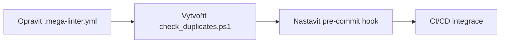
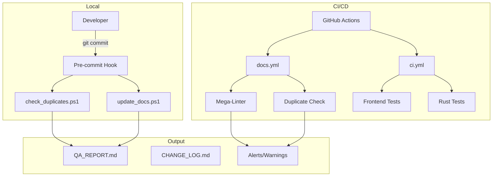

# Vylepšený plán automatizace dokumentace

**Datum:** 2026-02-14 18:00 (UTC+1)  
**Verze:** 2.0  
**Status:** K revizi

---

## 📊 Analýza současného stavu

### Existující nástroje

| Nástroj | Účel | Stav | Poznámka |
|---------|------|------|----------|
| [`scripts/update_docs.ps1`](scripts/update_docs.ps1) | Aktualizace QA_REPORT.md | ⚠️ Částečně funkční | Chybí detekce duplicit |
| [`.mega-linter.yml`](.mega-linter.yml) | CI/CD linting | 🔴 DUPLICITY | Řádky 1-54 a 55-108 jsou totožné |
| [`Dangerfile.js`](Dangerfile.js) | PR validace | ✅ OK | Null check opraven |
| [`.github/workflows/ci.yml`](.github/workflows/ci.yml) | CI testing | ⚠️ Omezený | Pouze frontend testy |

### Identifikované problémy

#### 1. Kritické: Duplicitní konfigurace
```
.mega-linter.yml obsahuje duplicitní blok (řádky 55-108)
```

#### 2. Chybějící skripty
Plán v [`plans/documentation_automation_improvements.md`](plans/documentation_automation_improvements.md) zmiňuje skripty, které **neexistují**:
- `scripts/check_duplicates.ps1`
- `scripts/fix_duplicates.ps1`
- `scripts/validate_timestamps.ps1`

#### 3. Žádná prevence duplicit
- Žádný pre-commit hook
- Žádná automatická detekce při commit

#### 4. Omezená CI/CD
- `ci.yml` testuje pouze frontend
- Chybí workflow pro dokumentaci
- Chybí Rust testy v CI

---

## 🎯 Navrhovaná vylepšení

### Fáze 1: Okamžité opravy (Priorita HIGH)



#### 1.1 Oprava `.mega-linter.yml`
Odstranit duplicitní blok řádků 55-108.

#### 1.2 Vytvoření `scripts/check_duplicates.ps1`

```powershell
# scripts/check_duplicates.ps1
# Detekce duplicitních řádků v souborech
param(
    [string]$Path = "$PSScriptRoot/..",
    [double]$Threshold = 1.3  # Poměr celkových/unikátních řádků
)

$targetFiles = @(
    "CHANGE_LOG.md",
    "NEXT_SESSION.md",
    "QA_REPORT.md",
    ".mega-linter.yml",
    "src-tauri/src/rpc.rs",
    "src-tauri/tests/rpc_contract_test.rs"
)

$errors = @()

foreach ($file in $targetFiles) {
    $fullPath = Join-Path $Path $file
    if (-not (Test-Path $fullPath)) { continue }
    
    $content = Get-Content $fullPath
    $totalLines = $content.Count
    $uniqueLines = ($content | Select-Object -Unique).Count
    $ratio = $totalLines / $uniqueLines
    
    if ($ratio -gt $Threshold) {
        $errors += "DUPLICATE: $file - Total: $totalLines, Unique: $uniqueLines, Ratio: $ratio"
    }
}

if ($errors.Count -gt 0) {
    Write-Error ($errors -join "`n")
    exit 1
}

Write-Host "OK: No duplicates detected"
exit 0
```

#### 1.3 Vytvoření `scripts/fix_duplicates.ps1`

```powershell
# scripts/fix_duplicates.ps1
# Automatická oprava duplicitních bloků
param(
    [string]$FilePath
)

if (-not (Test-Path $FilePath)) {
    Write-Error "File not found: $FilePath"
    exit 1
}

$content = Get-Content $FilePath
$unique = $content | Select-Object -Unique
$unique | Set-Content $FilePath -Encoding UTF8

Write-Host "Fixed: $FilePath - Removed $($content.Count - $unique.Count) duplicate lines"
```

### Fáze 2: Pre-commit Hooks

#### 2.1 Git pre-commit hook

```bash
# .git/hooks/pre-commit
#!/bin/bash
echo "Running documentation checks..."

# 1. Kontrola duplicit
powershell -File scripts/check_duplicates.ps1
if ($LASTEXITCODE -ne 0) { exit 1 }

# 2. Update QA report
powershell -File scripts/update_docs.ps1

echo "All checks passed!"
```

#### 2.2 Alternativa: Husky (cross-platform)

```json
// package.json
{
  "scripts": {
    "prepare": "husky install"
  },
  "devDependencies": {
    "husky": "^9.0.0"
  }
}
```

### Fáze 3: CI/CD Integrace

#### 3.1 Nový workflow: `.github/workflows/docs.yml`

```yaml
name: Documentation Check
on: [push, pull_request]

jobs:
  check:
    runs-on: windows-latest
    steps:
      - uses: actions/checkout@v4
      
      - name: Check for duplicates
        run: powershell -File scripts/check_duplicates.ps1
        
      - name: Update QA Report
        run: powershell -File scripts/update_docs.ps1
```

#### 3.2 Rozšíření `ci.yml` o Rust testy

```yaml
# Přidat do ci.yml
test-rust:
  runs-on: windows-latest
  steps:
    - uses: actions/checkout@v4
    - name: Setup Rust
      uses: dtolnay/rust-toolchain@stable
    - name: Run Rust tests
      run: |
        cd src-tauri
        cargo test
```

### Fáze 4: Monitoring a reportování

#### 4.1 Týdenní report
Rozšířit [`scripts/update_docs.ps1`](scripts/update_docs.ps1) o:
- Počet duplicitních souborů
- Stav Rust testů
- Timestamp posledního běhu

#### 4.2 Dashboard v QA_REPORT.md
Automaticky generovat sekci s metrikami dokumentace.

---

## 📋 Implementační checklist

### Fáze 1: Okamžité opravy
- [ ] Opravit duplicity v `.mega-linter.yml`
- [ ] Vytvořit `scripts/check_duplicates.ps1`
- [ ] Vytvořit `scripts/fix_duplicates.ps1`
- [ ] Vytvořit `scripts/validate_timestamps.ps1`

### Fáze 2: Pre-commit hooks
- [ ] Nastavit Git pre-commit hook
- [ ] Nebo implementovat Husky pro cross-platform

### Fáze 3: CI/CD integrace
- [ ] Vytvořit `.github/workflows/docs.yml`
- [ ] Rozšířit `ci.yml` o Rust testy
- [ ] Přidat automatický changelog generátor

### Fáze 4: Monitoring
- [ ] Rozšířit `update_docs.ps1` o metriky
- [ ] Dashboard v QA_REPORT.md
- [ ] Týdenní automatický report

---

## 🔧 Architektura automatizace



---

## ⚠️ Rizika a mitigace

| Riziko | Pravděpodobnost | Dopad | Mitigace |
|--------|-----------------|-------|----------|
| Pre-commit hook zpomalí commit | Střední | Nízký | Spouštět pouze na změněných souborech |
| Falešné pozitivy v detekci | Nízká | Střední | Nastavit práh na 1.3x |
| Konflikty s OneDrive | Střední | Nízký | Přidat .gitignore pro dočasné soubory |
| Husky kompatibilita | Nízká | Nízký | Použít nativní Git hooks |

---

## 📈 Očekávané výsledky

1. **Konzistentní dokumentace** - žádné duplicity
2. **Automatická prevence** - při každém commit
3. **Validace v CI/CD** - před merge
4. **Týdenní přehled** - stav dokumentace

---

## 🚀 Doporučení pro implementaci

### Priorita implementace:
1. **IHNEĐ**: Opravit `.mega-linter.yml` (kritická duplicita)
2. **Tento týden**: Vytvořit `check_duplicates.ps1` a pre-commit hook
3. **Příští týden**: CI/CD integrace
4. **Budoucí**: Monitoring a dashboard

### Odpovědnosti:
- **Code mód**: Implementace skriptů
- **Architect mód**: Revize plánu a architektury
- **CI/CD**: Automatické spouštění

---

*Poslední aktualizace: 2026-02-14 18:00 (UTC+1)*
